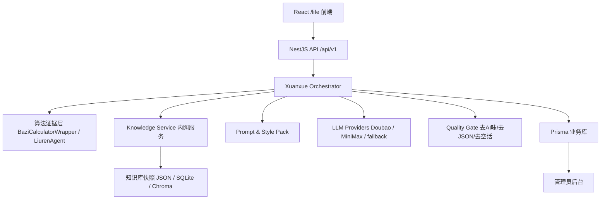

# 人生决策宗师内容中台 V1 工程文档

## 1. 概述
**目标**：建立一个可并发、可留存、可质检的“玄学内容中台”，把算法、知识库、案例库、数据库与 LLM 串起来，让输出从“命理基础说明”升级为“决策报告 + 真人话”。

**V1 范围**：子平八字 + 大六壬。  
**不做**：六爻、梅花、紫微、奇门前台入口；不直接让前端调用 `knowledge-base/tools`；不动 `awkn.cn/` 根主页。

## 2. 总体架构


**形态决策**：  
- NestJS 是唯一生产入口，保持认证、积分、记录、管理员后台都在现有后端。
- 新增 Python `Knowledge Service` 只在内网运行，负责知识检索、案例召回、来源追踪。
- LLM 长任务走队列，前端拿 `recordId` 后轮询模块状态，不刷新整页。

## 3. 后端模块
新增 `XuanxueOrchestratorService`，负责统一编排：

1. `IntentRouter`
   - 输入用户问题、出生信息、问事时间。
   - 输出 `ziping | liuren | mixed | clarify`。
   - 规则：事业/财富全年趋势偏子平；“现在问某事/能不能成/何时推进”偏六壬；混合问题拆双证据包。

2. `EvidencePacketBuilder`
   - 子平：只读 `BaziCalculatorWrapper` 输出，不再由 `ZipingAgent` 旧计算器重算。
   - 六壬：读取 `LiurenAgentService` 的课体、四课、三传、神煞、规则引擎结果。
   - 生成标准 `EvidencePacket`，所有字段入库。

3. `KnowledgeRetrieverClient`
   - 调内网 `Knowledge Service`。
   - 输入：`routeType`、问题、证据标签、日主/课体/神煞/主题。
   - 输出：相似案例、知识片段、来源 ID、置信度。

4. `GenerationComposer`
   - 拼接算法证据、知识片段、案例 few-shot、风格约束。
   - 输出结构化 JSON，不允许 LLM 自行重算命盘/课局。

5. `QualityGate`
   - 拦截 raw JSON 泄露、`coreAction/steps` 字符串、后台词、空泛巴纳姆话。
   - 不合格时自动二次修复；仍失败则标记 `failed_retryable`。

## 4. 内网 Knowledge Service
路径建议：`AWKN-LABlife/services/knowledge-service`

**运行方式**：
- FastAPI + Uvicorn，多 worker。
- 只监听 `127.0.0.1:8701`。
- 生产不直接挂原始 `knowledge-base`，先生成 `knowledge-runtime` 快照。

**接口**：
```http
GET /health
```
返回：
```json
{ "status": "ok", "version": "2026-05-v1", "loadedSources": 4 }
```

```http
POST /retrieve
```
请求：
```json
{
  "routeType": "ziping",
  "question": "今年事业财富运势",
  "evidenceTags": ["dayMaster:庚", "dayun:庚未", "topic:wealth"],
  "limit": 6
}
```
响应：
```json
{
  "items": [
    {
      "sourceId": "ZP-CAI-01",
      "title": "财运实战断法",
      "text": "身强财旺遇食伤财才可发大财...",
      "score": 0.86
    }
  ]
}
```

```http
POST /similar-cases
```
返回相似命例/课例，只给摘要和来源，不直接给最终断语。

## 5. 数据库设计
现有 `ConsultRecord` 保留，新增以下 Prisma models，JSON 仍用 `String` 存储以兼容当前 SQLite；迁 PostgreSQL 后再改 `Json`。

```prisma
model EvidencePacket {
  id          String   @id @default(uuid())
  recordId    String
  routeType   String
  version     String
  inputHash   String
  packetJson  String   @default("{}")
  warnings    String   @default("[]")
  createdAt   DateTime @default(now())

  @@index([recordId])
  @@index([routeType, createdAt])
}

model GenerationRun {
  id            String   @id @default(uuid())
  recordId      String
  moduleId      String
  status        String   @default("pending")
  provider      String?
  model         String?
  promptVersion String
  evidenceId    String?
  rawOutput     String?
  finalJson      String?
  qualityScore  Int      @default(0)
  errorCode     String?
  errorMessage  String?
  durationMs    Int?
  createdAt     DateTime @default(now())
  updatedAt     DateTime @updatedAt

  @@index([recordId, moduleId])
  @@index([status, createdAt])
}

model KnowledgeHit {
  id          String   @id @default(uuid())
  runId       String
  sourceId    String
  sourceType  String
  title       String?
  snippet     String
  score       Int
  createdAt   DateTime @default(now())

  @@index([runId])
  @@index([sourceId])
}

model InteractionEvent {
  id          String   @id @default(uuid())
  userId      String?
  sessionId   String?
  recordId    String?
  eventType   String
  eventJson   String   @default("{}")
  createdAt   DateTime @default(now())

  @@index([userId, createdAt])
  @@index([recordId, createdAt])
}
```

## 6. API 文档
### 创建咨询
沿用现有：
```http
POST /api/v1/consult
```
变化：
- 返回体增加 `record_id`、`generation_status`。
- 后端同步保存 `EvidencePacket`。
- LLM 超时不丢记录，状态写入 `GenerationRun`。

### 获取模块内容
```http
GET /api/v1/consult/records/:recordId/modules/:moduleId
```
响应：
```json
{
  "data": {
    "recordId": "uuid",
    "moduleId": "breakthrough",
    "status": "completed",
    "content": {},
    "qualityScore": 86,
    "retryable": false
  },
  "error": null
}
```

### 重试模块
```http
POST /api/v1/consult/records/:recordId/modules/:moduleId/retry
```
规则：
- 只重试当前模块，不刷新整页。
- 如果模块扣积分，失败不扣；成功后再扣或确认已扣流水。

### 管理员查看证据链
```http
GET /api/v1/admin/consult-records/:id/evidence
GET /api/v1/admin/consult-records/:id/generation-runs
GET /api/v1/admin/knowledge-hits?recordId=xxx
```

## 7. 输出风格规范
Prompt 分三层：

- 算法纪律：只依据证据包，不重算、不猜测、不编造古籍来源。
- 判断纪律：先回答用户问的事，命理术语必须落到现实场景。
- 表达纪律：报告骨架 + 真人话。

最终中文结构固定：
```text
一句话定性
判断依据
当前风险
建议动作
时间窗口
落一句最实在的话
```

禁止前台出现：
- `algorithm / calc-engine`
- `基于算法证据包`
- `coreAction / steps`
- 纯 JSON 字符串
- `顺势而为、保持努力、未来可期、注意沟通` 等空话单独成句。

## 8. 测试用例
| 场景 | 输入 | 期望 |
|---|---|---|
| 子平事业财运 | 出生信息 + “今年事业财富” | 进入 ziping，不误入 liuren |
| 六壬断事 | “现在问这个合作能不能做” | 进入 liuren，展示用户问了什么 |
| 混合问题 | 出生信息 + 当前事件 | 生成两个证据包，前台有主次 |
| LLM 超时 | 模拟 provider timeout | 模块失败可重试，不刷新整页，不输出兜底模板 |
| 知识服务挂掉 | 关闭 8701 | 降级为算法证据 + 本地 cases，不阻塞咨询记录保存 |
| 内容质检 | LLM 返回 raw JSON | QualityGate 修复或标记失败 |
| 管理员后台 | 查询某 record | 可看到输入、命盘、证据包、知识命中、LLM 原文、最终文案 |
| 并发 | 100 mock 请求 | API 不崩，任务进入队列，状态可追踪 |

## 9. 实施任务包
1. 资产快照
   - 写只读扫描脚本，标记可用/损坏 DB。
   - 生成 `knowledge-runtime`，只包含 V1 可用资产。

2. Knowledge Service
   - 实现 `/health`、`/retrieve`、`/similar-cases`。
   - 加载 `mingli.db`、`liuren.db`、清洗 JSONL、后端 `cases.json`。

3. Orchestrator
   - 新增 `EvidencePacketBuilder`、`KnowledgeRetrieverClient`、`GenerationComposer`、`QualityGate`。
   - 改造 `LlmGatewayService`，让 ziping/liuren 走统一编排。

4. 数据留存
   - Prisma 新增 4 张表。
   - 每次咨询、模块生成、知识命中、用户互动均入库。

5. 前端与后台
   - 结果页模块状态改为局部重试。
   - 管理员后台增加证据链与生成记录详情。

6. 并发与部署
   - 增加 Redis + BullMQ。
   - PM2 增加 `knowledge-service` 进程。
   - `/life` 子站部署不影响 `awkn.cn/` 首页。

## 10. 验收标准
- `npm run build` 后端通过，前端 build 通过。
- 子平和六壬各 5 条 golden case 输出稳定。
- 管理员能完整查看“用户互动 + 命盘数据 + 算法证据 + LLM生成过程”。
- 付费模块失败不扣积分，可局部重试。
- 前台不再出现后台字段、JSON碎片、空泛模板话。
- `https://awkn.cn/` 首页不变，`https://awkn.cn/life/` 正常。
