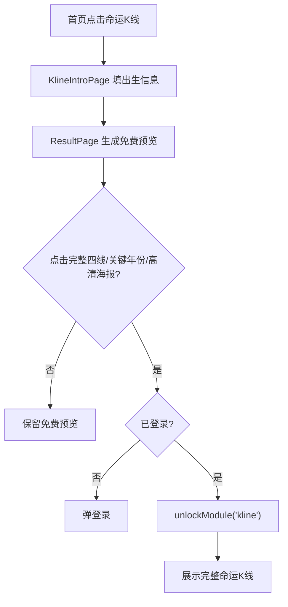
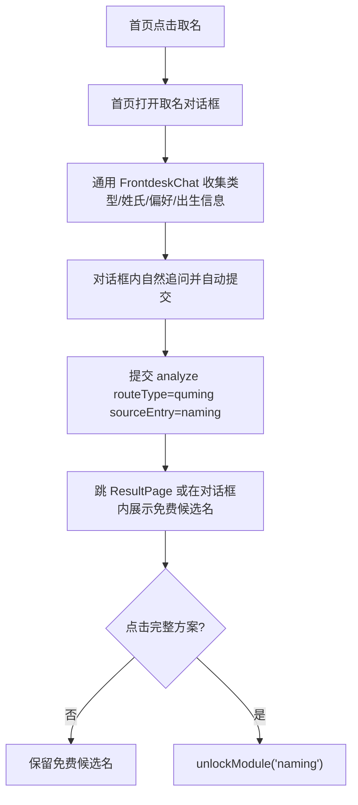
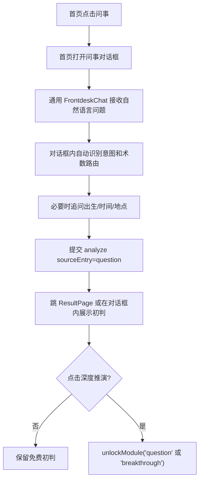

# 三入口闭环修复与资产留存工程文档

> 日期：2026-05-17  
> 状态：已部署（P0 已修复，线上基础验收通过；P1 i18n 清理待继续）  
> 来源：`PRD-三入口拟人化前台与会员分层-20260516.md` 执行后审核  
> 目标路径：`awkn.cn/life`  
> 根路径约束：不得修改或重定向 `awkn.cn/`

## 1. 工程目标

本轮目标不是继续新增功能，而是修复 PRD 执行后的关键闭环问题：

1. 命运K线免费预览不能被登录挡住。
2. 取名完整方案不能再误调用 `kline` 解锁。
3. 三入口记录必须写入后台资产字段。
4. 取名、问事都在首页通用对话前台完成，不跳独立页面；独立页面仅保留兼容路由。
5. 三入口新增文案进入 i18n，避免英文/泰文模式中文残留。
6. 现有 `/consult/preview` 占位接口需要接入真实流程或暂时下线，避免误判为已完成。

## 2. 现状问题

### 2.1 命运K线免费预览被登录挡住

原问题：

- `KlineIntroPage` 默认写入 `route_type: 'kline'`。
- `ResultPage` 读取后把 `kline` 转成 `ziping`。
- `ResultPage` 对 `ziping` 未登录用户直接弹登录。

结果：

- 用户填完命运K线信息后无法看到免费预览。
- PRD 中“先生成、后收费”的策略未成立。

### 2.2 取名解锁误用 K线模块

当前：

- `InitialQumingAlgorithmPanel` 展示取名免费/会员分层。
- 但 `ResultPage` 传入的 `onUnlock` 是 `handleVipClick('kline')`。

结果：

- 用户点击“解锁完整取名方案”时实际解锁 K线。
- 积分流水、会员权限、后台解锁记录都会串模块。

### 2.3 后台资产字段未写入

当前 Prisma 已有：

- `sourceEntry`
- `namingType`
- `namingPreferences`
- `questionIntent`
- `unlockStatus`
- `shareGenerated`

但 `ConsultService.analyze()` 创建记录和更新记录时没有写入这些字段。

结果：

- 管理员后台新增的 K线/取名/问事筛选无法稳定命中。
- 用户互动数据仍不完整，未形成核心资产。

### 2.4 取名/问事前台存在页面与弹窗两套入口

当前：

- `/naming` 页面：`NamingFrontdesk`
- 首页弹窗：`NamingChat`
- `/question` 页面：`QuestionFrontdesk`
- 首页三入口点击取名时打开弹窗，但问事点击仍跳页面。

当前修复方向：

- 首页三入口统一通过 `EntryGrid.onEntryClick(entryKey)` 分发。
- `naming`、`question` 在首页打开同一个 `FrontdeskChat`。
- `/naming`、`/question` 只作为兼容路由，复用 `FrontdeskChat renderAs="page"`。
- 旧 `NamingChat`、`NamingFrontdesk`、`QuestionFrontdesk` 不再作为主流程入口，后续可标记 legacy 或删除。

结果：

- 页面式前台和对话框式前台并存。
- 取名、问事体验不统一。
- 后续维护、i18n、埋点、验收都会重复。

目标：

- 首页三入口点击后都留在当前首页。
- 命运K线可打开专用出生信息对话框。
- 取名、问事使用同一个通用对话前台组件。
- 对话框内完成需求收集、必要信息补充、提交生成和会员承接。
- `/naming`、`/question` 仅作为兼容路由，复用同一个通用对话前台组件，不再作为主流程。

### 2.5 i18n 未完成

当前新增前台中大量常量为中文：

- 取名类型
- 取名追问
- 问事开场白
- 快捷问题
- 按钮文案
- 录音提示

结果：

- 英文模式、泰文模式仍出现中文。

### 2.6 `/consult/preview` 是占位接口

当前：

- 后端已有 `POST /consult/preview`。
- 返回固定样例内容。
- 前端 `consultApi.createPreview()` 存在但主流程未调用。

结果：

- 免费预览在工程上没有真正接入。
- 容易误以为预览功能已完成。

## 3. 本轮范围

### 3.1 必做

- 修复命运K线匿名免费预览。
- 修复取名解锁模块。
- 写入三入口资产字段。
- 合并取名/问事对话前台主入口。
- 补齐新增前台文案 i18n。
- 增加核心单测/构建验证。

### 3.2 暂不做

- 不重构完整会员商品体系。
- 不新增开放式聊天。
- 不重做命运K线算法。
- 不重做管理员后台 UI。
- 不新增大规模数据库表。
- 不修改 `awkn.cn` 根主页。

## 4. 目标用户流程

### 4.1 命运K线



### 4.2 取名



### 4.3 问事



## 5. 前端改造

### 5.1 首页三入口

文件：

- `app/src/components/home/EntryCard.tsx`
- `app/src/components/home/CompactEntryCard.tsx`
- `app/src/components/home/EntryGrid.tsx`
- `app/src/pages/HomePage.tsx`
- `app/src/components/frontdesk/FrontdeskChat.tsx`（新增）
- `app/src/components/frontdesk/frontdeskConfigs.ts`（新增）
- `app/src/components/frontdesk/types.ts`（新增）

改造：

1. `EntryGrid` 接收 `onEntryClick(entryKey)`。
2. `EntryCard` 和 `CompactEntryCard` 不再自行 `navigate('/naming')` 或 `navigate('/question')`。
3. 首页维护统一状态：

```ts
const [activeFrontdesk, setActiveFrontdesk] =
  useState<null | 'kline' | 'naming' | 'question'>(null)
```

4. 点击三入口：

| entryKey | 行为 |
|---|---|
| kline | 打开 K线出生信息对话框 |
| naming | 打开通用对话前台，mode = naming |
| question | 打开通用对话前台，mode = question |

5. 新增通用组件 `FrontdeskChat`，通过 `mode` 和配置驱动不同业务。
6. 从 `NamingChat`、`NamingFrontdesk`、`QuestionFrontdesk` 抽取共性能力，不再维护两套前台；旧文件仅作为迁移参考。
7. `/naming` 和 `/question` 页面仅复用 `FrontdeskChat`，用于直接链接兼容，不作为首页主流程。

通用组件接口建议：

```ts
type FrontdeskMode = 'naming' | 'question' | 'kline'

interface FrontdeskChatProps {
  mode: FrontdeskMode
  onClose?: () => void
  renderAs?: 'modal' | 'page'
}
```

配置结构建议：

```ts
interface FrontdeskConfig {
  mode: FrontdeskMode
  titleKey: string
  subtitleKey: string
  greetingKey: string
  quickOptions?: FrontdeskQuickOption[]
  followupSteps: FrontdeskStep[]
  buildPayload: (state: FrontdeskState) => ConsultPayload
  submitRoute: 'result'
}
```

其中：

- `naming` 配置负责：宝宝取名、成人改名、品牌取名、姓氏、风格偏好、出生信息。
- `question` 配置负责：自然语言问题、快捷问题、意图分类、必要补充信息。
- `kline` 后续可配置为：出生信息、当前关注方向、生成命运K线。

验收：

- 首页点击取名不离开首页，打开对话框。
- 首页点击问事不离开首页，打开对话框。
- 对话框内可以完成问题收集和提交。
- 取名和问事共用同一个 `FrontdeskChat` 组件。
- 不存在两套相似对话组件各自维护状态和提交逻辑。
- 桌面和移动端行为一致。

### 5.2 命运K线免费预览

文件：

- `app/src/pages/KlineIntroPage.tsx`
- `app/src/pages/ResultPage.tsx`
- `app/src/components/LifeKLineChart.tsx`
- `app/src/lib/destinyKline/*`

改造：

1. `KlineIntroPage` 写入：

```json
{
  "route_type": "ziping",
  "source_entry": "kline",
  "unlock_status": "preview"
}
```

2. `ResultPage` 登录判断调整：

当前逻辑：

```ts
if (routeType === 'ziping' && !isAuthenticated) {
  setShowAuthModal(true)
}
```

目标逻辑：

```ts
const sourceEntry = data.source_entry || data.sourceEntry
const isKlineEntry = sourceEntry === 'kline'

if (routeType === 'ziping' && !isAuthenticated && !isKlineEntry) {
  setShowAuthModal(true)
}
```

3. 免费态允许展示：

- 当前阶段
- 总势线简版
- 未来三年简述
- 机会窗口 1 个
- 风险窗口 1 个

4. 会员态才展示：

- 事业K线
- 财运K线
- 情感K线
- 年份级 tooltip
- 高清海报
- AI 解盘师完整问题

验收：

- 未登录用户从首页进入命运K线，填表后能看到预览。
- 未登录用户点击完整四线时才弹登录。
- 登录但非会员用户点击完整四线进入会员承接。
- 月会员/管理员直接看到完整四线。

### 5.3 取名解锁

文件：

- `app/src/pages/ResultPage.tsx`
- `app/src/components/result/InitialQumingAlgorithmPanel.tsx`
- `app/src/api/membership.ts`
- `awkn-life-backend/apps/api-server/src/membership/membership.service.ts`

改造：

1. `ResultPage` 改为：

```tsx
<InitialQumingAlgorithmPanel
  result={result}
  onUnlock={() => handleVipClick('naming')}
  recordId={result.record_id}
/>
```

2. `MembershipService` 增加 `naming` 模块权限。

建议：

```ts
const monthModules = [...basicModules, 'full', 'query', 'reminder', 'history', 'kline', 'naming', 'question', 'morning']
```

3. `moduleCreditCost` 增加：

```ts
naming: 1
question: 1
```

4. `getModuleRequiredPlan('naming')` 返回 `month`。

验收：

- 点击取名完整方案时请求 `/membership/unlock` 的 `moduleId` 为 `naming`。
- 普通免费用户失败后进入会员页。
- 管理员失败时只显示重试错误，不跳会员页。
- 管理员成功后产生 `module_unlock` 流水，模块为 `naming`。

### 5.4 问事解锁

文件：

- `app/src/pages/ResultPage.tsx`
- `app/src/components/question/*`
- `awkn-life-backend/apps/api-server/src/membership/membership.service.ts`

改造：

1. 问事深度解锁统一使用：

- 轻量深度：`question`
- 重大推演：`breakthrough`

2. `question` 进入月会员模块。
3. `breakthrough` 保持年会员模块。

验收：

- 问事初判免费。
- 点击深度推演时使用正确模块。
- `question` 和 `breakthrough` 不混用。

### 5.5 i18n

文件：

- `app/src/locales/zh-CN/translation.json`
- `app/src/locales/en/translation.json`
- `app/src/locales/th/translation.json`
- `app/src/pages/NamingFrontdesk.tsx`
- `app/src/pages/QuestionFrontdesk.tsx`
- `app/src/pages/KlineIntroPage.tsx`

新增 key 建议：

```json
{
  "home.entries.kline.title": "...",
  "home.entries.naming.title": "...",
  "home.entries.question.title": "...",
  "naming.frontdesk.greeting": "...",
  "naming.frontdesk.followup.baby": "...",
  "naming.frontdesk.followup.adult": "...",
  "naming.frontdesk.followup.brand": "...",
  "question.frontdesk.greeting": "...",
  "question.quick.careerChange": "...",
  "question.quick.relationship": "...",
  "question.quick.cooperation": "...",
  "question.quick.turningPoint": "..."
}
```

验收：

- 英文模式打开取名对话框或进入兼容 `/naming` 无中文按钮。
- 英文模式进入 `/question` 无中文快捷问题。
- 泰文模式不缺 key；如果泰文翻译不足，至少不 fallback 到中文，使用英文兜底。

## 6. 后端改造

### 6.1 DTO 扩展

文件：

- `awkn-life-backend/apps/api-server/src/consult/dto/index.ts`

新增字段：

```ts
sourceEntry?: 'kline' | 'naming' | 'question'
namingType?: 'baby' | 'adult' | 'brand'
namingPreferences?: Record<string, unknown>
questionIntent?: string
unlockStatus?: 'preview' | 'unlocked_partial' | 'unlocked_full'
```

兼容 snake_case：

```ts
source_entry?: string
naming_type?: string
question_intent?: string
unlock_status?: string
```

### 6.2 ConsultRecord 写入资产字段

文件：

- `awkn-life-backend/apps/api-server/src/consult/consult.service.ts`

创建记录时写入：

```ts
sourceEntry: dto.sourceEntry || dto.source_entry || inferSourceEntry(routeType, question)
namingType: dto.namingType || dto.naming_type
namingPreferences: JSON.stringify(buildNamingPreferences(dto))
questionIntent: dto.questionIntent || dto.question_intent
unlockStatus: dto.unlockStatus || dto.unlock_status || 'preview'
```

更新记录时保留字段，不覆盖为 null。

推断规则：

| 条件 | sourceEntry |
|---|---|
| `sourceEntry` 明确传入 | 使用传入值 |
| routeType = `quming` | `naming` |
| question 包含 命运K线/kline | `kline` |
| 其他问事入口 | `question` |

### 6.3 解锁后更新记录

文件：

- `awkn-life-backend/apps/api-server/src/membership/membership.service.ts`

`unlockModule(userId, moduleId, recordId)` 成功后：

```ts
await prisma.consultRecord.update({
  where: { id: recordId },
  data: {
    unlockStatus: moduleId === 'breakthrough' ? 'unlocked_full' : 'unlocked_partial'
  }
})
```

模块映射建议：

| moduleId | unlockStatus |
|---|---|
| kline | unlocked_full |
| naming | unlocked_full |
| question | unlocked_partial |
| breakthrough | unlocked_full |
| morning | unlocked_partial |

### 6.4 预览接口处理

当前 `/consult/preview` 是固定样例。两种方案择一：

#### 推荐方案 A：本轮暂不使用 preview 接口

- 前端不调用 `/consult/preview`。
- 免费预览由现有 `/consult/analyze` 返回的算法结果生成。
- 文档中标记 preview 为实验接口。

优点：

- 最小改动。
- 不再引入一套并行结果。

#### 备选方案 B：让 preview 接口真实创建预览记录

- `POST /consult/preview` 创建 `ConsultRecord`。
- `status = completed`
- `unlockStatus = preview`
- `sourceEntry` 写入。
- 返回 `recordId + freeContent + lockedContent`。

缺点：

- 和 `/consult/analyze` 有重复。
- 本轮不建议做。

## 7. 数据库设计

### 7.1 现有字段

`ConsultRecord` 已有字段：

| 字段 | 类型 | 说明 |
|---|---|---|
| sourceEntry | String? | kline/naming/question |
| namingType | String? | baby/adult/brand |
| namingPreferences | String? | JSON |
| questionIntent | String? | 问事意图 |
| unlockStatus | String? | preview/unlocked_partial/unlocked_full |
| shareGenerated | Boolean | 是否生成分享图 |

### 7.2 本轮是否新增字段

本轮不新增字段。

### 7.3 建议后续索引

如 SQLite/Prisma 迁移允许，后续增加：

```prisma
@@index([sourceEntry])
@@index([unlockStatus])
@@index([routeType])
@@index([createdAt])
```

本轮如没有迁移窗口，可先不加索引。

## 8. 接口文档

### 8.1 POST /api/v1/consult/analyze

功能：

创建咨询记录并返回免费初步结果。

请求：

```json
{
  "routeType": "ziping",
  "question": "我想生成命运K线",
  "birthDate": "1983-07-11",
  "birthTime": "03:00",
  "birthPlace": "樟树",
  "gender": "male",
  "sourceEntry": "kline",
  "unlockStatus": "preview",
  "lang": "zh-CN"
}
```

响应：

```json
{
  "record_id": "string",
  "route_type": "ziping",
  "summary_line": "string",
  "summary_body": "string",
  "calc_result": {},
  "paywall_modules": ["kline"],
  "sourceType": "algorithm"
}
```

错误：

| 状态 | 场景 |
|---|---|
| 400 | 缺少出生日期 |
| 400 | 问题少于 2 字 |
| 500 | 算法异常 |

### 8.2 POST /api/v1/membership/unlock

功能：

解锁会员模块并真实扣积分。

请求：

```json
{
  "moduleId": "naming",
  "recordId": "string"
}
```

响应：

```json
{
  "success": true,
  "moduleId": "naming",
  "creditBalance": 49
}
```

模块：

| moduleId | 权限 |
|---|---|
| kline | 月会员/年会员/管理员 |
| naming | 月会员/年会员/管理员 |
| question | 月会员/年会员/管理员 |
| breakthrough | 年会员/管理员 |

### 8.3 GET /api/v1/admin/kline-records

筛选条件：

```text
sourceEntry = kline
```

返回应包含：

- recordId
- user
- question
- birth info
- unlockStatus
- createdAt

### 8.4 GET /api/v1/admin/naming-records

筛选条件：

```text
routeType = quming OR sourceEntry = naming
```

返回应包含：

- recordId
- namingType
- namingPreferences
- name suggestions summary
- unlockStatus
- createdAt

### 8.5 GET /api/v1/admin/question-records

筛选条件：

```text
sourceEntry = question OR routeType IN (liuren, liuyao, qimen)
```

返回应包含：

- recordId
- question
- questionIntent
- routeType
- unlockStatus
- createdAt

## 9. 工程任务拆分

### P0-1 修复命运K线免费预览

文件：

- `app/src/pages/KlineIntroPage.tsx`
- `app/src/pages/ResultPage.tsx`

任务：

- 写入 `source_entry: 'kline'`。
- 调整 `ziping` 登录拦截逻辑。
- 确认免费态只遮罩深度内容，不遮罩基础预览。

验收：

- 未登录用户可以看到命运K线预览。

### P0-2 修复取名解锁模块

文件：

- `app/src/pages/ResultPage.tsx`
- `awkn-life-backend/apps/api-server/src/membership/membership.service.ts`
- `awkn-life-backend/apps/api-server/src/membership/membership.service.spec.ts`

任务：

- `handleVipClick('kline')` 改为 `handleVipClick('naming')`。
- Membership 加 `naming`。
- 单测覆盖普通用户、月会员、管理员。

验收：

- 取名解锁流水 moduleId 为 `naming`。

### P0-3 写入后台资产字段

文件：

- `awkn-life-backend/apps/api-server/src/consult/dto/index.ts`
- `awkn-life-backend/apps/api-server/src/consult/consult.service.ts`
- `app/src/pages/KlineIntroPage.tsx`
- `app/src/pages/NamingFrontdesk.tsx`
- `app/src/pages/QuestionFrontdesk.tsx`

任务：

- 前端传 `sourceEntry`、`namingType`、`questionIntent`。
- 后端 DTO 接收。
- ConsultRecord 创建时写入。

验收：

- 后台 K线/取名/问事记录能查到新记录。

### P1-1 合并取名/问事前台为通用首页对话框

文件：

- `app/src/components/home/EntryCard.tsx`
- `app/src/components/home/CompactEntryCard.tsx`
- `app/src/pages/HomePage.tsx`
- `app/src/components/home/NamingChat.tsx`
- `app/src/components/frontdesk/FrontdeskChat.tsx`
- `app/src/components/frontdesk/frontdeskConfigs.ts`
- `app/src/components/frontdesk/types.ts`
- `app/src/pages/NamingFrontdesk.tsx`
- `app/src/pages/QuestionFrontdesk.tsx`

任务：

- 新增 `FrontdeskChat` 通用组件。
- 首页点击取名打开 `FrontdeskChat mode="naming"`。
- 首页点击问事打开 `FrontdeskChat mode="question"`。
- `FrontdeskChat` 统一负责消息流、输入框、快捷选项、步骤推进、提交状态、错误状态、关闭逻辑。
- `frontdeskConfigs.ts` 负责不同业务的文案 key、步骤、payload 构建。
- `/naming` 页面复用 `FrontdeskChat mode="naming" renderAs="page"`。
- `/question` 页面复用 `FrontdeskChat mode="question" renderAs="page"`。
- 旧 `NamingChat`、`NamingFrontdesk`、`QuestionFrontdesk` 迁移后标记 legacy 或删除引用。

验收：

- 首页是取名和问事主入口。
- 取名和问事都在对话框完成核心流程。
- 独立路由只是兼容入口，不再产生第二套体验。
- 取名和问事没有两套前台组件。
- 新增一个功能入口时，只需要新增一份 config，而不是复制一个页面。

### P1-2 新增 i18n

文件：

- `app/src/locales/zh-CN/translation.json`
- `app/src/locales/en/translation.json`
- `app/src/locales/th/translation.json`
- `app/src/pages/NamingFrontdesk.tsx`
- `app/src/pages/QuestionFrontdesk.tsx`

任务：

- 常量迁移到翻译文件。
- 泰文缺失时用英文兜底。

验收：

- 英文模式三入口流程无中文残留。

### P1-3 标注 preview 接口状态

文件：

- `app/src/api/consult.ts`
- `awkn-life-backend/apps/api-server/src/consult/consult.controller.ts`
- `awkn-life-backend/apps/api-server/src/consult/consult.service.ts`

任务：

- 如果不接入，添加注释：实验接口，主流程不使用。
- 如果接入，改为真实创建记录。

验收：

- 团队不再误判 preview 已完成。

## 10. 测试用例

| 用例ID | 用例名称 | 前置条件 | 输入 | 预期输出 | 优先级 |
|---|---|---|---|---|---|
| TC-KLINE-001 | 未登录生成命运K线预览 | 未登录 | 首页点击命运K线并填出生信息 | 进入结果页，展示免费预览，不弹登录 | P0 |
| TC-KLINE-002 | 未登录点击完整四线 | 已看到免费预览 | 点击事业/财运/情感线 | 弹登录，不直接跳会员页 | P0 |
| TC-KLINE-003 | 免费用户点击完整四线 | 已登录免费用户 | 点击完整K线 | 调用 unlock kline，失败后跳会员页 | P0 |
| TC-KLINE-004 | 管理员解锁完整K线 | 管理员登录，余额可为 0 | 点击完整K线 | 自动补积分并扣分，展示完整K线 | P0 |
| TC-NAME-001 | 首页取名入口 | 任意用户 | 点击首页取名 | 首页打开通用对话框，mode=naming，不跳页面 | P0 |
| TC-NAME-002 | 取名免费结果 | 任意用户 | 完成取名前台 | 展示 3 个免费候选名 | P0 |
| TC-NAME-003 | 取名解锁模块正确 | 登录免费用户 | 点击完整取名方案 | 请求 moduleId 为 naming | P0 |
| TC-NAME-004 | 管理员解锁取名 | 管理员登录 | 点击完整取名方案 | 扣积分，流水 moduleId 为 naming | P0 |
| TC-Q-001 | 问事自然语言输入 | 任意用户 | 输入“要不要换工作” | 自动判断意图，进入结果页 | P0 |
| TC-Q-003 | 首页问事入口 | 任意用户 | 点击首页问事 | 首页打开通用对话框，mode=question，不跳页面 | P0 |
| TC-FD-001 | 通用前台复用 | 开发检查 | 搜索前台组件 | 取名、问事共用 FrontdeskChat，不存在两套重复状态机 | P0 |
| TC-Q-002 | 问事记录资产字段 | 任意用户 | 提交问事 | ConsultRecord 写入 sourceEntry/questionIntent | P0 |
| TC-ASSET-001 | K线记录后台可查 | 已生成K线记录 | 管理员打开 K线记录 | 能看到记录 | P0 |
| TC-ASSET-002 | 取名记录后台可查 | 已生成取名记录 | 管理员打开取名记录 | 能看到 namingType 和 preferences | P0 |
| TC-I18N-001 | 英文取名前台 | 切换英文 | 进入 `/naming` | 无中文常量 | P1 |
| TC-I18N-002 | 英文问事前台 | 切换英文 | 进入 `/question` | 无中文快捷问题 | P1 |

## 11. 构建与验证命令

前端：

```bash
cd app
npm run build
```

后端：

```bash
cd awkn-life-backend
npm run build
npm test -- --runInBand membership.service.spec.ts
```

建议新增后端测试：

```bash
npm test -- --runInBand consult.service.spec.ts membership.service.spec.ts
```

中文残留扫描：

```bash
rg -n "[\u4e00-\u9fff]" app/src/pages/NamingFrontdesk.tsx app/src/pages/QuestionFrontdesk.tsx app/src/components/home -g "*.tsx"
```

允许：

- 中文 locale 文件
- 中文默认内容生成逻辑
- 命理内部中文 key

不允许：

- 英文模式 UI 常量直接写中文
- 按钮直接写中文
- placeholder 直接写中文

## 12. 发布约束

部署只影响：

- `/life` 前端静态资源
- `awkn-life-backend` 后端服务

不得影响：

- `awkn.cn/` 根主页
- 根路径 Nginx 配置

发布前检查：

- 备份 `/life` 静态目录。
- 备份后端目录。
- 备份 SQLite 数据库。
- 确认 Nginx `/life/` fallback 不覆盖 `/`。
- 确认 `/api/v1` 代理正常。

## 13. 完成定义

本轮完成必须同时满足：

- [ ] 未登录用户可看到命运K线免费预览。（待浏览器实测完整流程）
- [x] 取名解锁使用 `naming`，不是 `kline`。（本地代码已改，待线上验收）
- [x] `ConsultRecord.sourceEntry` 对三入口正确写入。（本地代码已改，待数据库验收）
- [x] 管理员后台能查到 K线/取名/问事记录。（代码已接入标签页与接口，待线上数据验收）
- [x] 首页取名只有一条主流程。（首页入口已接到 `FrontdeskChat mode="naming"`）
- [x] 首页问事只有一条主流程。（首页入口已接到 `FrontdeskChat mode="question"`）
- [x] 取名、问事主流程都在对话框内完成，不强制跳独立页。（兼容路由保留）
- [x] 取名、问事共用一个通用对话前台组件。
- [ ] 英文模式三入口主要流程无中文残留。（三入口前台新增文案已补，结果页历史 fallback 待清理）
- [x] 前端构建通过。
- [x] 后端构建通过。
- [x] 会员服务单测通过。
- [x] 不影响 `awkn.cn/` 根主页。

## 14. 当前执行快照

| 项目 | 状态 | 说明 |
|---|---|---|
| 首页三入口点击协议 | 已本地修复 | `EntryGrid` 改为统一 `onEntryClick`，避免取名/问事误走旧路由。 |
| 取名前台步骤弹窗 | 已本地规避 | 主流程改为对话内追问后自动提交，不再进入 `步骤 1/1` 表单。旧步骤代码后续可清理。 |
| 问事误进八字 | 已线上验证 | 问事入口强制按断事入口处理，默认走 `liuren`；接口冒烟已确认“财运好转”问题不再被改路由到命理。 |
| 临时结果深入推演 400 | 已本地修复 | `ResultPage` 对 `Q_`、`NAME_`、`KLINE_` 等临时 ID 不再请求后端记录详情。 |
| 取名会员解锁 | 已本地修复 | `InitialQumingAlgorithmPanel` 解锁改为 `handleVipClick('naming')`。 |
| 后台资产留存字段 | 已本地接入 | DTO 和 `ConsultService.analyze()` 已接收并写入 `sourceEntry`、`namingType`、`questionIntent` 等字段。 |
| 管理员后台资产查看 | 已本地接入 | `AdminPage` 已有取名、问事、K线标签页，后端已有对应 admin records 接口；待线上数据验收。 |
| i18n | 部分完成 | 三入口前台新增 `autoSubmit`、`forceQuestionRoute`，清理未使用中文 quickOptions；结果页仍有历史中文 fallback，需另起 i18n 清理。 |
| 构建与测试 | 已通过 | `app npm run build`、`awkn-life-backend npm run build`、`membership.service.spec.ts` 均通过。 |
| 线上部署 | 已完成 | 已备份并发布 `/www/wwwroot/awkn-lab/life` 与 `/opt/awkn-life/awkn-life-backend`，`awkn.cn/`、`/life/`、`/life/api/v1/health` 基础验证通过。 |
| Nginx 可用性 | 已恢复 | 发布后发现 Nginx 原本处于 `failed`，80/443 未监听；已 `systemctl start nginx` 恢复。 |

## 15. 本次部署记录

- 部署时间：2026-05-17 20:01-20:05 CST。
- 静态目录：`/www/wwwroot/awkn-lab/life`。
- 后端目录：`/opt/awkn-life/awkn-life-backend`。
- PM2 进程：`awkn-life-backend`，已重启，状态 `online`。
- 备份时间戳：`20260517_195947`。
- 备份文件：
  - `/opt/awkn-life/backups/life-static-20260517_195947.tgz`
  - `/opt/awkn-life/backups/backend-src-20260517_195947.tgz`
  - `/opt/awkn-life/backups/prod-20260517_195947.db`
  - `/opt/awkn-life/backups/nginx-20260517_195947.conf`
- 线上基础验收：
  - `https://awkn.cn/`：200，根主页未被 `/life` 替换。
  - `https://awkn.cn/life/`：200，新构建资源加载。
  - `https://awkn.cn/life/assets/index-D0iUPGnu.css`：200。
  - `https://awkn.cn/life/api/v1/health`：200，返回 `awkn-life-backend` 健康信息。
  - `POST https://awkn.cn/life/api/v1/consult/analyze`，`source_entry=question` + `route_type=liuren` + “什么时候财运才能好转”：200，返回 `route_type=liuren`，不再要求出生日期。
