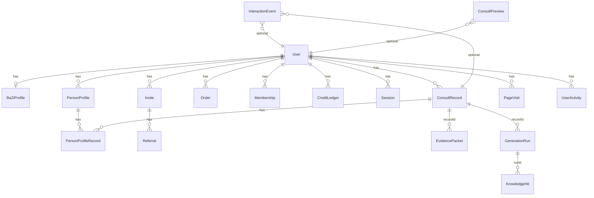

# 人生决策宗师 — 全项目工程文档

> 工程阶段：B-Build（DSPBRSE v2.3）
> 生成日期：2026-05-22
> 依据：PRD-三入口拟人化前台与会员分层 / 命运K线 V2 / P2 补全 spec
> 范围：全项目架构、API 接口清单、数据库设计、前端路由与组件树、数据流、测试体系

---

## 1. 项目概述

### 1.1 基本信息

| 项目 | 值 |
|------|-----|
| 名称 | 人生决策宗师 (AWKN-LABlife) |
| 线上地址 | `https://awkn.cn/life` |
| 代码仓库 | `AWKN-Lab/人生决策宗师/AWKN-LABlife` |
| 技术栈 | NestJS + Prisma(SQLite) + React 18 + Vite + Tailwind + Zustand |
| 三语支持 | zh-CN / en / th |
| 部署 | PM2 (api-server:3000) + Nginx 反向代理 |

### 1.2 项目结构

```
AWKN-LABlife/
├── app/                          # 前端 (React + Vite)
│   └── src/
│       ├── pages/                # 15 个页面
│       ├── components/           # 30+ 组件目录
│       │   ├── ui/               # 50+ shadcn 基础组件
│       │   ├── result/           # 结果页组件（八字/六壬/命理/K线）
│       │   ├── kline/            # 命运K线组件
│       │   ├── frontdesk/        # 拟人化前台（取名/问事）
│       │   ├── home/             # 首页组件（EntryGrid/EntryCard）
│       │   ├── membership/       # 会员组件（FreePreviewGate/LockedContent）
│       │   ├── celebrity/        # 名人案例
│       │   ├── fortune/          # 运势组件
│       │   ├── naming/           # 取名组件
│       │   ├── question/         # 问事组件
│       │   └── conclusion/       # 结论组件
│       ├── store/                # 11 个 Zustand stores
│       ├── lib/                  # 工具库
│       │   ├── destinyKline/     # 命运K线引擎（V2四线派生）
│       │   ├── i18n.ts           # i18n 初始化
│       │   ├── intentRouter.ts   # 用户意图路由
│       │   ├── analytics.ts      # 前端埋点
│       │   └── liuren-engine.ts  # 六壬前端引擎
│       ├── locales/              # 三语翻译文件
│       └── types/                # TypeScript 类型定义
├── awkn-life-backend/            # 后端 (NestJS monorepo)
│   └── apps/api-server/src/
│       ├── auth/                 # JWT 认证（register/login/wx-login/refresh/logout）
│       ├── user/                 # 用户管理（profile/membership）
│       ├── consult/              # 核心咨询模块
│       │   ├── consult.controller.ts   # 主控制器（20+ 端点）
│       │   ├── consult.service.ts      # 主服务
│       │   ├── person-profile.service.ts # 人物档案服务
│       │   ├── router.service.ts       # 意图路由（大六壬/八字/六爻/奇门）
│       │   ├── generators/             # 生成器模块（BullMQ consumers）
│       │   └── orchestrator/           # 编排器（XuanxueOrchestratorService）
│       ├── membership/           # 会员管理（plans/activate/unlock/check）
│       ├── payment/              # 支付（Stripe 集成）
│       ├── admin/                # 管理后台（用户/记录/会员/统计）
│       ├── analytics/            # 数据分析（页面访问/用户行为/八字档案）
│       ├── growth/               # 增长引擎（邀请码/推荐/优惠）
│       ├── llm-providers/        # LLM 提供商适配（MiniMax/Kimi/..）
│       ├── llm-gateway/          # LLM 网关
│       ├── liuren-agent/         # 大六壬 Agent
│       ├── ziping-agent/         # 子平八字 Agent
│       ├── liuyao-agent/         # 六爻 Agent
│       ├── qimen-agent/          # 奇门 Agent
│       ├── ziwei-agent/          # 紫微斗数 Agent
│       ├── quming-agent/         # 取名 Agent
│       ├── calc-engine/          # 八字计算引擎
│       ├── websocket/            # WebSocket 消息推送
│       ├── shared/
│       │   ├── redis/            # Redis 缓存层
│       │   ├── queue/            # BullMQ 异步队列
│       │   └── rule-engine/      # 规则引擎
│       └── prisma/               # Prisma ORM
├── prisma/
│   └── schema.prisma             # 20 个数据模型
└── docs/                         # 工程文档
```

---

## 2. 技术栈总览

### 2.1 后端

| 层 | 技术 | 版本 |
|----|------|------|
| 运行时 | Node.js | ^20 |
| 框架 | NestJS | ^10 |
| ORM | Prisma | ^5 |
| 数据库 | SQLite (dev) / MySQL (prod) | — |
| 缓存 | Redis (ioredis) | ^5 |
| 异步队列 | BullMQ | ^5 |
| 认证 | JWT (passport-jwt) | — |
| LLM | MiniMax / Kimi / DeepSeek | 多模型路由 |
| 玄学术数 | 自建 calc-engine + agent 体系 | — |

### 2.2 前端

| 层 | 技术 | 版本 |
|----|------|------|
| 框架 | React 18 | ^18 |
| 构建 | Vite | ^5 |
| 样式 | Tailwind CSS v4 | ^4 |
| 状态管理 | Zustand | ^4 |
| 路由 | react-router-dom v6 | ^6 |
| 国际化 | i18next | ^23 |
| 动画 | framer-motion | ^10 |
| HTTP | fetch (原生) | — |
| UI 基础 | shadcn/ui (radix + lucide) | — |

---

## 3. 后端架构

### 3.1 模块拓扑

```
                      ┌─────────────┐
                      │  AppModule  │
                      └──────┬──────┘
          ┌──────────────────┼──────────────────┐
    ┌─────┴─────┐      ┌─────┴─────┐      ┌─────┴─────┐
    │ AuthModule│      │ConsultModule│     │Membership │
    │ JWT+Guard │      │ Orches+Gen │     │ +Payment  │
    └─────┬─────┘      └─────┬─────┘      └─────┬─────┘
          │                  │                   │
    ┌─────┴─────┐    ┌──────┴──────┐    ┌──────┴──────┐
    │UserModule │    │Agent Modules│    │AdminModule  │
    │ Profile   │    │(liuren/etc) │    │(监控后台)    │
    └───────────┘    └──────┬──────┘    └─────────────┘
                     ┌──────┴──────┐
                     │LlmGateway   │
                     │LlmProviders │
                     └─────────────┘

┌──────────┐  ┌──────────┐  ┌──────────┐  ┌──────────┐
│ Analytics │  │  Growth  │  │WebSocket │  │  Shared  │
│(埋点/档案)│  │(邀请/优惠)│  │(消息推送)│  │Redis/Queue│
└──────────┘  └──────────┘  └──────────┘  └──────────┘
```

### 3.2 核心模块职责

| 模块 | 路径 | 职责 |
|------|------|------|
| `AppModule` | `app.module.ts` | 根模块，加载 13 个子模块 |
| `AuthModule` | `auth/` | 注册/登录/微信登录/Token刷新/登出 |
| `UserModule` | `user/` | 用户资料 CRUD、会员状态查询 |
| `ConsultModule` | `consult/` | **核心咨询** — 路由/分析/结果/预览/运势/名人案例/档案 |
| `MembershipModule` | `membership/` | 套餐管理/激活/解锁/权限检查 |
| `PaymentModule` | `payment/` | Stripe 支付创建/状态/退款/Webhook |
| `AdminModule` | `admin/` | 管理后台 20+ 查询端点（JWT+Admin双Guard） |
| `AnalyticsModule` | `analytics/` | 页面访问追踪/用户行为/八字档案 |
| `GrowthModule` | `growth/` | 邀请码/推荐记录/优惠活动 |
| `WebsocketModule` | `websocket/` | WebSocket 实时消息 |
| `LlmProvidersModule` | `llm-providers/` | LLM 多提供商路由 |
| `LlmGatewayModule` | `llm-gateway/` | LLM 调用网关 |

### 3.3 玄学 Agent 模块

| Agent | 路由类型 | 职责 |
|-------|---------|------|
| `LiurenAgent` | `liuren` | 大六壬占卜分析与解读 |
| `ZipingAgent` | `ziping` | 子平八字命理分析 |
| `LiuyaoAgent` | `liuyao` | 六爻占卦解释 |
| `QimenAgent` | `qimen` | 奇门遁甲排盘 |
| `ZiweiAgent` | `ziwei` | 紫微斗数命盘 |
| `QumingAgent` | `quming` | 取名/改名方案生成 |

### 3.4 全局配置

```ts
// main.ts
app.setGlobalPrefix('api/v1');
app.enableCors({ origin: ['https://awkn.cn', 'https://www.awkn.cn', ...], credentials: true });
app.useGlobalPipes(new ValidationPipe({ whitelist: true, transform: true }));
// 端口: process.env.PORT || 3000
```

---

## 4. API 接口清单

> 全局前缀：`/api/v1`
> 鉴权：🔒 = JWT required | 👑 = Admin required | ⚪ = public

### 4.1 Health

| 方法 | 路径 | 鉴权 | 说明 |
|------|------|------|------|
| GET | `/health` | ⚪ | 服务健康检查 |
| GET | `/health/llm` | ⚪ | LLM 服务健康 |
| HEAD | `/health` | ⚪ | Head 健康检查 |

### 4.2 Auth (认证)

| 方法 | 路径 | 鉴权 | 说明 |
|------|------|------|------|
| POST | `/auth/register` | ⚪ | 邮箱/手机注册 |
| POST | `/auth/login` | ⚪ | 账号密码登录 |
| POST | `/auth/wx-login` | ⚪ | 微信小程序登录 |
| POST | `/auth/refresh` | ⚪ | 刷新 Token |
| POST | `/auth/logout` | 🔒 | 登出 |

### 4.3 User (用户)

| 方法 | 路径 | 鉴权 | 说明 |
|------|------|------|------|
| GET | `/user/profile` | 🔒 | 获取个人资料 |
| PATCH | `/user/profile` | 🔒 | 更新个人资料 |
| GET | `/user/membership` | 🔒 | 查询当前会员状态 |

### 4.4 Consult (核心咨询) — 25 个端点

| 方法 | 路径 | 鉴权 | 说明 |
|------|------|------|------|
| POST | `/consult/preview` | ⚪ | 免费预览（kline/naming/question） |
| POST | `/consult/analyze` | ⚪ | 提交咨询分析（异步队列） |
| POST | `/consult/route` | ⚪ | 意图路由（liuren/ziping/liuyao/qimen） |
| POST | `/consult/clarify` | ⚪ | 生成澄清追问 |
| POST | `/consult/info` | ⚪ | 提交补充信息 |
| GET | `/consult/result/:recordId` | ⚪ | 获取分析结果 |
| POST | `/consult/save` | 🔒 | 保存记录到用户 |
| GET | `/consult/records` | 🔒 | 获取用户记录列表 |
| POST | `/consult/records/delete` | 🔒 | 批量删除记录 |
| GET | `/consult/person-profiles` | 🔒 | 获取人物档案列表 |
| GET | `/consult/person-profiles/:id/records` | 🔒 | 获取档案关联记录 |
| DELETE | `/consult/person-profiles/:id` | 🔒 | 删除人物档案 |
| GET | `/consult/fortune/daily` | ⚪ | 每日运势 |
| GET | `/consult/fortune/monthly/:year/:month` | ⚪ | 月度运势 |
| GET | `/consult/fortune/yearly/:year` | ⚪ | 年度运势 |
| GET | `/consult/celebrity-cases` | ⚪ | 名人案例列表 |
| GET | `/consult/celebrity-cases/:id` | ⚪ | 名人案例详情 |
| POST | `/consult/celebrity-cases/:id/similarity` | ⚪ | 八字相似度 |
| POST | `/consult/records/:rid/modules/:mid/destiny-snapshot` | ⚪ | 保存命运K线快照 |
| GET | `/consult/records/:rid/modules/:mid` | ⚪ | 查询模块生成状态 |
| POST | `/consult/records/:rid/modules/:mid/retry` | ⚪ | 重试失败模块 |
| POST | `/consult/records/:id/behavior` | ⚪ | 保存用户交互行为 |

### 4.5 Membership (会员)

| 方法 | 路径 | 鉴权 | 说明 |
|------|------|------|------|
| GET | `/membership/plans` | ⚪ | 套餐列表 |
| GET | `/membership/plans/:planId` | ⚪ | 套餐详情 |
| GET | `/membership/current` | 🔒 | 当前会员 |
| POST | `/membership/activate` | 🔒 | 激活会员 |
| POST | `/membership/unlock` | 🔒 | 解锁模块 |
| GET | `/membership/check/:moduleId` | 🔒 | 权限检查 |
| GET | `/membership/history` | 🔒 | 会员历史 |
| POST | `/membership/cancel/:id` | 🔒 | 取消会员 |

### 4.6 Payment (支付)

| 方法 | 路径 | 鉴权 | 说明 |
|------|------|------|------|
| POST | `/payment/create` | 🔒 | 创建订单 |
| GET | `/payment/status/:orderId` | ⚪ | 订单状态 |
| GET | `/payment/orders` | 🔒 | 用户订单列表 |
| POST | `/payment/webhook/stripe` | ⚪ | Stripe Webhook |
| POST | `/payment/refund/:orderId` | 🔒 | 退款 |

### 4.7 Analytics (分析埋点)

| 方法 | 路径 | 鉴权 | 说明 |
|------|------|------|------|
| GET | `/analytics/admin/stats` | 👑 | 管理后台统计 |
| POST | `/analytics/page-visit` | ⚪ | 记录页面访问 |
| POST | `/analytics/activity` | ⚪ | 记录用户行为 |
| POST | `/analytics/bazi-profile` | 🔒 | 保存八字档案 |
| GET | `/analytics/bazi-profile` | 🔒 | 获取八字档案 |
| GET | `/analytics/stats` | 🔒 | 用户分析统计 |
| POST | `/analytics/consult-result` | 🔒 | 批量保存分析结果 |

### 4.8 Growth (增长)

| 方法 | 路径 | 鉴权 | 说明 |
|------|------|------|------|
| GET | `/growth/invite-code` | 🔒 | 获取邀请码 |
| GET | `/growth/invite-stats` | 🔒 | 邀请统计 |
| POST | `/growth/referral/record` | ⚪ | 记录回流访问 |
| POST | `/growth/referral/activate` | 🔒 | 激活推荐关系 |
| GET | `/growth/offers` | ⚪ | 获取优惠活动 |

### 4.9 Admin (管理后台) — 20+ 个端点

| 方法 | 路径 | 鉴权 | 说明 |
|------|------|------|------|
| GET | `/admin/users` | 👑 | 用户列表（分页/筛选） |
| GET | `/admin/person-profiles` | 👑 | 人物档案列表 |
| GET | `/admin/consult-records` | 👑 | 咨询记录搜索（分页/多条件） |
| GET | `/admin/consult-records/:id` | 👑 | 咨询记录详情（含 profiles） |
| GET | `/admin/consult-records/:id/manifest` | 👑 | 记录摘要 Manifest |
| GET | `/admin/consult-records/:id/evidence` | 👑 | 证据链详情 |
| GET | `/admin/consult-records/:id/generation-runs` | 👑 | 生成过程追踪 |
| GET | `/admin/stats` | 👑 | 统计概览 |
| GET | `/admin/stats/enhanced` | 👑 | 增强统计（按来源/路由/会员） |
| GET | `/admin/consult-previews` | 👑 | 预览记录列表 |
| GET | `/admin/memberships` | 👑 | 会员列表 |
| GET | `/admin/naming-records` | 👑 | 取名记录 |
| GET | `/admin/question-records` | 👑 | 问事记录 |
| GET | `/admin/kline-records` | 👑 | 命运K线记录 |
| GET | `/admin/unlock-records` | 👑 | 解锁记录 |
| GET | `/admin/credit-usage` | 👑 | 积分使用记录 |
| GET | `/admin/llm-failures` | 👑 | LLM 调用失败记录 |
| GET | `/admin/knowledge-hits` | 👑 | 知识命中记录 |
| GET | `/admin/interaction-events` | 👑 | 用户互动事件 |

---

## 5. 数据库设计

### 5.1 数据库 — SQLite (dev) / MySQL (prod)

Provider: `prisma-client-js`

### 5.2 模型总览（20 个）



### 5.3 核心表

#### User — 用户
| 字段 | 类型 | 说明 |
|------|------|------|
| id | UUID | PK |
| email | String? | 唯一 |
| phone | String? | 唯一 |
| wxOpenId | String? | 唯一，微信登录 |
| password | String? | 哈希 |
| nickname | String? | 昵称 |
| gender | String? | 性别 |
| birthDate | DateTime? | 出生日期 |
| birthTime | String? | 出生时辰 |
| birthPlace | String? | 出生地 |
| timezone | String? | 时区 |
| isAdmin | Boolean | 管理员标识 |
| creditBalance | Int | 测试积分余额 |

#### BaZiProfile — 八字命理档案
| 字段 | 类型 | 说明 |
|------|------|------|
| id | UUID | PK |
| userId | String | FK → User (1:1) |
| birthYear/Month/Day/Hour/Minute | Int | 出生时间 |
| gender | String | male/female |
| yearGanZhi/monthGanZhi/dayGanZhi/timeGanZhi | String | 四柱干支 |
| wuXingDist | String(JSON) | 五行分布 |
| shenWang | String | 身旺/身弱/中和 |
| xiYongShen | String(JSON) | 喜忌用神 |
| shiShen | String(JSON) | 十神 |
| shenSha | String(JSON) | 神煞 |
| qiYunAge | Int | 起运年龄 |
| taiYuan/mingGong | String? | 胎元命宫 |
| naYinYear/Month/Day/Time | String? | 纳音五行 |
| correctedHour | Int? | 真太阳时校正 |

#### ConsultRecord — 咨询记录（核心表）
| 字段 | 类型 | 说明 |
|------|------|------|
| id | UUID | PK |
| userId | String? | FK → User |
| sessionId | String? | 匿名会话 ID |
| question | String | 用户问题 |
| routeType | String | liuren/ziping/liuyao/qimen/quming |
| status | String | pending/analyzing/completed/failed |
| inputData | String(JSON) | 用户输入原始数据 |
| calcResult | String?(JSON) | 八字计算结果 |
| llmResult | String?(JSON) | LLM 返回原始 JSON |
| summaryScore | Int? | 综合评分 |
| summaryLine | String? | 一句话总结 |
| analysisData | String?(JSON) | 完整分析结果 |
| calcDuration/llmDuration | Int? | 耗时（毫秒） |
| modelUsed | String? | 所用模型 |
| isSaved | Boolean | 是否已保存到用户 |
| sourceEntry | String? | kline/naming/question |
| namingType | String? | baby/adult/brand |
| namingPreferences | String?(JSON) | 取名偏好 |
| questionIntent | String? | 问事意图分类 |
| unlockStatus | String? | 解锁状态 |
| shareGenerated | Boolean | 是否生成分享 |

#### Membership — 会员
| 字段 | 类型 | 说明 |
|------|------|------|
| id | UUID | PK |
| userId | String | FK → User |
| type | String | free/month/year/admin |
| status | String | active/expired/cancelled |
| startDate | DateTime | 开始日期 |
| expireDate | DateTime? | 过期日期 |

#### Order — 订单
| 字段 | 类型 | 说明 |
|------|------|------|
| id | UUID | PK |
| userId | String | FK → User |
| productType/productId | String | 产品类型与 ID |
| amount | Int | 金额（分） |
| currency | String | usd |
| status | String | pending/completed/refunded |
| paymentMethod | String? | stripe |
| paymentId | String? | Stripe PaymentIntent ID |

#### 辅助表

| 表 | 用途 |
|----|------|
| CreditLedger | 积分变动流水 |
| PersonProfile + PersonProfileRecord | 人物档案多对多关联 |
| PageVisit | 页面访问追踪 |
| UserActivity | 用户行为追踪 |
| Session | 刷新令牌 |
| Invite + Referral | 邀请增长体系 |
| GrowthOffer | 限时优惠活动 |
| EvidencePacket | 分析证据链存储 |
| GenerationRun | LLM 生成运行记录 |
| KnowledgeHit | 知识库命中记录 |
| InteractionEvent | 用户互动事件日志 |
| ConsultPreview | 免费预览临时数据 |
| LiurenCase | 六壬案例库 |

---

## 6. 前端架构

### 6.1 路由表（15 条）

| 路径 | 页面 | 组件 | 说明 |
|------|------|------|------|
| `/` | HomePage | `pages/HomePage.tsx` | 首页（三入口 + Hero + 示例） |
| `/consult` | ConsultPage | `pages/ConsultPage.tsx` | 传统咨询表单 |
| `/info` | InfoPage | `pages/InfoPage.tsx` | 信息填写页 |
| `/result` | ResultPage | `pages/ResultPage.tsx` | 分析结果页（多模块渲染） |
| `/membership` | MembershipPage | `pages/MembershipPage.tsx` | 会员中心 |
| `/profile` | ProfilePage | `pages/ProfilePage.tsx` | 个人资料 |
| `/history` | HistoryPage | `pages/HistoryPage.tsx` | 历史记录 |
| `/pricing` | PricePage | `pages/PricePage.tsx` | 定价页 |
| `/feedback` | FeedbackPage | `pages/FeedbackPage.tsx` | 用户反馈 |
| `/growth` | GrowthPage | `pages/GrowthPage.tsx` | 增长页面（邀请/优惠） |
| `/fortune` | FortunePage | `pages/FortunePage.tsx` | 运势日历 |
| `/admin` | AdminPage | `pages/AdminPage.tsx` | 管理后台 |
| `/kline-intro` | KlineIntroPage | `pages/KlineIntroPage.tsx` | 命运K线引导页 |
| `/naming` | FrontdeskChat | `components/frontdesk/FrontdeskChat.tsx` | 取名前台 (mode=naming) |
| `/question` | FrontdeskChat | `components/frontdesk/FrontdeskChat.tsx` | 问事前台 (mode=question) |

> 全局路由 basename: `/life`
> 所有页面均使用 React.lazy 懒加载
> Loading fallback: `PageLoader` (spinner)

### 6.2 组件目录总览

```
components/
├── ui/                  # 50+ shadcn 基础组件（Button/Card/Dialog/...）
├── result/              # 结果渲染组件
│   ├── InitialZipingAlgorithmPanel.tsx   # 八字算法面板（含 kline 手风琴）
│   ├── InitialLiurenAlgorithmPanel.tsx   # 六壬算法面板
│   ├── InitialLiuyaoAlgorithmPanel.tsx   # 六爻算法面板
│   ├── InitialQimenAlgorithmPanel.tsx    # 奇门算法面板
│   ├── InitialNamingAlgorithmPanel.tsx   # 取名结果展示
│   ├── InitialZiweiAlgorithmPanel.tsx    # 紫微结果展示
│   ├── SummaryBar.tsx                   # 分数进度条
│   └── ConclusionSection.tsx            # 结论区块
├── kline/               # 命运K线组件
│   ├── LifeKLineChart.tsx               # K线图（ECharts 渲染）
│   ├── KLineImageGenerator.tsx          # K线海报生成
│   └── KLineWechatShare.tsx             # 微信分享卡片
├── frontdesk/           # 拟人化前台
│   └── FrontdeskChat.tsx                # 取名/问事双模式对话
├── home/                # 首页
│   ├── EntryGrid.tsx                    # 三入口卡片网格
│   ├── EntryCard.tsx                    # 单个入口卡片
│   ├── HeroSection.tsx                  # 品牌标题
│   └── ExampleSection.tsx               # 示例展示
├── membership/          # 会员
│   ├── FreePreviewGate.tsx              # 免费预览→会员承接
│   ├── LockedContent.tsx                # 锁定内容遮罩+CTA
│   └── MembershipCard.tsx               # 会员卡展示
├── celebrity/           # 名人案例
├── fortune/             # 运势
├── naming/              # 取名
├── question/            # 问事
├── conclusion/          # 结论
├── Card/                # 通用卡片
├── KnowledgeGraph/      # 知识图谱
├── MultiEnding/         # 多结局展示
├── NPC/                 # NPC 对话
└── StateMachine/        # 状态机
```

### 6.3 Zustand Stores（11 个）

| Store | 文件 | 职责 |
|-------|------|------|
| `useAuthStore` | `store/authStore.ts` | JWT Token + 用户身份 |
| `useConsultStore` | `store/consultStore.ts` | 咨询流程状态 |
| `useMembershipStore` | `store/membershipStore.ts` | 会员状态 |
| `usePreviewStore` | `store/previewStore.ts` | 免费预览状态 |
| `useEntryStore` | `store/entryStore.ts` | 三入口选择 |
| `useHistoryStore` | `store/historyStore.ts` | 历史记录 |
| `useNamingStore` | `store/namingStore.ts` | 取名状态 |
| `useQuestionStore` | `store/questionStore.ts` | 问事状态 |
| `useFortuneStore` | `store/fortuneStore.ts` | 运势状态 |
| `useI18nStore` | `store/i18nStore.ts` | 语言切换 |
| `useAdminStore` | `store/adminStore.ts` | 管理后台状态 |

### 6.4 核心工具库

| 模块 | 路径 | 职责 |
|------|------|------|
| `destinyKline/` | `lib/destinyKline/` | 命运K线 V2 引擎 |
| ├─ `types.ts` | | KlineAspect/KlineSignal/KlineFactorBreakdown/DestinyKlineBundle |
| ├─ `ruleFactors.ts` | | 12 条内置规则因子（财/官/情感/风险） |
| ├─ `deriveDestinyKline.ts` | | 从 calcResult 派生四线数据 |
| └─ `shortCycle.ts` | | 短周期均线派生 |
| `i18n.ts` | `lib/i18n.ts` | i18next 初始化（zh-CN/en/th） |
| `analytics.ts` | `lib/analytics.ts` | 前端埋点追踪 |
| `intentRouter.ts` | `lib/intentRouter.ts` | 自然人意图→技术路由映射 |
| `liuren-engine.ts` | `lib/liuren-engine.ts` | 六壬前端引擎 |
| `solarTime.ts` | `lib/solarTime.ts` | 真太阳时校正 |
| `tokenStorage.ts` | `lib/tokenStorage.ts` | JWT Token 持久化 |
| `utils.ts` | `lib/utils.ts` | 通用工具函数 |

---

## 7. 数据流

### 7.1 核心咨询流程（async 队列模式）

```
用户 → ConsultPage (填写问题+出生信息)
  → POST /consult/analyze
  → ConsultService.analyze()
    → Prisma 创建 ConsultRecord (status=pending)
    → CalcEngine 计算八字
    → XuanxueOrchestratorService.enqueue() → BullMQ Queue
    → 返回 recordId (status=analyzing)
  → 前端轮询 GET /consult/result/:recordId
    → GenerationProcessor 消费队列
      → routeType 派发到对应 Agent (Liuren/Ziping/Liuyao/Qimen)
      → LlmGateway → MiniMax/Kimi/DeepSeek
      → GenerationRun (status=completed, qualityScore)
      → ConsultRecord.analysisData 写入
  → 前端获取完整 analysisData → ResultPage 渲染
```

### 7.2 会员解锁流程

```
免费用户 → 首页 EntryGrid → 点击入口
  → KlineIntroPage / NamingFrontdesk / QuestionFrontdesk
  → POST /consult/analyze (免费参数)
  → ResultPage
    → MembershipService.checkAccess(userId, module)
      → hasAccess=false → LockedContent 遮罩
      → [点击解锁] → PricePage → POST /payment/create
        → Stripe Payment → POST /payment/webhook/stripe
        → POST /membership/activate → GET /consult/result (完整)
```

### 7.3 命运K线四线数据流

```
GET /consult/result/:id?module=kline
  → module_content.destinyKline 存在？
    ✓ → 直接渲染四线（总势/事业/财运/情感）
    ✗ → deriveDestinyKline(calcResult, chartData)
      → 12条内置规则因子 → 分aspect加权
      → OHLCV 映射 → DestinyKlineBundle
  → LifeKLineChart + KLineImageGenerator 渲染
```

### 7.4 三入口拟人化前台流程

```
首页 EntryGrid (三卡等宽)
├── [命运K线] → KlineIntroPage → 填出生信息
│   → POST /consult/analyze → ResultPage (module=kline)
├── [取名] → FrontdeskChat (mode=naming) → 2-3步表单
│   → POST /consult/analyze → ResultPage (routeType=quming)
└── [问事] → FrontdeskChat (mode=question) → 自然语言输入
    → intentRouter 分流 → POST /consult/analyze → ResultPage
```

---

## 8. 命运K线 V2 引擎设计

### 8.1 四线体系

| KlineAspect | 中文 | 评分因子 |
|-------------|------|---------|
| `overall` | 总势 | 日主强弱/用神到位/大运顺逆/流年扶抑/五行流通 |
| `career` | 事业 | 官杀/印星/食伤/驿马/文昌/将星 |
| `wealth` | 财运 | 正财偏财/食伤生财/比劫夺财/财库冲合 |
| `relationship` | 情感 | 财星(男)/官杀(女)/夫妻宫/桃花/红鸾 |

### 8.2 OHLCV 映射规则

```ts
close = baseChart*0.20 + daYun*0.25 + yearly*0.25 + aspect*0.20 + knowledge*0.10 - riskPenalty
score = clamp(close, 5, 95)
high = clamp(close + opportunityScore*0.35 + volume*0.12, score, 100)
low = clamp(close - riskPenalty*0.7 - volume*0.08, 0, score)
open = previousClose*0.65 + currentBase*0.35
volume = conflictCount*10 + combinationCount*6 + shenShaHitCount*5 + knowledgeHitCount*8 + daYunChangeBonus
```

### 8.3 信号规则（6 个首批信号）

| 信号 ID | 中文 | 触发条件 |
|---------|------|---------|
| `rise_cross` | 启势金叉 | 短期均线向上，close > 前一年，volume 增强 |
| `noble_volume` | 贵人放量 | 天乙/文昌/将星命中，volume 明显抬升 |
| `wealth_breakout` | 财星突破 | 财运线 close 高于近五年均值，命中财星 |
| `relationship_shift` | 关系异动 | 情感线 volume 抬升，桃花/红鸾触发 |
| `void_pullback` | 空亡回撤 | 机会分高但空亡因子强，high 高 close 低 |
| `useful_god_return` | 用神回归 | 用神五行在大运流年中重新增强 |

### 8.4 兼容策略

- 后端有 `destinyKline` → 前端直接渲染
- 后端无 → 前端 `deriveDestinyKline(calcResult, chartData)` 派生
- 旧 `chartData` 映射为 `aspects.overall`
- 不破坏现有 `yearData/monthData`

---

## 9. 测试体系

### 9.1 命运K线测试用例

| 编号 | 场景 | 预期 |
|------|------|------|
| KLINE-001 | 老数据兼容（仅 chartData） | 显示总势线，其他线用派生数据 |
| KLINE-002 | 四线切换 | 总势/事业/财运/情感切换正常 |
| KLINE-003 | 当前年份命中 | 当前阶段取当前年点 |
| KLINE-004 | 无当前年份 | 使用当前年龄附近点兜底 |
| KLINE-005 | 财运信号触发 | 出现"财星突破"解释 |
| KLINE-006 | 情感风险 | 出现"关系异动" |
| KLINE-007 | 空数据 | 显示空状态，不白屏 |
| KLINE-008 | 海报 | 不暴露完整出生信息 |
| KLINE-009 | 英文模式 | 无中文文案残留 |
| KLINE-010 | 前端构建 | `npm run build` 零错误 |

### 9.2 三入口测试用例

| 编号 | 场景 | 预期 |
|------|------|------|
| HOME-001 | 桌面端三入口等宽排列 | 三个卡片并排 |
| HOME-002 | 移动端垂直堆叠 | 三卡单列 |
| HOME-003 | 点击命运K线 | 进入 KlineIntroPage |
| HOME-004 | 点击取名 | 进入 FrontdeskChat(naming) |
| HOME-005 | 点击问事 | 进入 FrontdeskChat(question) |
| HOME-006 | 英文模式 | 三入口文案英文 |
| HOME-007 | 底部导航 | 不影响标签页切换 |

### 9.3 会员分层测试

| 编号 | 场景 | 预期 |
|------|------|------|
| MEM-001 | 免费用户查看 kline 四线 | locked，提示充值 |
| MEM-002 | 月会员查看 kline 四线 | hasAccess=true |
| MEM-003 | 年会员查看全部 | hasAccess=true |
| MEM-004 | 管理员 | 全部 hasAccess=true |
| MEM-005 | 会员过期 | hasAccess=false |

---

## 10. 当前状态

### 10.1 构建验证

| 项目 | 状态 |
|------|------|
| 后端 `npm run build` | ✅ 通过 |
| 前端 `npm run build` | ✅ 通过 |
| 后端 `tsc --noEmit` | ✅ 通过 |

### 10.2 待处理

| 项 | 状态 |
|----|------|
| Git 未提交文件 | 100+ 文件 |
| prisma migrate | 待执行 |
| 全流程回归测试 | 待执行 |

### 10.3 已知问题

| 问题 | 影响 | 状态 |
|------|------|------|
| 命运K线 analyze API 前端的 `sourceEntry` 未传递到后端 | 后端不知道请求来自 kline 入口 | 已识别（GAP 1） |
| Mock 模式临时记录解锁路径无实际解锁逻辑 | 仅影响本地开发 | 已识别（GAP 2） |
| 命运K线 compact 模式四大区块已改为可折叠手风琴 | — | ✅ 已修复 |
| "纯算法，未调用 LLM" 文字已隐藏 | — | ✅ 已修复 |
| 重复出生日期已移除 | — | ✅ 已修复 |

---

## 11. 部署配置

### 11.1 Nginx 关键配置

```nginx
location /life {
    alias /path/to/awkn-life-frontend/dist/;
    try_files $uri $uri/ /life/index.html;
}

location /life/api {
    proxy_pass http://localhost:3000;
    proxy_set_header Host $host;
}
```

### 11.2 PM2 进程

```bash
pm2 start dist/main.js --name awkn-life-api --cwd awkn-life-backend/apps/api-server
```

### 11.3 环境变量（关键项）

| 变量 | 说明 |
|------|------|
| `DATABASE_URL` | Prisma 数据库连接 |
| `JWT_SECRET` | JWT 签名密钥 |
| `STRIPE_SECRET_KEY` | Stripe 支付密钥 |
| `MINIMAX_API_KEY` | MiniMax API Key |
| `REDIS_HOST` | Redis 连接 |
| `PORT` | 服务端口 (default: 3000) |

---

## 12. 经验沉淀

### 12.1 已沉淀的开发规则

| 规则 | 来源 |
|------|------|
| 规则 1：第三方 API 接入前先建接口-模型兼容矩阵 | MiniMax TTS |
| 规则 4：异步 API 状态判断先确认返回类型 | MiniMax 异步 TTS |
| 规则 5：部署前确认 3 个实际路径 | 价值猎手部署 |
| 规则 8：API 版本迁移必须做路由对齐 | v2 API 缺失端点 |
| 规则 9：数据库应优先在线数据源 | SQLite 损坏 |

### 12.2 项目特有经验

1. **前端 base 路径 = `/life`**：`BrowserRouter basename="/life"`，Nginx `location /life`，Vite `base: /life/` — 三者必须一致。
2. **kline compact 模式**：使用 `AnimatePresence` + `framer-motion` 实现手风琴折叠动画，而不是完全隐藏。
3. **三入口 sourceEntry**：命名入口 `/naming` 和问事入口 `/question` 共用 `FrontdeskChat` 组件，通过 `mode` prop 区分。
4. **异步队列模式**：analyze 请求立即返回 recordId，前端轮询 result 直到 status=completed，避免长连接超时。

---

## 13. 文档索引

| 文档 | 路径 | 范围 |
|------|------|------|
| 三入口工程文档 | `docs/ENGINEERING-三入口拟人化前台与会员分层-20260516.md` | 三入口 + 会员分层 |
| 命运K线工程文档 | `docs/命运K线.txt` | 命运K线 V2 四线引擎 |
| 本全项目工程文档 | `docs/ENGINEERING-全项目-20260522.md` | 全项目综合文档 |
| PRD 三入口 | `docs/PRD-三入口拟人化前台与会员分层-20260516.md` | 产品需求文档 |
| P2 补全 spec | `.trae/specs/p2-completion/` | P2 阶段需求规格 |