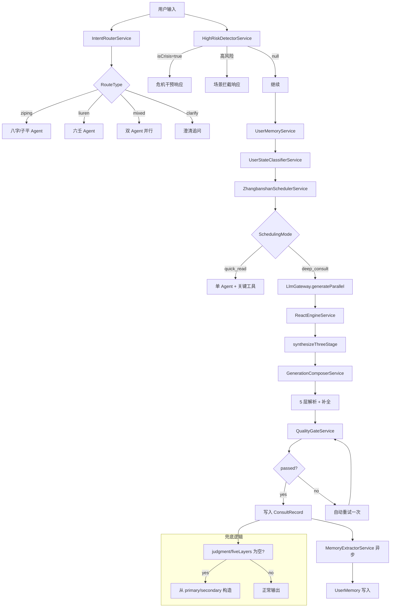

# L2 Pipeline 工程文档

> **版本**：v1.0
> **生成日期**：2026-06-15
> **口径源**：源码逆向（所有接口均从 `.ts` 文件提取）
> **语义纠偏**：4 路由 + scheduler + parallel gateway + ReAct | FiveLayerOutput 5 层接口 | ConsultRecord.status 字符串

---

## 1. Pipeline 架构总览

### 1.1 核心组件

| 组件 | 职责 |
|------|------|
| 4 路由（ziping / liuren / mixed / clarify） | 根据问题关键词 + 出生信息决定命理算法路径 |
| ZhangbanshanSchedulerService | 场景匹配 + 工具编排 + 两段式漏斗（quick_read / deep_consult） |
| LlmGatewayService.generateParallel() | 并行双调（primary + secondary Agent），一致性评估 |
| ReactEngineService | THINK → ACT → OBSERVE → REFLECT 循环（最大 5 轮），仅 deep_consult 触发 |

### 1.2 数据流图

```
用户输入
  │
  ▼
IntentRouterService.route()
  │ → RouteType: 'ziping' | 'liuren' | 'mixed' | 'clarify'
  ▼
HighRiskDetectorService.detect()
  │ → HighRiskScenario | null（危机干预 / 高风险场景拦截）
  ▼
UserMemoryService.searchRelevantMemory()
  │ → { hits, summary }（关键词匹配 + bigram，topK=3）
  ▼
UserStateClassifierService.classify()
  │ → ClassificationResult { state, confidence, evidence }
  ▼
ZhangbanshanSchedulerService.schedule()
  │ → SchedulingDecision { primaryAgent, secondaryAgent, mode, confidence, toolCombo, toolNames }
  ▼
LlmGatewayService.generateParallel()
  │ → ParallelGatewayOutput { primary, secondary, consistency }
  ▼
ReactEngineService.run()  ← 仅 mode === 'deep_consult'
  │ → ReactRunResult { steps, finalAnswer, totalIters }
  ▼
ZhangbanshanSchedulerService.synthesizeThreeStage()
  │ → ZhangbanshanOutput { judgment, premise, cost, reasoning_trace, ... }
  ▼
GenerationComposerService.generate()  ← 渲染 + 5 层解析
  │ → { content, fiveLayers, qualityScore }
  ▼
QualityGateService.evaluate()
  │ → QualityResult { passed, score, filteredText }
  ▼
orchestrator.renderOutput()  ← 兜底补全（第 417-455 行）
  │ → ConsultRecord 写入（status: 'completed'）
  ▼
MemoryExtractorService.extractAndPersist()  ← 异步，不阻塞响应
  │ → ExtractedFact[] → UserMemory
```

---

## 2. 各模块接口文档

### 2.1 IntentRouterService

| 字段 | 值 |
|------|-----|
| 文件路径 | `src/consult/orchestrator/intent-router.service.ts` |
| 类名 | `IntentRouterService` |

**输入接口：**

```typescript
interface IntentRoutingInput {
  question: string;
  hasBirthInfo: boolean;
  hasAskTime: boolean;
}
```

**输出接口：**

```typescript
type RouteType = 'ziping' | 'liuren' | 'mixed' | 'clarify';
```

**关键方法签名：**

```typescript
route(input: IntentRoutingInput): RouteType
```

**路由规则：**

| 条件 | 路由 |
|------|------|
| hasBirthInfo && liurenScore >= 1 | `mixed` |
| hasBirthInfo && zipingScore >= 1 | `ziping` |
| !hasBirthInfo | `clarify` |
| 默认 | `ziping` |

**环境变量依赖：** 无

---

### 2.2 HighRiskDetectorService

| 字段 | 值 |
|------|-----|
| 文件路径 | `src/consult/safety/high-risk-detector.service.ts` |
| 类名 | `HighRiskDetectorService` |

**输入接口：**

```typescript
// 输入为 question: string
```

**输出接口：**

```typescript
interface HighRiskScenario {
  scenarioId: string;
  scenarioName: string;
  response: string;
  isCrisis: boolean;
}
// 返回 null 表示未命中
```

**关键方法签名：**

```typescript
detect(question: string): HighRiskScenario | null
```

**检测优先级：**
1. 危机关键词（`isCrisisQuestion()`）→ `isCrisis: true`
2. YAML 规则关键词匹配
3. YAML 规则正则匹配

**环境变量依赖：** 无（规则文件：`scenario-rules.yaml`）

---

### 2.3 UserMemoryService

| 字段 | 值 |
|------|-----|
| 文件路径 | `src/consult/memory/user-memory.service.ts` |
| 类名 | `UserMemoryService` |

**核心接口：**

```typescript
interface ConsultEntry {
  date: string;
  question: string;
  judgment: string;
  cost: string;
  toolsUsed: string[];
}

interface TimelineEvent {
  date: string;
  event: string;
  dayunRange?: string;
  liunianGanZhi?: string;
  source: 'user_stated' | 'system_inferred';
}

interface InsightEntry {
  date: string;
  insight: string;
  relatedEvents: string[];
  confidence: number;
}
```

**关键方法签名：**

```typescript
getMemory(userId: string): Promise<UserMemory | null>
appendConsult(userId: string, entry: ConsultEntry): Promise<void>
appendTimelineEvent(userId: string, event: TimelineEvent): Promise<void>
appendInsight(userId: string, insight: InsightEntry): Promise<void>
getMemorySummary(userId: string): Promise<string>
searchRelevantMemory(
  userId: string,
  query: string,
  options?: { topK?: number; maxSummaryLength?: number }
): Promise<{
  hits: Array<{ source: 'consult' | 'timeline' | 'insight'; date: string; text: string; score: number }>;
  summary: string;
}>
buildMemoryAnchor(userId: string, currentQuestion: string): Promise<string | null>
getRepeatingQuestionCount(userId: string, question: string, timeWindowDays: number): Promise<number>
extractTimelineEvents(text: string, dayunRange?: string, liunianGanZhi?: string): TimelineEvent[]
```

**常量：**

| 常量 | 值 | 说明 |
|------|-----|------|
| MAX_CONSULT_HISTORY | 50 | 咨询记录上限 |
| MAX_TIMELINE_EVENTS | 100 | 时间线事件上限 |
| MAX_INSIGHTS | 30 | 洞察上限 |
| MEMORY_SUMMARY_MAX_LENGTH | 500 | 摘要最大字符数 |

**环境变量依赖：** 无（依赖 PrismaService → DATABASE_URL）

---

### 2.4 UserStateClassifierService

| 字段 | 值 |
|------|-----|
| 文件路径 | `src/consult/classifier/user-state-classifier.service.ts` |
| 类名 | `UserStateClassifierService` |

**输入接口：**

```typescript
// userId: string, question: string, sessionHistory?: Array<{ role: string; content: string }>
```

**输出接口：**

```typescript
type UserState = 'casual' | 'genuine' | 'repeating' | 'validating';

interface ClassificationResult {
  state: UserState;
  confidence: number;
  evidence: string[];
}
```

**关键方法签名：**

```typescript
classify(userId: string, question: string, sessionHistory?: Array<{ role: string; content: string }>): Promise<ClassificationResult>
clearCache(userId?: string): void
```

**分类优先级：**

| 优先级 | 状态 | 触发条件 |
|--------|------|---------|
| 1 | `repeating` | 30 天内问过类似问题（≥3 token 重叠） |
| 2 | `validating` | 问题包含验证型关键词（如"之前有人说"） |
| 3 | `genuine` | 有情绪词 + 背景描述 + 问题较具体（≥2 项） |
| 4 | `casual` | 默认 |

**环境变量依赖：** `USER_CLASSIFIER_ENABLED`（需为 `'true'` 才启用）

---

### 2.5 ZhangbanshanSchedulerService

| 字段 | 值 |
|------|-----|
| 文件路径 | `src/consult/orchestrator/zhangbanshan-scheduler.service.ts` |
| 类名 | `ZhangbanshanSchedulerService` |

**输入接口：**

```typescript
type AgentType = 'liuren' | 'qimen' | 'ziping' | 'ziwei' | 'liuyao' | 'quming';
type QuestionCategory = '事业' | '婚姻' | '财运' | '健康' | '时机' | '综合';
type SchedulingMode = 'quick_read' | 'deep_consult';

interface SchedulingInput {
  question: string;
  hasBirthInfo: boolean;
  hasAskTime: boolean;
  sessionHistory?: Array<{ role: string; content: string }>;
}
```

**输出接口：**

```typescript
interface SchedulingDecision {
  primaryAgent: AgentType;
  secondaryAgent?: AgentType;
  needClarify: boolean;
  clarifyingQuestion?: string;
  scheduleReason: string;
  toolCombo: string;
  toolNames: string[];
  mode: SchedulingMode;
  confidence: number;  // 0-1
}

interface ZhangbanshanOutput {
  judgment: string;
  premise: string;
  cost: string;
  reasoning_trace: string;
  primary_agent: string;
  secondary_agent?: string;
  schedule_reason: string;
  agent_consistency?: 'consistent' | 'undetermined' | 'conflicting';
  arbitration_note?: string;
  toolResults?: ToolExecutionResult[];
  emotion_snapshot?: string;
  mode?: SchedulingMode;
  confidence?: number;
  costWarnings?: Array<{ type: string; text: string }>;
  costConfirmationRequired?: boolean;
  memoryAnchor?: string;
}

interface ArbitrationResult {
  consistency: 'consistent' | 'undetermined' | 'conflicting';
  trustedAgent: AgentType;
  trustedReason: string;
  arbitrationText: string;
  hasConflict: boolean;
  agentConfidences: Array<{ agent: AgentType; confidence: string }>;
}
```

**关键方法签名：**

```typescript
schedule(input: SchedulingInput): SchedulingDecision
dispatch(toolNames: string[], inputs: Record<string, any>): Promise<ToolExecutionResult[]>
synthesizeThreeStage(
  question: string,
  decision: SchedulingDecision,
  primaryOutput: GatewayOutput,
  secondaryOutput?: GatewayOutput,
  userId?: string,
  onToken?: (token: string) => void,
  costWarningEnabled?: boolean
): Promise<ZhangbanshanOutput>
arbitrate(
  decision: SchedulingDecision,
  primaryOutput: GatewayOutput,
  secondaryOutput: GatewayOutput,
  consistency: 'consistent' | 'undetermined' | 'conflicting'
): ArbitrationResult
synthesizeByNode(
  node: number,
  question: string,
  userId: string,
  nodeContext: NodeContext,
  onLLMToken?: (token: string) => void
): Promise<{ output: string; nextNode?: number; clarifyingQuestion?: string }>
```

**两段式漏斗规则：**

| 条件 | mode | confidence |
|------|------|-----------|
| scenario.id <= 6 && score >= 6 | `quick_read` | 0.5 + score × 0.05 |
| 其他 | `deep_consult` | 0.5 + score × 0.05 |
| 无关键词命中 | `deep_consult` | 0.5 |
| 缺少出生信息 | `deep_consult` | 0.6 |

**环境变量依赖：** `COST_WARNING_ENABLED`、`USER_CLASSIFIER_ENABLED`

---

### 2.6 LlmGatewayService

| 字段 | 值 |
|------|-----|
| 文件路径 | `src/llm-gateway/llm-gateway.service.ts` |
| 类名 | `LlmGatewayService` |

**输入接口：**

```typescript
interface GatewayInput {
  routeType: 'ziping' | 'liuren' | 'clarify' | 'quming' | 'qimen' | 'liuyao' | 'ziwei';
  calcResult?: any;
  inputData?: {
    birthDate?: string;
    birthTime?: string;
    birthPlace?: string;
    gender?: 'male' | 'female';
    askTime?: string;
    askLocation?: string;
    question?: string;
    surname?: string;
    parentWish?: string;
    avoidChars?: string[];
  };
  lang?: string;
}

interface ParallelGatewayInput {
  primaryRouteType: 'ziping' | 'liuren' | 'quming' | 'qimen' | 'liuyao' | 'ziwei';
  secondaryRouteType?: 'ziping' | 'liuren' | 'quming' | 'qimen' | 'liuyao' | 'ziwei';
  calcResult?: any;
  inputData?: GatewayInput['inputData'];
  lang?: string;
}
```

**输出接口：**

```typescript
interface ParallelGatewayOutput {
  primary: GatewayOutput;
  secondary?: GatewayOutput;
  primaryFailed: boolean;
  secondaryFailed: boolean;
  consistency: 'consistent' | 'undetermined' | 'conflicting';
}

interface AlgorithmEvidencePacket {
  routeType: GatewayInput['routeType'];
  summary: string;
  evidenceTags: string[];
  raw?: Record<string, any>;
}

interface GatewayOutput {
  summary_line: string;
  summary_body: string;
  one_line_conclusion?: string;
  character_portrait?: string;
  counterpart_portrait?: { willingness?: string; realConcerns?: string[] };
  repositioning_strategy?: string;
  three_layer_advice?: { layer1_goal?: string; layer2_phased?: string; layer3_breakdown?: string };
  phased_calendar?: Array<{ period: string; goal: string; doThis: string[]; doNotDo: string[] }>;
  scripts?: { openingLine?: string; keyPhrases?: string[]; forbiddenPhrases?: string[] };
  success_signals?: string[];
  failure_signals?: string[];
  action_strategy?: string;
  evidence_tags?: string[];
  proposal_versions?: Array<{ version: string; when: string; content: string[] }>;
  risks: string[];
  actions: string[];
  time_window: string;
  evidence_fold: string;
  paywall_modules: string[];
  llm_fallback: boolean;
  route_type: string;
  qualityScore?: number;
  schemaValid?: boolean;
  provider?: string;
  model?: string;
  retryCount?: number;
  fallbackReason?: string;
  algorithmEvidence?: AlgorithmEvidencePacket;
  record_id?: string;
  // ... 其他路由特有字段（patternType, strengthLevel, 课体, 三传, modules 等）
  agent_confidence?: string;
  agent_uncertainty_factors?: string[];
  zhangbanshan_output?: { judgment: string; cost: string; reasoning_trace: string; primary_agent: string; secondary_agent?: string; schedule_reason: string; agent_consistency?: string; arbitration_note?: string };
}
```

**关键方法签名：**

```typescript
generate(input: GatewayInput): Promise<GatewayOutput>
generateParallel(input: ParallelGatewayInput): Promise<ParallelGatewayOutput>
getAgentStatus(): Promise<{ ziping: boolean; liuren: boolean; quming: boolean; timestamp: string }>
```

**一致性评估规则：**

| 条件 | consistency |
|------|------------|
| 无 secondary | `consistent` |
| 任一 failed | `undetermined` |
| 任一 confidence='低' | `undetermined` |
| 双方 confidence='高' 且方向矛盾 | `conflicting` |
| 方向矛盾但非双高 | `undetermined` |
| 方向一致 | `consistent` |

**环境变量依赖：** LLM Provider 配置（见 §4.2）

---

### 2.7 ReactEngineService

| 字段 | 值 |
|------|-----|
| 文件路径 | `src/consult/orchestrator/react-engine.service.ts` |
| 类名 | `ReactEngineService` |

**输入接口：**

```typescript
type ReactAction =
  | { kind: 'tool'; tool: string; args: Record<string, any> }
  | { kind: 'subagent'; agent: string; question: string }
  | { kind: 'ask_user'; question: string }
  | { kind: 'conclude'; finalAnswer: string };
```

**输出接口：**

```typescript
interface ReactStep {
  iter: number;
  phase: 'think' | 'act' | 'observe' | 'reflect';
  content: string;
  action?: ReactAction;
  observation?: string;
  reflection?: string;
  done: boolean;
  ts: number;
}

interface ReactRunResult {
  steps: ReactStep[];
  finalAnswer: string;
  totalIters: number;
  done: boolean;
  reason: 'completed' | 'max_iters' | 'no_tools' | 'error';
}
```

**关键方法签名：**

```typescript
run(input: {
  question: string;
  systemContext: string;
  availableTools?: string[];
  availableAgents?: string[];
  contextFacts?: Record<string, any>;
}): Promise<ReactRunResult>
```

**循环限制：** `MAX_ITERS = 5`

**环境变量依赖：** 无（依赖 LlmProvidersService）

---

### 2.8 prompt-layers.ts（5 层 Prompt 架构）

| 字段 | 值 |
|------|-----|
| 文件路径 | `src/consult/orchestrator/prompt-layers.ts` |
| 导出类型 | 函数集（非 Injectable） |

**5 层结构：**

| 层 | 函数 | Token 估算 | 变化频率 |
|----|------|-----------|---------|
| Layer 1 Identity | `buildIdentityLayer()` | ~800 | 极少（KV Cache 命中） |
| Layer 2 Capability | `buildCapabilityLayer(input)` | ~400 | 按场景切换 |
| Layer 3 Context | `buildContextLayer(input)` | ~300 | 每轮更新 |
| Layer 4 Dynamic | `buildDynamicLayer(input)` | ~500 | 每次调用变化 |
| Layer 5 Confirmation | `buildConfirmationLayer(input)` | ~150 | 仅重大决策注入 |

**组合入口：**

```typescript
function buildSystemPromptFromLayers(input: BuildSystemPromptInput): string
```

**BuildSystemPromptInput 接口：**

```typescript
interface BuildSystemPromptInput {
  scenarioName: string;
  primaryAgent: string;
  primaryAgentName?: string;
  secondaryAgent: string | null;
  availableTools: string[];
  memorySummary: string;
  emotionInstruction: string;
  question: string;
  agentName: string;
  agentSummary: string;
  secondarySection: string;
  costWarningEnabled?: boolean;
  costWarningType?: 'cost' | 'boundary' | 'memory_anchor' | 'framework_correction';
  costConfirmationRequired?: boolean;
  userRestatedCost?: string;
  memoryAnchor?: string;
  userState?: string;
  nodeContext?: NodeContext;
}

interface NodeContext {
  currentNode: 0 | 1 | 2 | 3 | 4 | 5 | 6;
  previousNodeOutput?: string;
  collectedBackground?: string[];
}
```

**环境变量依赖：** 无

---

### 2.9 GenerationComposerService

| 字段 | 值 |
|------|-----|
| 文件路径 | `src/consult/orchestrator/generation-composer.service.ts` |
| 类名 | `GenerationComposerService` |

**输入接口：**

```typescript
interface GenerationInput {
  recordId: string;
  moduleId: string;
  routeType: string;
  question: string;
  evidencePacket: Record<string, unknown>;
  knowledgeItems?: Array<{ sourceId: string; title: string; text: string }>;
  promptVersion?: string;
  generateFollowUp?: boolean;
}
```

**输出接口：**

```typescript
interface QualityBaselineScore {
  completeness: number;  // 0-100
  accuracy: number;
  consistency: number;
  identity: number;
  overall: number;
}

// generate() 返回
{
  content: string;
  followUpQuestions: string[];
  qualityScore: number;
  retryable: boolean;
  baselineScore?: QualityBaselineScore;
}
```

**关键方法签名：**

```typescript
generate(input: GenerationInput): Promise<{ content: string; followUpQuestions: string[]; qualityScore: number; retryable: boolean; baselineScore?: QualityBaselineScore }>
validateAndFillFiveLayers(rawOutput: string): { layers: FiveLayerOutput; missingLayers: string[]; isComplete: boolean }
```

**5 层解析逻辑：**
1. `parseFiveLayers()` — 按 `FIVE_LAYER_MARKERS` 正则拆分
2. `validateAndFillFiveLayers()` — 缺层时用 `MISSING_LAYER_PLACEHOLDER` 补全
3. `composeFiveLayerText()` — 重新组装带标记文本

**质量基线：**

| 维度 | 基线 | 不达标行为 |
|------|------|-----------|
| completeness | 90 | 自动重试一次 |
| identity | 80 | 自动重试一次 |

**环境变量依赖：** 无（依赖 PrismaService、LlmProvidersService、QualityGateService）

---

### 2.10 QualityGateService

| 字段 | 值 |
|------|-----|
| 文件路径 | `src/consult/orchestrator/quality-gate.service.ts` |
| 类名 | `QualityGateService` |

**输入接口：**

```typescript
// text: string
```

**输出接口：**

```typescript
interface QualityResult {
  passed: boolean;
  score: number;
  warnings: string[];
  filteredText: string;
}
```

**关键方法签名：**

```typescript
evaluate(text: string): QualityResult
```

**过滤规则：**

| 规则 | 扣分 |
|------|------|
| BANNED_PATTERNS（coreAction / algorithm / calc-engine / 基于算法证据包 / steps） | -5/次 |
| BANNED_PHRASES（顺势而为 / 保持努力 / 未来可期 / 注意沟通 / 建议您 / 请注意 / 的建议是 / 建议您可以） | -10/次 |
| RAW_JSON_PATTERN | -15 |
| 行长 > 200 字符 | -2/行 |

**通过标准：** `score >= 60 && warnings.length < 3`

**环境变量依赖：** 无

---

### 2.11 MemoryExtractorService

| 字段 | 值 |
|------|-----|
| 文件路径 | `src/consult/memory/memory-extractor.service.ts` |
| 类名 | `MemoryExtractorService` |

**输入接口：**

```typescript
// recordId: string, userId?: string | null
```

**输出接口：**

```typescript
interface ExtractedFact {
  category: 'identity' | 'family' | 'career' | 'relationship' | 'finance' | 'health' | 'decision' | 'preference';
  text: string;
  date?: string;
  confidence: number;
  sourceRecordId: string;
  extractedAt: string;
}
```

**关键方法签名：**

```typescript
extractAndPersist(recordId: string, userId?: string | null): Promise<ExtractedFact[]>
```

**提取策略：**
1. 优先规则匹配（`RULE_PATTERNS`，7 类关键词正则）
2. 规则无命中 → LLM 提取（`chatCheap`，jsonMode）
3. SimHash 去重（bigram Jaccard ≥ 0.8 视为重复）

**写入目标：**
- `UserMemoryService.appendConsult()` — consultHistory
- `UserMemoryService.appendInsight()` — insights（confidence ≥ 0.7）

**环境变量依赖：** 无

---

### 2.12 EvidencePacketBuilderService

| 字段 | 值 |
|------|-----|
| 文件路径 | `src/consult/orchestrator/evidence-packet-builder.service.ts` |
| 类名 | `EvidencePacketBuilderService` |

**输入接口：**

```typescript
interface EvidencePacketData {
  recordId: string;
  routeType: string;
  version: string;
  packetData: Record<string, unknown>;
  warnings?: string[];
}
```

**输出接口：**

```typescript
// build() 返回 packetId: string
// getPacket() 返回 Prisma EvidencePacket 记录
```

**关键方法签名：**

```typescript
build(input: EvidencePacketData): Promise<string>
getPacket(packetId: string): Promise<EvidencePacket | null>
```

**存储：** Prisma `evidencePacket` 表，`inputHash` = SHA-256 前 32 位

**环境变量依赖：** 无（依赖 PrismaService → DATABASE_URL）

---

### 2.13 KnowledgeRetrieverService

| 字段 | 值 |
|------|-----|
| 文件路径 | `src/consult/orchestrator/knowledge-retriever.service.ts` |
| 类名 | `KnowledgeRetrieverService` |

**输入接口：**

```typescript
interface RetrieveInput {
  routeType: string;
  question: string;
  evidenceTags: string[];
  limit?: number;
}
```

**输出接口：**

```typescript
interface KnowledgeItem {
  sourceId: string;
  title: string;
  text: string;
  score: number;
}
```

**关键方法签名：**

```typescript
retrieve(runId: string, input: RetrieveInput): Promise<KnowledgeItem[]>
getSimilarCases(runId: string, evidenceTags: string[], limit?: number): Promise<KnowledgeItem[]>
```

**外部服务：** `http://127.0.0.1:8701`（超时 3000ms，失败返回空数组）

**环境变量依赖：** 无（硬编码 baseUrl）

---

## 3. FiveLayerOutput 5 层输出格式

### 3.1 接口定义

```typescript
interface FiveLayerOutput {
  /** L2-1 事实层：八字排盘 + 大运流年 */
  factLayer: string;
  /** L2-2 解读层：格局 + 用神 + 旺衰 */
  interpretationLayer: string;
  /** L2-3 推演层：3 条推演路径 + 概率 */
  deductionLayer: string;
  /** L2-4 建议层：每条路径对应行动建议 */
  adviceLayer: string;
  /** L2-5 点睛层：一句话金句 + 追问引导 */
  insightLayer: string;
}
```

### 3.2 FIVE_LAYER_MARKERS 正则

```typescript
const FIVE_LAYER_MARKERS: Record<keyof FiveLayerOutput, RegExp> = {
  factLayer: /【事实层】|【L2-1】|【八字排盘】|【事实】/,
  interpretationLayer: /【解读层】|【L2-2】|【格局用神】|【解读】/,
  deductionLayer: /【推演层】|【L2-3】|【推演路径】|【推演】/,
  adviceLayer: /【建议层】|【L2-4】|【行动建议】|【建议】/,
  insightLayer: /【点睛层】|【L2-5】|【金句】|【点睛】/,
};
```

### 3.3 兜底逻辑

**位置：** `orchestrator.service.ts` 第 417-455 行

**触发条件：** `!zhangbanshanOutput.judgment` 或 `fiveLayersEmpty`（任一层为空或纯空白）

**兜底策略：**

| 字段 | 兜底值来源 |
|------|-----------|
| `judgment` | `primary?.summary_line` → 硬编码默认值 |
| `premise` | `primary?.evidence_fold?.slice(0, 300)` → 硬编码默认值 |
| `cost` | 硬编码默认值 |
| `reasoning_trace` | 追加 `[兜底]` 标记 + primary/secondary 摘要 |
| `fiveLayers.factLayer` | `primary?.summary_body?.slice(0, 500)` → 硬编码默认值 |
| `fiveLayers.interpretationLayer` | `primary?.evidence_fold?.slice(0, 500)` → 硬编码默认值 |
| `fiveLayers.deductionLayer` | `primary?.summary_line` → 硬编码默认值 |
| `fiveLayers.adviceLayer` | `(primary?.actions \|\| []).join('；')` → 硬编码默认值 |
| `fiveLayers.insightLayer` | `primary?.summary_line` → 硬编码默认值 |

**缺层占位文本：** `'此层推演暂缺，请追问获取更深入分析'`

### 3.4 前端读取路径

```
ConsultRecord.llmResult (JSON string)
  → JSON.parse()
  → result.fiveLayers
  → { factLayer, interpretationLayer, deductionLayer, adviceLayer, insightLayer }
```

前端通过 `result.fiveLayers` 直接读取 5 层内容。若 `fiveLayers` 为 null，前端判定为降级输出。

---

## 4. 配置项

### 4.1 Feature Flags

| 环境变量 | 默认值 | 说明 |
|---------|--------|------|
| `USER_CLASSIFIER_ENABLED` | 未设置（不启用） | 用户状态分类器开关 |
| `COST_WARNING_ENABLED` | 未设置（不启用） | 蛐蛐代价提醒开关 |
| `REDIS_ENABLED` | 未设置 | BullMQ 队列开关（关闭时同步执行） |
| `L2_TIMEOUT_MS` | `60000` | L2 超时阈值（ms） |
| `AWKN_ALLOW_COMMIT` | `1` | Git 提交权限 |

### 4.2 LLM Provider 配置（6 通道）

LlmProvidersService 支持多 Provider 降级链，配置通过环境变量注入：

| 通道 | 环境变量前缀 | 说明 |
|------|------------|------|
| DeepSeek | `DEEPSEEK_*` | 主力模型 |
| OpenAI | `OPENAI_*` | 备选 |
| Zhipu | `ZHIPU_*` | GLM 系列 |
| Moonshot | `MOONSHOT_*` | Kimi |
| Qwen | `QWEN_*` | 通义千问 |
| SiliconFlow | `SILICONFLOW_*` | 推理加速 |

关键方法：`chatCheap()`（低成本）、`chat()`（标准）、`chatStream()`（流式）、`chatWithFallback()`（降级链）

### 4.3 BullMQ 配置

| 配置项 | 说明 |
|--------|------|
| Queue 名 | `generation-queue` |
| 开关 | `REDIS_ENABLED` 环境变量 |
| 降级 | 未配置时 `@Optional() @InjectQueue('generation-queue')` 注入为 null，同步执行 |

### 4.4 超时配置

| 配置项 | 值 | 位置 |
|--------|-----|------|
| `L2_TIMEOUT_MS` | 60000 | orchestrator.service.ts 顶部常量 |
| 工具执行超时 | 30000 | ZhangbanshanSchedulerService.createTimeout() |
| Knowledge Retriever 超时 | 3000 | KnowledgeRetrieverService 硬编码 |
| ReAct 最大迭代 | 5 | ReactEngineService.MAX_ITERS |

---

## 5. 数据流图（Mermaid）



---

## 6. 已知限制

| # | 限制 | 影响 | 现状 |
|---|------|------|------|
| 1 | 5 层输出依赖 LLM 遵循 Prompt 标签 | LLM 不遵循标记时，`parseFiveLayers()` 拆分失败，触发兜底补全 | 兜底逻辑已覆盖，但兜底内容质量低于正常输出 |
| 2 | Quality Gate 仅关键词过滤 | 无法检测语义层面的空话/套话，只能拦截固定 BANNED_PHRASES | P1-5 自评机制部分缓解，但 LLM 自评分数不可靠 |
| 3 | 0 个自动化测试 | 所有模块无单元测试/集成测试，回归靠手动验证 | 高风险，任何改动都可能引入回归 |
| 4 | mixed/clarify 路由端到端未验证 | mixed 路由（双 Agent 并行）和 clarify 路由（澄清追问）缺少端到端验证用例 | 可能存在未发现的边界问题 |
| 5 | KnowledgeRetriever 硬编码 baseUrl | `http://127.0.0.1:8701` 不可配置，部署环境需手动确保服务可达 | 超时 3s 后静默降级为空数组 |
| 6 | ReactEngine.observe() 不真正执行工具 | ACT 阶段选择 tool 时，OBSERVE 只返回占位文本，不实际调用 | ReAct 循环的 tool 调用由 orchestrator 外部完成 |
| 7 | UserStateClassifier 内存缓存 | `Map<string, ClassificationResult>` 无过期/大小限制，长期运行可能内存泄漏 | `clearCache()` 需手动调用 |
| 8 | SimHash 去重精度有限 | bigram Jaccard 相似度对短文本不够敏感，可能误判为重复 | 规则提取优先，LLM 提取为兜底 |
