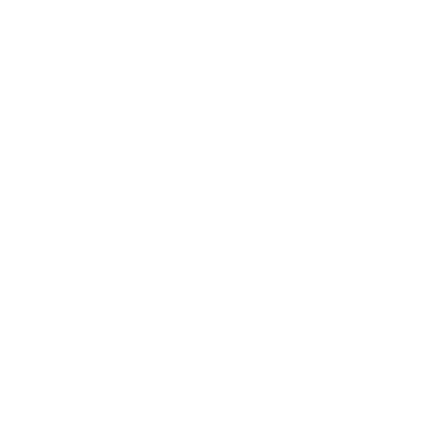

<!-- 来源: https://tianfu-ai.com/ -->
<!-- 抓取时间: 2026-05-29T10:04:30.111Z -->
<!-- 工具: guanlan_read -->
<!-- 图片: 2/2 张已下载 -->

Title: Tianfu Agent — AI 命理推演引擎 | 紫微斗数·八字·奇门遁甲

URL Source: https://tianfu-ai.com/

Published Time: Mon, 25 May 2026 08:10:35 GMT

Markdown Content:
## Questions you've probably asked yourself more than once

At critical moments, see your situation clearly

### Exploring Possibilities

## Should I stay the course,

or seek a new horizon?

The noise is loud, but the light in you never went out. See the energy others overlook, align your gifts with opportunity, and step onto the trajectory that's truly yours.

Potential Discovery·Trend Analysis·Timing Advice

### Relationship Insight

## Soulmates,

or a trial written by fate?

Move beyond a single label for the relationship. Deconstruct how energy fields interweave and reshape each other. See the hidden bonds and the moments of sudden clarity — about yourself, about others, about the quiet confidence rising from the depths of uncertainty.

Energy Match·Bond Depth·Communication Window

### Risk and Opportunity

## Dodge the hidden reefs,

or sail blindly into the storm?

Fate promises no smooth road, nor sets traps on purpose. Illuminate the brilliance and undercurrents ahead, so at life's critical junctures you can see when to ride the momentum and when to step back wisely.

Risk Alerts·Opportunity Capture·Cycle Awareness

## Think like a master. Deliver like an engineer.

A multi-agent AI analysis system

Replicating master-level reasoning, blending social reality with cosmic timing. Through every experience and choice along your life's journey, it finds the one and only you. Multiple specialized AI agents work in concert, pursuing rigor and transparency at every step of reasoning.

### Three Systems, Every Step Verified

Zi Wei Dou Shu · Ba Zi · Qi Men Dun Jia — three systems, cross-validated. 250+ specialized tools for core metaphysical analysis.

Divination Systems

Custom Interpretation Tools

#### Zi Wei Dou Shu

Ziwei Doushu

Traditionally attributed to the Song-dynasty Daoist scholar Chen Tuan (Chen Xiyi), Zi Wei Dou Shu synthesizes classical Chinese astrology. Its texts were refined and widely circulated through the Ming and Qing dynasties. The stars in this system are not astronomical bodies but personified symbols of Yin-Yang and the Five Elements. With its vast framework and rigorous logic, it excels at nuanced psychological profiling and detailed depiction of life’s varied circumstances, earning the reputation of a “subtly transformative” predictive art.

#### Ba Zi

Bazi (Four Pillars)

The most widely practiced destiny-analysis system in China. Originated with Li Xuzhong in the Tang dynasty and perfected by Xu Ziping in the Song dynasty, who established the Day Master (the heavenly stem of the birth day) as the central axis, combined with the hour pillar for a complete analytical framework—hence the name “Ziping Ba Zi.” It is essentially a temporal algebra built on the ancient Stem-Branch calendar and the Five-Element interaction model, characterized by a high degree of abstraction and macro-level generalization.

#### Qi Men Dun Jia

Qimen Dunjia

One of China’s most renowned classical systems for prediction and strategic decision-making. Unlike Zi Wei and Ba Zi, which focus on the longitudinal trajectory of an individual’s “innate timeline,” Qi Men Dun Jia operates on a three-dimensional holographic matrix (the board) built upon a “specific space-time cross-section.” It constructs a dynamic model comprising the Heaven, Earth, Human, and Spirit plates to harness space-time energy and identify optimal timing, direction, and strategy.

Beyond interpretation — it's about reasoning

Tianfu Engine's core capabilities — from Agent collaboration and visual reasoning to hallucination suppression and knowledge tracing — build a rigorous metaphysical analysis loop.

## Frequently Asked Questions

About Tianfu Agent's methodology, usage, and data security

## Ready to explore your destiny chart?

Start a truly in-depth destiny analysis conversation

Tianfu Agent

Chart. Reason. Insight — transparent and traceable destiny analysis.

© 2026 DestinyLinker Technology Limited. All rights reserved.

