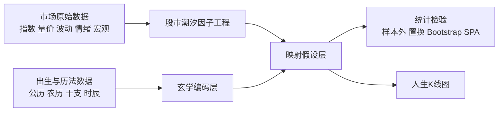
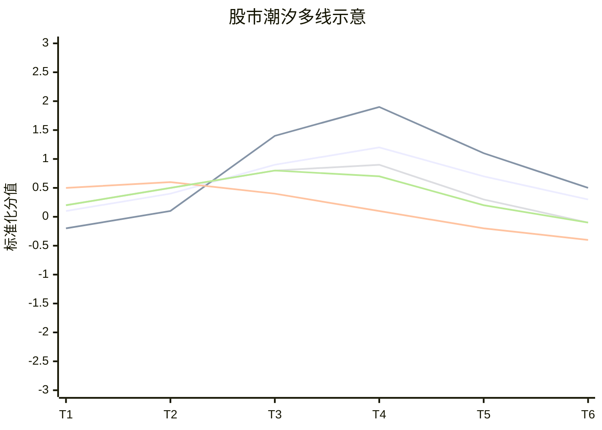
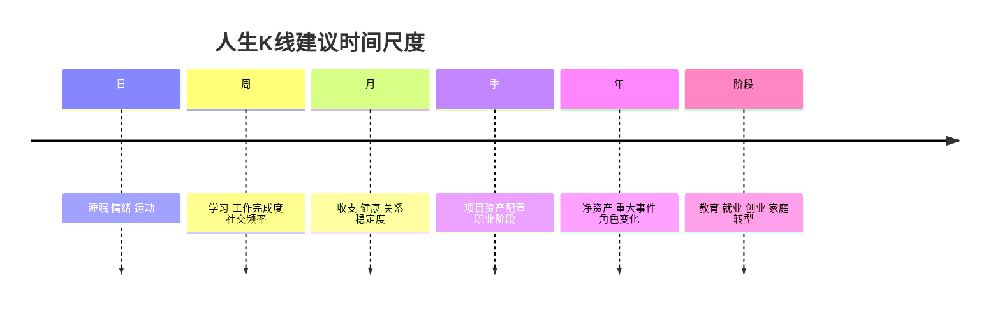

# 股市潮汐与人生K线图的可量化研究框架

## 执行摘要

“股市潮汐”并不是标准金融学术语，但它可以被严格地操作化为一个**多维、分层、可回测**的市场状态系统：至少应同时刻画价格趋势、波动压力、流动性、市场广度、量价结构、情绪、宏观金融条件，以及更慢变量的风格/因子暴露。金融文献和官方数据体系已经分别为这些维度提供了成熟抓手，例如上证综指和标普500这类整体市场指数、VIX 这类前瞻波动指标、Amihud 流动性指标、Advance/Decline 广度、AAII 情绪调查、NFCI 金融条件指数，以及 Fama-French 因子库；多尺度上，则可以用小波分解、状态空间模型和隐马尔可夫/切换模型把“潮涨—过渡—潮落”从单一折线扩展为多条线与多状态概率。 citeturn34view0turn21search1turn21search7turn37view2turn37view5turn36view3turn37view3turn36view2turn38view0turn38view2turn40view0

东方玄学部分也可以转换为**可编码但未必已被证实有效**的符号特征系统。八卦可编码为阴阳爻的二进制结构，八字可编码为四柱天干地支、五行分布、十神关系与流年/大运序列，紫微斗数可编码为十二宫、十四主星、四化与辅助星/神煞配置，神煞可编码为规则触发型布尔特征或计数特征。现代量化研究者对传统术数的一个关键主张是：先把测量方法、问卷或特征字典固定，再讨论信度与效度；而现有有限实证证据中，至少有一项紫微斗数研究在 243 名大学生样本上未发现其与已建立信效度的心理量表存在相关。换言之，**玄学可编码，不等于玄学已被统计学验证为稳定的预测机制**。 citeturn36view1turn36view0turn9search1turn9search3turn34view3turn36view7

因此，本报告给出的核心方法论是：把“股市潮汐”定义为**经验层**，把八卦、八字、紫微、神煞、五行定义为**符号层**，二者之间只通过预先声明的映射假设、相似度/回归/因子分析/机器学习等算法联系起来，并通过样本外测试、时间序列交叉验证、置换检验、Reality Check、SPA、Step-SPA、PBO 和 Deflated Sharpe Ratio 等程序来防止“看起来很神、其实只是数据挖掘”的错觉。 citeturn37view8turn37view10turn34view2turn38view3turn38view7turn38view4turn38view5

本报告中未由用户指定的事项，均明确标注为**未指定**：具体市场、研究时间范围、出生样本、样本数量、出生地、性别、是否校正真太阳时、是否允许机器学习模型、起卦规则版本、神煞规则版本。  

## 研究边界与方法

本研究采取“双层框架”。第一层研究**市场可观测变量**，目标是把“潮汐”从比喻改写成指标体系；第二层研究**玄学可编码变量**，目标不是先验承认其真，而是把它们转成可检验的结构化特征，再用统计学检验它们是否对市场状态或人生轨迹提供增量信息。这个路径与传统术数量化研究中“先制定测量方法、再做信度与效度研究”的思路一致。 citeturn34view3turn36view7

公开市场示例，建议优先使用**上证综指**与**标普500**。上证综指由上海证券交易所上市的符合条件股票与存托凭证构成，反映上交所上市公司的整体表现；标普500则被 FRED 描述为美国大型股的重要市场代表。历史日频/周频/月频下载可使用 Yahoo Finance，机构级研究可使用 Wind 金融终端与 Bloomberg Terminal，它们都明确提供多资产、实时/历史数据与分析工具。 citeturn34view0turn21search1turn21search9turn36view5turn36view4

如果要把本研究直接落地到文档、看板或代码仓库，建议先用 Mermaid 固定“数据—编码—映射—验证—可视化”的总流程：



研究对象的默认数据层级建议如下：**市场频率**以日/周/月为主；**人生频率**以月/季/年为主；**玄学动态频率**以流年/大运或事件触发为主。若出生时辰缺失，则四柱的时柱与紫微时宫信息均应标记为**未指定**，实现时可选择“12 时辰枚举并形成不确定性带”，而不是伪造一个确定值。干支历与农历转换在实现上可使用基于天文历算法的库，例如 sxtwl；该库也将“真太阳时”作为可选能力暴露给实现者，因此本报告把“是否校正真太阳时”定义为一个显式参数，而不是默认真理。 citeturn36view0turn36view6

## 股市潮汐的数据维度与多线绘制

要把“潮汐”真正画出来，最重要的不是先挑一个神秘总分，而是先把不同维度的**线**分开画清楚。市场切换模型研究表明，金融时间序列常存在不同动态特征的状态区间；小波研究又说明，市场波动和周期在不同时间尺度上并不相同。因此，“潮汐”天然适合做成**多因子、多时间窗、多尺度**的多折线系统，而不是单线拟合。 citeturn38view2turn40view0turn38view0

| 维度 | 可量化指标 | 公开/机构数据 | 对“潮汐”的含义 | 主要依据 |
|---|---|---|---|---|
| 价格趋势 | 对数收益、EMA20/60 差、60日/120日动量、价格相对 VWAP 的偏离 | 上证综指、S&P 500、Yahoo Finance、Wind、Bloomberg | 表示“潮向”；正向上行、负向回落 | 上证综指与标普500可作为整体市场代表，Yahoo Finance 提供历史数据，Wind/Bloomberg 提供多资产与分析能力；VWAP 为成交量加权均价。 citeturn34view0turn21search1turn21search9turn36view5turn36view4turn24search2 |
| 波动压力 | 20日实现波动率、ATR%、VIX 或同类隐含波动率 | Cboe、OHLC 数据 | 高波动常对应“退潮”或高风险冲浪区 | VIX 设计目标是度量由 S&P 500 期权价格传递的未来 30 天预期波动；ATR 是基于真实波幅的平均范围指标。 citeturn21search7turn21search11turn24search3 |
| 流动性 | 换手率、成交额、Amihud ILLIQ、价量冲击比 | 交易所统计、OHLCV、Wind/Bloomberg | 流动性收缩时，退潮期的跌落会更急 | Amihud 证明预期市场非流动性与超额收益正相关，说明流动性是核心状态维度。 citeturn37view2 |
| 市场广度 | Advance/Decline Line、AD Ratio、McClellan Oscillator、上涨/下跌家数 | 交易所/终端广度数据 | 看“到底是指数在涨，还是大多数股票都在涨” | A/D Line 是上涨家数与下跌家数差值的累计；McClellan 属于基于上涨/下跌家数差的广度指标。 citeturn37view5turn23search15turn23search24 |
| 量价结构 | OBV、VWAP 带、Keltner 通道、Volume-Weighted MACD | OHLCV | 检查趋势是否被真实成交支持 | OBV 用上涨日加量、下跌日减量来衡量买卖压力；Keltner 通道用 ATR 作为均线带宽。 citeturn37view6turn24search2turn37view7 |
| 风格/因子 | 市场、规模、价值、盈利、投资、动量；A股可加趋势因子 | Kenneth French Data Library、A股研究因子库 | 表示“潮水偏爱哪类船” | Kenneth French 提供 U.S. 因子回报；五因子模型刻画规模、价值、盈利、投资；动量因子有明确定义。中国市场研究还提出价格与成交量多期限组合的趋势因子。 citeturn36view2turn37view1turn37view0turn40view2 |
| 情绪 | AAII 多空差、情绪扩散率、新闻不确定性 | AAII、EPU、新闻文本 | 情绪过热或恐慌往往对应潮头/潮尾 | Baker-Wurgler 将投资者情绪定义为无法被当下事实支持的未来现金流/风险信念；AAII 持续收集投资者情绪；EPU 用新闻文本测量政策不确定性。 citeturn37view4turn36view3turn29search10turn29search6 |
| 宏观金融条件 | NFCI、利率曲线、信用利差、流动性条件 | FRED、央行/终端 | 表示“外海风向与海床水位” | NFCI 汇总货币、债务、股权市场及传统/影子银行条件，正值表示条件较平均更紧。 citeturn37view3 |

在工程上，我建议把“股市潮汐”拆成四类图层同时画：**因子线**、**时间窗线**、**多尺度线**、**状态概率线**。因子线用于同时画趋势、波动、流动性、广度、情绪、宏观；时间窗线用于同一指标画 5/20/60/120/250 日；多尺度线用于画小波分解后的短周期、中周期、长周期成分；状态概率线则由 HMM 或状态空间模型给出“牛市/震荡/风险”概率。小波变换的多分辨率特性、状态切换模型对不同市场状态的刻画，以及状态空间模型对滤波与区间预测的能力，都适合这类图。 citeturn38view0turn38view2turn40view0turn37view9turn16search20

一套可直接落地的默认可视化参数如下。原始价格或指数放在**右轴**，所有因子线先做滚动 252 日标准化后放在**左轴**。综合潮汐线建议用黑色实线、线宽 2.6；趋势线用蓝色实线；波动压力线用红色虚线；流动性线用紫色点划线；广度线用绿色实线；宏观金融条件线用棕色点线；玄学共振线永远放**次级面板或灰阶副轴**，避免与经验层混淆。平滑优先用 EMA 或状态空间滤波；若要加入置信区间，建议对综合潮汐分数做移动区块 bootstrap，给出 95% 区带，而不是只画一根“神准主线”。区间估计与 resampling 在 SciPy 的统计工具中都有现成实现。 citeturn37view10

一个示意性的多线图可以写成 Mermaid 代码，直接嵌入报告或知识库：



若要形成单一综合分数，可用如下结构：

\[
\text{Tide}_t = \sum_{i=1}^{m} w_i z_{i,t}, \quad \sum_i w_i =1
\]

其中 \(z_{i,t}\) 是第 \(i\) 个维度的滚动标准化值。推荐三种权重方案：**等权**适合基础版；**PCA/FA 权重**适合结构提纯；**滚动信息系数权重**适合研究级，但只允许在训练集内估计。PCA 与 FA 都是成熟的降维/潜因子方法。 citeturn16search1turn37view11

## 东方玄学要素的编码框架

从研究角度看，东方玄学最适合被当作**规则系统**而不是“不可言说的直觉”。《说卦》本身就把八卦处理成一套可排列、可错综、可逆数的符号结构；干支系统则提供了明确的十天干、十二地支、六十甲子、十二时辰与年干定月干、日干定时干的对照规则。这意味着：至少在“输入—编码”这一层，八卦、八字、五行是完全可以程序化的。 citeturn36view1turn36view0

| 体系 | 需要输入 | 可编码要素 | 时间/出生信息需求 | 未指定项 | 主要依据 |
|---|---|---|---|---|---|
| 八卦 | 事件时点、研究时点，或自定义起卦时间；也可不依赖出生信息 | 三爻阴阳可记为 3-bit；两经卦可拼成 6-bit 六十四卦；可附先天/后天序号与五行标签 | 若用于“时点占断”，需要具体时间；若纯结构映射，可只用类别编码 | 起卦规则、先天/后天采用方式均**未指定** | 《说卦》写明八卦的定位与相错关系；后世注疏将八纯卦对应到五行，如乾金、坎水、艮土、震木、巽木、离火、坤土、兑金。 citeturn36view1turn27search2turn7search3 |
| 八字 | 公历出生年、月、日、时；实现上还应保存时区、历法版本 | 四柱天干地支 one-hot、阴阳、五行计数、日主、十神、刑冲合会、流年/大运索引 | 最低需要出生到“时”；若无时辰，可做 12 时辰枚举；年/月/日/时干支转换有明确历法规则 | 出生地、性别、真太阳时开关、大运流派均**未指定** | 香港天文台给出干支、十二时辰及年干定月干/日干定时干关系；量化研究已把八字当作可设计问卷与指标的对象；sxtwl 提供天文历法实现与真太阳时支持。 citeturn36view0turn34view3turn36view6 |
| 紫微斗数 | 农历出生年、月、日、时，常还要性别；部分系统加入出生地/真太阳时 | 十二宫位、十四主星、辅星、四化、诸神煞、大小限/流年状态 | 至少要年/月/日/时；通常还要农历转换 | 性别、出生地、校时规则、采用流派均**未指定** | 紫微斗数通常以农历出生年、月、日、时排盘，命盘分十二宫，并以十四主星为核心；博物馆与公开课程资料也明确列出十二宫、主星、辅星、神煞和流年。 citeturn9search1turn9search3turn7search5 |
| 神煞 | 通常基于四柱干支，或紫微盘中星曜/宫位组合 | 规则触发布尔变量、计数变量、吉/凶分类、版本号 | 与八字/紫微输入绑定 | 采用哪些神煞、规则字典版本均**未指定** | 相关研究与应用资料表明，神煞常作为八字或紫微的附加层；但不同流派使用范围与权重差异很大，因此最应版本化。 citeturn30search2turn30search6turn31search1 |
| 五行 | 由天干、地支、八卦、宫位或自定义映射得到 | 木火土金水计数、阴阳拆分、平衡指数、相生相克邻接矩阵 | 可静态用于出生盘，也可动态用于流年/流月 | 映射版本、季节权重均**未指定** | 天干、地支与五行有固定对应；五行还可形成相生相克图，用作可计算的关系矩阵。 citeturn11search0turn11search6turn27search3 |

最重要的编码原则有三条。第一，**历法版本必须固定**，因为农历/节气/干支换算会直接影响所有后续特征。第二，**规则字典必须版本化**，尤其是神煞、十神强弱、喜忌、紫微流派差异。第三，**先保存原始结构特征，再决定是否压缩成分数**；不要在第一步就把复杂结构揉成一个“玄学总能量”。这个建议与传统术数量化研究强调的“先测量、后验证”相一致。 citeturn34view3

还必须明确一个研究边界：玄学编码层目前更像“可工程化的文化符号”，而不是“已经被稳定证实的预测变量”。已有紫微斗数研究在心理量表验证上给出了**无显著相关**的结果，这提醒我们：文化解释价值与统计预测价值必须分开讨论。 citeturn36view7

## 映射假设、算法与统计检验

市场数据与玄学要素之间，不应只做一种“神秘对应”，而应同时写出多种**竞争性映射假设**。否则你既无法证伪，也无法判断结果究竟来自真实结构，还是来自后验解释。数据挖掘偏差、模型筛选偏差和回测过拟合在金融研究里是老问题；在“股市 + 玄学”这类变量极多、规则极多、解释空间极大的问题上，更应当先假设自己会过拟合。 citeturn34view2turn38view3turn38view4turn38view5

| 映射假设 | 映射逻辑 | 可用特征 | 算法 | 验证与检验 |
|---|---|---|---|---|
| 周期同构假设 | 把市场的多维状态切换映射为八卦/五行的离散状态 | 趋势、波动、流动性、广度、宏观条件；八卦 3-bit/6-bit，五行计数 | HMM/马尔可夫切换先识别 bull/bear/transition，再用规则把状态映射到八卦或五行标签 | 看状态稳定性、转移概率、样本外命中率，并用置换检验判断离散映射是否优于随机分配。 citeturn38view2turn40view0turn37view10 |
| 能量相似假设 | 市场因子向量与“五行能量向量”之间存在方向相似性 | 市场因子 z-score 向量；五行计数/平衡向量 | 余弦相似度、欧氏距离、动态时间规整 | 余弦相似度可直接计算，显著性可用滚动窗口 + 区块置换。 citeturn37view14turn37view10 |
| 潜因子投影假设 | 市场与玄学都只是更深层潜在结构的表征 | 多条市场线 + 八字/紫微原始编码特征 | PCA、FA、层次聚类 | 看主成分/潜因子是否稳定、是否跨样本复现、是否能解释额外方差。 citeturn16search1turn37view11 |
| 可预测增量假设 | 玄学特征能否在基准市场模型之上提供增量预测 | 基准市场因子 + 玄学编码特征 | 线性/岭回归、Logistic Regression、Random Forest | 只允许时间序列样本外验证；用 TimeSeriesSplit、AUC/RMSE、置换检验，比较“有玄学特征”与“无玄学特征”的增量。 citeturn37view8turn37view13turn37view12turn37view10 |
| 规则事件假设 | 某些神煞/流年/宫位触发点对应极端行情或人生事件 | 神煞触发、流年切点、紫微化星、市场极值/人生里程碑 | 事件研究、二项检验、异常收益/异常事件率分析 | 当规则很多时，必须做 White RC、SPA 或 Step-SPA，防止“总能挑到一个准的”。 citeturn34view2turn38view3turn38view7 |

如果你要把这些映射真正做成研究，而不是做成故事，建议采用如下验证顺序。首先，所有模型都必须有**无玄学基准模型**；任何“玄学有效”的说法，都必须表现为对基准模型的样本外增量。其次，时间序列性质要求你只能用**时间顺序交叉验证**，而不能打乱数据随机抽样。再次，显著性不能只看一个普通 p 值，因为在大规模搜索下，数据重用会把“偶然好结果”放大。White 的 Reality Check 直接就是为这种情形提出的；Hansen 的 SPA 则更有力、对无关差模型不那么敏感；Step-SPA 进一步适合大规模技术规则筛选。 citeturn37view8turn34view2turn38view3turn38view7

最后，还要做两道更严格的防线。**PBO** 用来评估回测过拟合的概率；**DSR** 用来对多重试验与非正态收益造成的性能膨胀做修正。如果某个“玄学映射策略”在普通回测里很漂亮，但经不起 PBO 或 DSR，大概率只是试出来的，不是真的稳。 citeturn38view4turn38view5

在实践排序上，我建议优先级是：**相似度/线性基准 → PCA/FA → Logistic/树模型 → 复杂状态切换与组合规则搜索**。原因很简单：越靠前的模型，越容易解释，也越容易辨别“是否真的有增量信息”；越靠后的模型，越容易把研究做成玄学版 AutoML。  

## 人生K线图指标体系

“人生K线图”如果要严谨，不能只是把年龄横轴化，然后随手画几根“命运线”。金融里的 K 线本质上是一个周期内的 **Open、High、Low、Close**；因此人生 K 线也应围绕一个可重复计算的“人生资本”收盘值建立，再把机会与风险转成高低影线。传统术数量化研究已经尝试把婚姻、财帛、子女等命理主题做成问卷结构，这启发我们：人生 K 线最适合做成**客观数据线 + 主观量表线 + 玄学副线**的混合面板。 citeturn34view3

| 线名 | 含义 | 计算公式 | 数据来源 | 时间尺度 | 解读规则 |
|---|---|---|---|---|---|
| 事业线 | 职业成长与项目成果 | \(z(\text{职位层级}) + z(\text{项目完成度}) + z(\text{专业输出})\) 的加权和 | 工作日志、项目系统、履历数据 | 月 / 季 / 年 | 上升表示职业势能增强；若伴随高波动，表示“高机会高消耗” |
| 财富线 | 可支配财富与财务安全 | \(0.5 z(\text{净资产}) + 0.3 z(\text{储蓄率}) + 0.2 z(\text{现金跑道}) - z(\text{债务压力})\) | 账本、券商、银行、资产负债表 | 月 / 季 / 年 | 趋势比点值更重要；高位但流动性差并不稳 |
| 健康线 | 生理与生活质量 | \(z(\text{睡眠}) + z(\text{运动}) + z(\text{恢复}) - z(\text{健康风险})\) | 可穿戴设备、体检、健康记录 | 周 / 月 / 季 | 这是人生“底仓线”；长期向下，其他线的解释应降权 |
| 关系线 | 亲密关系、家庭与社会支持 | 关系满意度、社交支持、陪伴时长、冲突频率的组合分数 | 周记、问卷、沟通日志 | 月 / 季 | 对职业和财富有缓冲作用，适合作为解释变量也适合作为被解释变量 |
| 成长线 | 学习、认知与技能累积 | 学习时长、证书/作品、阅读/训练、技能阶段评分 | 学习平台、笔记系统、作品库 | 周 / 月 / 季 | 是“长期复利线”，常领先事业线 |
| 自由度线 | 时间、地点与选择权 | 现金月数、自由时间、职业可迁移性、地理流动性 | 财务数据、日历、工作形态 | 月 / 季 / 年 | 它类似人生的“流动性线” |
| 玄学共振线 | 出生编码与流年/大运/流限的符号层变化 | 基于八字/紫微/神煞的规则打分，单独归一化 | 出生信息与历法编码；当前用户样本为**未指定** | 年 / 十年 / 人生阶段 | 必须单独显示，不直接并入经验层主分数；只做辅助解释 |
| 综合收盘线 | 当前周期“人生资本”收盘值 | \(C_t = \sum_j \omega_j L_{j,t}\) | 上述各线 | 月 / 季 / 年 | 这是人生 K 线的 Close，权重可自定义、等权或由 PCA 导出 |

建议把人生 K 线的 **OHLC** 定义为：

\[
O_t = C_{t-1}
\]

\[
C_t = \sum_j \omega_j L_{j,t}
\]

\[
H_t = C_t + \max(0,\ \text{机会分}_t + \text{上行区间}_t)
\]

\[
L_t = C_t - \max(0,\ \text{风险分}_t + \text{下行区间}_t)
\]

其中，“机会分”可以来自事业机会、资产配置机会、学习机会；“风险分”可以来自健康压力、债务压力、冲突频率、宏观逆风；“上行/下行区间”则可来自 bootstrap 区间或主观不确定性打分。这样画出的 K 线才是真正的“人生 OHLC”，而不是把月收入折线硬叫 K 线。区间估计可以用 bootstrap。 citeturn37view10

为了防止“玄学副线夺走主线的因果解释权”，我建议遵守一条铁律：**经验层先解释，玄学层后补充**。如果事业线、财富线、健康线已经对综合人生资本提供了充足解释，那么玄学共振线只能作为叙事增强层；若二者冲突，以经验层为准。

人生多线图也可以用 Mermaid 先做结构示意：

```mermaid
xychart-beta
    title "人生多线示意"
    x-axis [18岁, 25岁, 32岁, 39岁, 46岁, 53岁]
    y-axis "标准化分值" -3 --> 3
    line "事业线" [-0.5, 0.2, 1.0, 1.5, 1.3, 1.1]
    line "财富线" [-1.0, -0.2, 0.8, 1.4, 1.8, 1.9]
    line "健康线" [1.0, 0.8, 0.6, 0.3, 0.1, -0.2]
    line "成长线" [0.6, 1.0, 1.3, 1.2, 1.0, 0.9]
    line "综合收盘线" [0.0, 0.4, 0.9, 1.1, 1.0, 0.9]
```

若要在文档里加时间尺度说明，建议再附一段时间线：



## 实施方案、伪代码与风险说明

真正落地时，建议分成三档做，而不是一上来就“全量玄学 + 全量机器学习”。

| 方案 | 复杂度 | 数据与方法 | 适合回答的问题 | 主要风险 |
|---|---|---|---|---|
| 基础版 | 低 | 上证综指/标普500 + OHLCV + VIX/NFCI/AAII；八字只做四柱与五行计数；等权综合、相关/事件研究、简单样本外 | “股市潮汐能否被多维线条清楚表达？”“五行计数是否与某类市场状态同向波动？” | 指标可能过粗，容易出现叙事大于证据 |
| 进阶版 | 中 | 增加广度、OBV、因子库、A股趋势因子；八字加入十神/刑冲合会；紫微加入十二宫/十四主星；PCA/FA + HMM + 时间序列交叉验证 | “哪组经验层 + 玄学层组合最稳？”“多尺度上是否有更强对应？” | 变量膨胀，解释复杂度上升 |
| 研究级 | 高 | 多市场面板、预注册假设、版本化神煞规则、区块 bootstrap、White RC、SPA、Step-SPA、PBO、DSR、盲法样本外验证 | “玄学编码是否对市场/人生目标有可复制的增量解释力？” | 数据挖掘、选择偏差、伦理与隐私压力最大 |

可操作的实施步骤，我建议按下面顺序走。

首先，固定研究问题与预测目标。目标不要写成“证明玄学有用”，而应写成“在给定目标 \(y\) 上，玄学编码是否在基准经验层模型之外提供样本外增量”。

其次，固定样本边界。至少写清楚：市场 = **未指定**，默认上证综指/标普500；样本期 = **未指定**，建议先从一个完整牛熊周期开始；出生样本 = **未指定**；是否使用机器学习 = **未指定**，因此应先跑可解释基准，再决定是否扩到 ML。

再次，建立可复现数据层。市场层按日频对齐；人生层按月/季/年对齐；玄学层把“固定出生盘特征”和“动态流年/大运特征”分开存。

然后，做编码与标准化。市场因子统一 winsorize 后 rolling z-score；玄学层优先保留原始 one-hot、计数、邻接关系，再视需要压缩为几个主题因子。

接着，先画图再建模。图阶段就要生成：原始价格、趋势线、波动线、流动性线、广度线、综合潮汐线，以及可选的 HMM 概率线。人生层同理，先画事业/财富/健康/成长/综合线，再谈 K 柱。

之后，才进入映射建模。务必从最简单的相似度、线性模型和 PCA/FA 开始，最后才做随机森林、状态切换和规则搜索。

再之后，做严格检验。时间序列必须用按时间递进的切分；大量规则或大量参数搜索必须做 RC、SPA 或 Step-SPA；性能指标必须附 bootstrap 或置换检验区间；策略型结论必须附 PBO/DSR。

最后，写解释时强制分层。任何结论都要写清楚：这是经验层发现，还是符号层发现；是样本内发现，还是样本外发现；是统计显著，还是仅仅视觉上好看。 citeturn37view8turn34view2turn38view3turn38view7turn38view4turn38view5

下面给出一版便于实现的伪代码。第一段是“股市潮汐”：

```python
# 输入：市场数据 df，至少包含 close/high/low/volume
# 可选：vix, nfci, aaii, epu, breadth, factor_returns

df["ret_1d"] = log(df["close"] / df["close"].shift(1))
df["mom_60"] = df["close"] / df["close"].shift(60) - 1
df["ema_20"] = EMA(df["close"], 20)
df["ema_60"] = EMA(df["close"], 60)
df["ema_gap"] = df["ema_20"] / df["ema_60"] - 1
df["atr_pct"] = ATR(df["high"], df["low"], df["close"], 14) / df["close"]
df["vwap_dist"] = df["close"] / VWAP(df) - 1
df["obv"] = OBV(df["close"], df["volume"])
df["obv_slope"] = slope(df["obv"], 20)
df["illiquidity"] = abs(df["ret_1d"]) / df["dollar_volume"]

# 若有广度、情绪、宏观数据
df["breadth_z"] = rolling_zscore(df["ad_ratio"], 252)
df["sentiment_z"] = rolling_zscore(df["aaii_bull_bear_spread"], 252)
df["macro_z"] = -rolling_zscore(df["nfci"], 252)   # 越宽松越偏正

# 基础分层
df["trend_line"] = (
    0.5 * rolling_zscore(df["ema_gap"], 252)
  + 0.3 * rolling_zscore(df["mom_60"], 252)
  + 0.2 * rolling_zscore(df["vwap_dist"], 252)
)

df["vol_line"] = -(
    0.6 * rolling_zscore(df["atr_pct"], 252)
  + 0.4 * rolling_zscore(df["vix"], 252)
)

df["liq_line"] = (
   -0.6 * rolling_zscore(df["illiquidity"], 252)
   +0.4 * rolling_zscore(df["turnover"], 252)
)

df["breadth_line"] = 0.7 * df["breadth_z"] + 0.3 * rolling_zscore(df["obv_slope"], 252)
df["macro_line"] = df["macro_z"]
df["sent_line"] = df["sentiment_z"]

# 综合潮汐
weights = {
    "trend_line": 0.25,
    "vol_line": 0.20,
    "liq_line": 0.15,
    "breadth_line": 0.15,
    "macro_line": 0.15,
    "sent_line": 0.10
}
df["tide_close"] = sum(weights[k] * df[k] for k in weights)

# 置信区间
df["tide_ci_low"], df["tide_ci_high"] = block_bootstrap_ci(
    series=df["tide_close"], block=20, alpha=0.05
)
```

第二段是“玄学编码 + 映射验证”：

```python
# 示例出生信息，仅演示，非用户本人
birth = {
    "date": "1990-06-15",
    "time": "08:30",
    "place": "北京",
    "gender": "男",
    "true_solar_time": False
}

# 玄学编码
ganzhi = convert_to_ganzhi(birth)                # 年月日时四柱
bazi_vec = encode_bazi(ganzhi)                   # one-hot + 五行计数 + 十神 + 结构关系
wuxing_vec = encode_wuxing(ganzhi)
bagua_vec = encode_bagua_from_time_or_rule(birth)  # 若采用时点法
ziwei_vec = encode_ziwei(birth, calendar="lunar")  # 12宫/14主星/四化
shensha_vec = apply_shensha_rules(ganzhi, version="v1")

mystic_vec = concat([bazi_vec, wuxing_vec, bagua_vec, ziwei_vec, shensha_vec])

# 映射目标：例如下一期市场状态 / 下一年人生阶段评分
X_base = market_features
X_full = concat([market_features, mystic_vec_repeated_over_time])
y = target_label_or_value

for train_idx, test_idx in TimeSeriesSplit(n_splits=5).split(X_base):
    base_model = fit_logistic_or_ridge(X_base[train_idx], y[train_idx])
    full_model = fit_logistic_or_ridge(X_full[train_idx], y[train_idx])

    pred_base = base_model.predict(X_base[test_idx])
    pred_full = full_model.predict(X_full[test_idx])

    compare_oos_metrics(pred_base, pred_full, y[test_idx])

# 若规则集很多，再跑 RC / SPA / Step-SPA
# 若策略型结果很多，再跑 PBO / DSR
```

第三段是“人生 K 线”：

```python
life["career"]   = zscore(career_score)
life["wealth"]   = zscore(wealth_score)
life["health"]   = zscore(health_score)
life["relation"] = zscore(relation_score)
life["growth"]   = zscore(growth_score)
life["freedom"]  = zscore(freedom_score)
life["mystic"]   = zscore(mystic_resonance_score)   # 单独副线

omega = {
    "career": 0.22,
    "wealth": 0.20,
    "health": 0.22,
    "relation": 0.14,
    "growth": 0.12,
    "freedom": 0.10
}

life["close"] = sum(omega[k] * life[k] for k in omega)
life["open"] = life["close"].shift(1)
life["high"] = life["close"] + np.maximum(0, life["opportunity"] + life["upper_ci"])
life["low"]  = life["close"] - np.maximum(0, life["risk"] + life["lower_ci"])
```

风险说明必须写得比模型更长一些，因为这类研究最容易“看出意义”。第一类风险是**统计风险**：时间序列非平稳、多重试验、数据重用和回测优化会系统性抬高“看起来有效”的概率，所以一定要用样本外切分、Reality Check、SPA、Step-SPA、PBO 和 DSR。 citeturn34view2turn38view3turn38view7turn38view4turn38view5

第二类风险是**编码风险**：出生时间误差、时区误差、节气切换点、农历换算、真太阳时开关、神煞字典版本，都可能导致特征在源头上发生改变；如果这些参数不固定，后面的任何显著性都不可靠。 citeturn36view0turn36view6

第三类风险是**解释风险**：当前公开实证证据并不足以把八字、紫微、神煞等视为稳定的科学预测机制；更合理的做法，是把它们视为一种文化语义层、结构假设层或研究变量层，而不是未检验前就把它们当作真因果。至少在紫微斗数上，已有研究显示其与已建构信效度的心理量表并无相关。 citeturn36view7turn34view3

第四类风险是**伦理与隐私风险**：出生时间、健康数据、财务数据、关系数据都属于敏感信息。人生 K 线若要用于个人决策支持，必须坚持最少必要原则、脱敏存储、可撤回授权，并避免用“命中注定”的语言给个体贴标签。  

综合来看，最可执行、也最稳妥的路径是：先用经验层把“股市潮汐”做成一组透明的多线指标，再把八卦、八字、紫微、神煞、五行做成版本化编码特征，最后仅在严格样本外检验下讨论二者是否存在增量对应。也就是说，**先把潮汐画清楚，再谈玄学怎么对标；先把 K 线做实，再谈人生如何叙事**。在这个顺序下，基础版就能产出清晰的多线看板，进阶版能产出可复核的映射研究，研究级方案才有资格谈“人生 K 线图”的统计解释力。