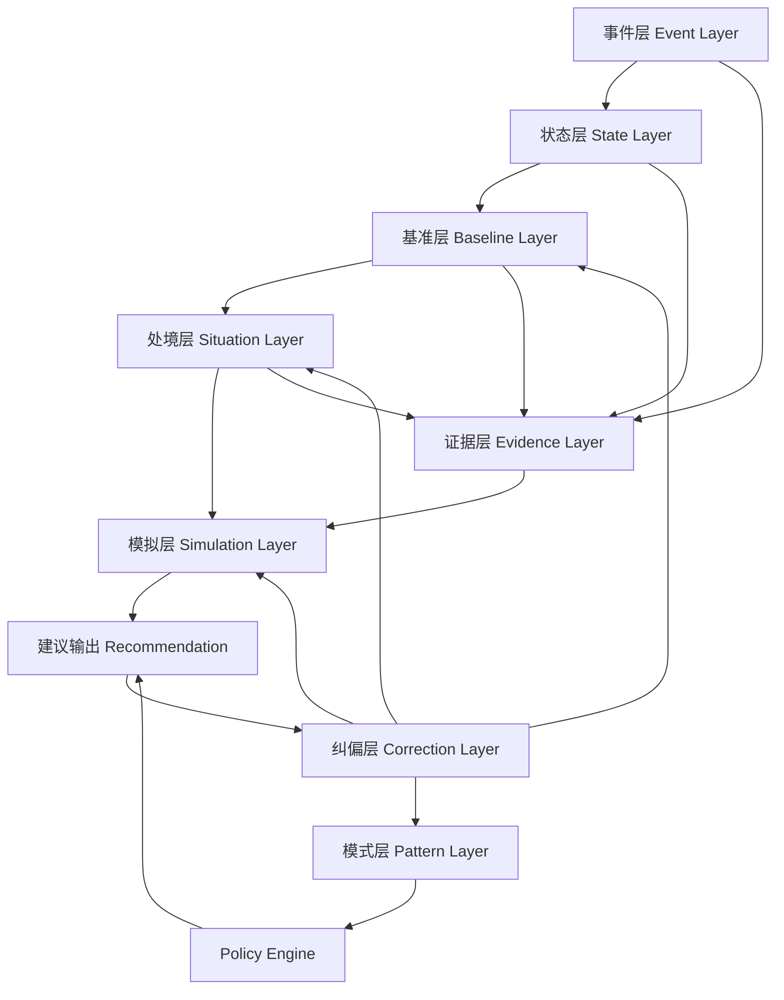
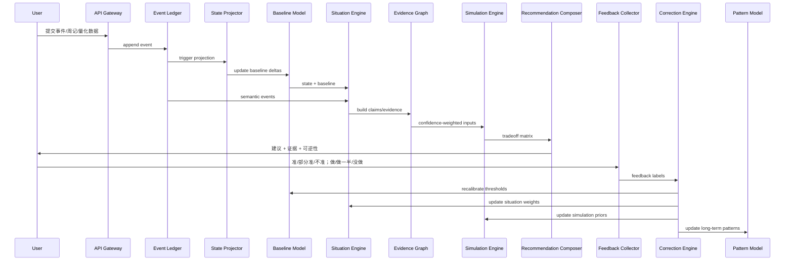
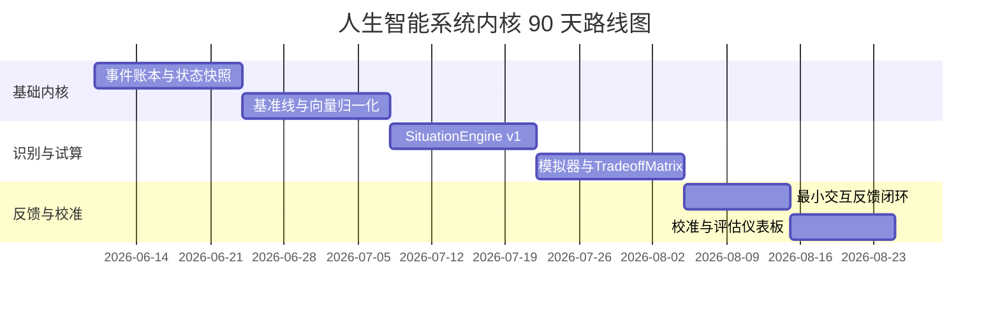
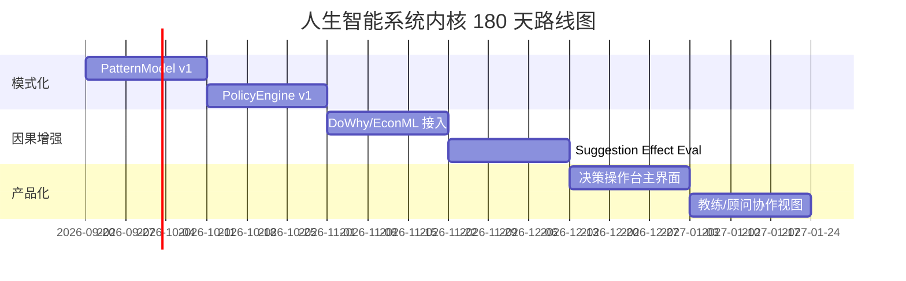
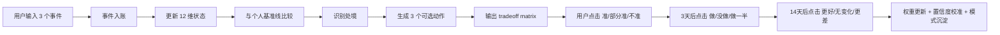

# 人生智能系统内核工程研究与落地计划

> 🔬 **RESEARCH**: 本文档为研究方向，不属于当前 26 周交付范围。8 层内核中 0 层完整实现，4 层有部分基础设施（StateVector/SituationEngine/EvidenceConfidence/CorrectionEngine），4 层完全不存在。等 L2 管道跑通后再评估哪些层需要独立实现。
>
> 执行框架参考：`.trae/rules/execution-framework.md`

## 执行摘要

这份复盘的核心结论是：你们前面已经把“外核”想清楚了——也就是人生 K 线、潮汐、相位、命理副线、可视化壳层、用户直觉入口；但真正决定产品能否从“会说”进化成“会越来越准”的，不是再做一层图，而是把**事件账本、个人基准线、处境识别、选择模拟、证据置信、反馈纠偏、模式沉淀、策略生成**这八件事打成一个可回放、可校准、可审计的内核。此前母文档已经把“现实数据主图、命理副图、行动反馈闭环”定为主线，本报告是在这一主线之上，把“时·位·心”“潮汐/相位/证据链”收敛成一套真正可工程化的内核系统。fileciteturn0file0 fileciteturn0file1

更直接地说，**人生 K 线不是终局，只是冷启动界面**。终局形态应升级为一个“**时·位·心 决策操作台**”或“**Personal Decision Twin 人生决策双生体**”：它不只显示趋势，还要持续记录事件、识别处境、推演选择的多维得失、展示证据链，并通过用户最小反馈持续校准自己。规范性决策理论本来就关心“不确定下如何在多个方案间做选择”，而且必须处理连续决策；因果决策理论进一步强调，真正有价值的，不是相关上的“像是有用”，而是行动的**预期因果后果**。这决定了终局产品不该输出一句“你该怎么做”，而应输出“此时此位此心下，哪些动作的**上行/下行/可逆性/承接力**更合理”。citeturn6view0turn7view2turn7view4

从中国系统观视角看，这个方向也是对的。《系辞下》把系统变化理解为“变动不居”，并强调“六爻相杂，唯其时物也”“同功而异位，其善不同”。这正好说明：同一个指标、同一类事件、甚至同一类能力，在不同时间条件和结构位置里，意义并不相同；因此内核必须把“时”“位”与“心”拆开建模，而不是只做统一分数。citeturn3view2

从工程与研究上看，最可行的落地路径不是先做复杂 AI，而是先做**事件溯源 + 状态快照 + 基准线 + 规则/NLP 处境识别 + 选择试算 + 三按钮反馈 + 概率校准**。这一体系既符合控制论式闭环，也符合现代因果推断与时序评估的最佳实践：时间数据要避免未来信息泄漏，置信度要做校准，解释工具不能被误当成因果证明，因果分析必须显式建模假设、识别、估计与反驳。citeturn0search6turn15view0turn17view1turn38view0turn20academia2

### 立即可执行的 P0 行动项

- 先落 **LifeEventLedger 事件账本 + StateSnapshot 状态快照**，所有建议与结论都必须可回放到原始事件与证据。
- 先实现 **UserStateVector 12 维状态向量 + PersonalBaselineModel**，没有个人基准线，就没有“异常”和“节律”，也就没有真正的“时”。
- 先做 **SituationEngine v1**：规则引擎 + NLP 抽取 + 因果模板，不追求一开始就复杂，只要求可解释、可标注、可修正。
- 先把前端反馈收缩成 **“准 / 部分准 / 不准”** 与 **“做 / 做一半 / 没做”** 两组最小交互，并将其直接接入 CorrectionEngine。
- 命理信号全部退到 **EvidenceConfidenceGraph 的低权重可关闭分支**，默认只做提示，不得主导建议。fileciteturn0file0

## 优先来源与研究方法

按你要求的优先顺序先行筛检后，本报告**实质纳入**的优先来源主要落在四类：其一是中文系统观与“时位”概念的原始文本来源，尤其是 `ctext.org`；其二是竞品边界观察来源，如 `tianfuagent.com`；其三是决策理论、因果模型与方法论来源，主要是 Stanford Encyclopedia of Philosophy、arXiv、DoWhy 与 EconML；其四是工程落地来源，主要是 scikit-learn、LightGBM、SHAP、Microsoft Learn 事件溯源模式，以及近年的 agent memory 论文。`musclewiki.com`、`cbeta.org`、`wikisource.org`、`dila.edu.tw`、`worldbank.org`、`ourworldindata.org`、`openalex.org`、`paperswithcode.com` 及咨询机构站点，本轮要么相关性较弱，要么没有形成比原始论文/官方文档更强的直接证据。citeturn2view0turn2view1turn2view2turn12view0turn12view1turn12view2turn12view3turn19view1turn20academia2turn42view0

你前面提到的 Tianfu Agent 首页标题直接把自己定位成“AI 命理推演引擎 | 紫微斗数·八字·奇门遁甲”。这类产品可以做节点解释、人格叙事、时机提示，但它们通常停留在“解释器”范畴。你们如果要形成真正商业护城河，就必须把重心从“命理生成内容”转向“**用户纵向事件数据 + 处境识别 + 反馈校准**”这套内核；因为后者会形成个人历史、频率、模式与纠偏能力，迁移成本远高于一个会说话的命理引擎。citeturn2view0

此外，本报告将方法论分成三条证据链并交叉验证：第一条是**中国系统观**，用来定义“时、位、心”和“相位/节律/异位异义”的框架；第二条是**决策与因果理论**，用来约束“建议不是相关性讲故事，而是因果后果的估计”；第三条是**软件与机器学习工程**，用来保证整个系统可审计、可回放、可回测、可校准。这样做的目的，是避免系统落回玄学叙事，也避免走向只会算分但不会解释的黑箱。citeturn3view2turn6view0turn7view0turn7view1turn20academia2turn42view0

### 优先参考来源清单

| 类别 | 本轮优先纳入 | 作用 |
|---|---|---|
| 中文系统观 | `ctext.org`、既有母文档 | 定义“时·位·心”、变化、异位、相位 |
| 竞品与边界 | `tianfuagent.com` | 澄清“命理引擎”与“人生操作系统”的差异 |
| 决策与因果 | Stanford Encyclopedia of Philosophy、`arxiv.org`、DoWhy、EconML | 定义选择、因果后果、估计与反驳 |
| 工程与验证 | scikit-learn、LightGBM、SHAP、Microsoft Learn | 定义 CV、校准、解释、事件溯源 |
| 个性化记忆 | MemMachine、MemoryOS、Memoria | 定义短期/长期/画像/证据型记忆层 |
| 低回收筛检 | `musclewiki.com`、`cbeta.org`、`wikisource.org`、`dila.edu.tw`、`worldbank.org`、`ourworldindata.org`、`openalex.org`、`paperswithcode.com`、`mckinsey.com`、`bcg.com`、`pwc.com`、`a16z.com`、`accenture.com` | 本轮未形成比核心来源更高价值的直接证据 |

## 终局定义与内核架构

### 终局定义

产品终局不是“最准的命理报告器”，而是“**最懂这个用户、并且能自我校准的人生决策内核**”。它的本体不是图表，而是一台能够持续处理下面这个循环的机器：

```text
事件 → 状态 → 基准 → 处境 → 选择模拟 → 建议 → 执行 → 反馈 → 校准 → 模式
```

因此，终局形态我建议定义为：

> **人生智能操作系统 LifeOS**  
> **内核名：Personal Decision Twin**  
> **前台名：时·位·心 决策操作台**

其中，K 线仍然保留，但只作为首页摘要；真正的主界面应该是一个“三联屏”：

- **相位屏**：我现在处于什么状态与节律。
- **试算屏**：我现在可选动作的上行/下行/可逆性是什么。
- **证据屏**：系统为什么这样判断，证据强度有多高。

这个升级是必要的，因为规范性决策理论虽然常以效用最大化为框架，但 SEP 也明确指出，异质选项之间的完备可比性本身就有争议，连续决策还会带来新的复杂性；所以终局产品更适合展示**tradeoff frontier**而非单一命令式答案。citeturn6view0

### 商业价值

从商业底层逻辑看，护城河不在“会解释”，而在“**越用越准**”。这会同时带来三个价值层：

| 层级 | 用户价值 | 商业价值 | 护城河来源 |
|---|---|---|---|
| 趋势可见 | 我看见自己在变好还是变坏 | 订阅启动 | 可视化与仪表盘 |
| 决策可试算 | 我知道现在什么选择更稳 | 高留存与高付费意愿 | 选择模拟与处境识别 |
| 系统可纠偏 | 系统记得我、学会我、越来越像我 | 数据飞轮与切换成本 | 反馈校准、事件账本、个人模式 |

用户心智也必须从“它替我算命”转向“**它帮我经营人生系统**”。换句话说，产品要从“解释器”变成“操作台”。

### 时·位·心的内核公式

综合你们之前的母文档，我建议把“时·位·心”正式写成内核公式：

```text
时_t = 时间条件 = {季节/周期/阶段/窗口/外部扰动}
位_t = 结构位置 = {角色/资源/关系位置/风险位置/机会位置}
心_t = 内在状态 = UserStateVector_t

处境_t = F(时_t, 位_t, 心_t, 事件序列_{t-k:t}, 基准线_t)
结果_{t+h} = G(处境_t, 选择_t, 外部扰动_{t:t+h})
命运轨迹 = Σ(结果 + 纠偏 + 模式沉淀)
```

这里最关键的是：**命运不是一个标签，而是一条被事件、选择与反馈反复塑形的轨迹**。这一点既契合你们的母文档，也契合控制论对循环因果和反馈的理解。fileciteturn0file0 fileciteturn0file1 citeturn0search6

### 形态升级阶梯

| 阶段 | 外在形态 | 关键能力 | 是否终局 |
|---|---|---|---|
| 人生 K 线 | 趋势摘要 | 看波动 | 否 |
| 潮汐/相位盘 | 时序节律 | 看阶段 | 否 |
| 证据链报告 | 诊断可解释 | 看为什么 | 否 |
| 选择试算器 | if-then 模拟 | 看代价与机会 | 否 |
| 决策操作台 | 持续运行 | 看当下可做什么 | 近终局 |
| Personal Decision Twin | 自我校准的个体内核 | 持续变准 | 终局 |

### 八层内核架构



### 八层职责、输入输出与接口契约

| 层 | 主要职责 | 核心输入 | 核心输出 | 接口契约 | 主表 |
|---|---|---|---|---|---|
| 事件层 | 接收用户事件、量化数据、外部记录，形成 append-only 账本 | 文本事件、打分、财务/健康/关系记录、命理标签 | 标准化事件 Envelope | `events.append(EventEnvelope) -> EventAccepted` | `life_events` |
| 状态层 | 把事件投影到 12 维状态空间 | 事件流、近窗指标 | `UserStateVector`、容量、熵 | `states.project(user_id, asof)` | `state_snapshots` |
| 基准层 | 建个人“正常值”“季节值”“阶段值” | 历史状态、同周期窗口 | 基准均值、分位、异常阈值 | `baselines.recompute(user_id)` | `personal_baselines` |
| 处境层 | 识别用户当前“到底在什么局里” | 当前状态、基准差分、事件语义、角色位置 | Situation candidates | `situations.infer(snapshot_id)` | `situations` |
| 模拟层 | 对选择做多维得失与可逆性试算 | Situation、可选动作、模式先验 | TradeoffMatrix、推荐顺序 | `simulations.run(situation_id, options[])` | `simulation_runs` |
| 证据层 | 管理支持/反驳/时效/来源权重 | 事件、状态、外部记录、模型输出 | `EvidenceConfidenceGraph`、置信度 | `evidence.build(claims[])` | `evidence_nodes` `evidence_edges` |
| 纠偏层 | 吃用户反馈，做权重更新、校准与退火 | 准确性反馈、执行反馈、结果反馈 | 模块权重更新、校准器更新 | `corrections.learn(feedback_id)` | `feedback_labels` `weight_updates` |
| 模式层 | 沉淀长期相位、触发器与有效策略 | 长窗状态序列、反馈结果 | 模式、政策、触发规则 | `patterns.mine(user_id)` | `patterns` `policies` |

## 核心模块与数据模型

### UserStateVector

我建议把状态层统一成一个 **12 维向量**，维度必须既能被用户理解，又能被后端稳定计算：

| 维度 | 含义 | 典型输入 | 归一化方式 |
|---|---|---|---|
| energy | 生理能量 | 睡眠、疲劳、运动、疼痛 | 相对个人基准 robust z-score |
| recovery | 恢复深度 | 睡眠波动、休息质量、恢复速度 | 反向压力 + 正向恢复打分 |
| emotion | 情绪稳定 | 心情、焦虑、烦躁、冲动 | Likert 映射 + 反向项 |
| clarity | 认知清晰 | 注意力、脑雾、决策困难 | 自评 + 行为 proxy |
| liquidity | 现金流安全 | 收入、支出、储蓄率、跑道 | 分段饱和函数 |
| momentum | 事业推进 | 项目进展、关键产出、成交 | EWMA 目标推进度 |
| support | 关系支持 | 家庭支持、亲密关系、社会支持 | 主客观混合 |
| agency | 自主性 | 自由时间、选择权、依赖度 | 反向依赖 + 正向自主 |
| order | 节律秩序 | 作息规律、日程完成度、环境秩序 | 波动反向分 |
| growth | 成长输入 | 学习、训练、反思、技能输出 | 目标加权 |
| optionality | 可选项空间 | 备选路径数、迁移能力、机会数 | log 变换后归一化 |
| buffer | 风险缓冲 | 现金 buffer、关系 buffer、时间 buffer | 下限敏感函数 |

归一化不建议直接用群体均值，而应优先对照**个人基准**。同样 6.5 小时睡眠，对一个长期 7.8 小时睡眠的人和对一个长期 5.8 小时睡眠的人，不是同一意义；这正是“异位异义”的工程化表达。citeturn3view2

推荐的 v1 归一化公式如下：

```python
def robust_norm(x, median, mad, reverse=False):
    z = (x - median) / (1.4826 * mad + 1e-6)
    score = max(0, min(100, 50 + 12 * z))
    return 100 - score if reverse else score
```

若指标是“负向频次”，例如冲突次数、失眠天数、延期次数，可用指数衰减映射：

```python
def negative_count_norm(count, lam=0.35):
    return 100 * math.exp(-lam * count)
```

最终状态向量不是瞬时值，而是一个短窗平滑值：

```python
State_t = 0.6 * CurrentWindowNorm + 0.3 * EWMA_7d + 0.1 * EventShockAdj
```

### LifeEventLedger

事件层必须采用“账本”而不是“覆盖式日志”。Microsoft 对事件溯源模式的定义非常贴切：不是只保存当前状态，而是把对象经历过的**完整动作序列**存入 append-only 存储，再通过重放或投影得到当前状态；这样做的最大收益是审计性、历史重建与投影灵活性，但也会引入复杂度、版本与一致性要求。citeturn42view0

因此，`LifeEventLedger` 推荐字段如下：

| 字段 | 说明 |
|---|---|
| event_id | 事件唯一 ID |
| user_id | 用户 |
| happened_at | 发生时间 |
| recorded_at | 入账时间 |
| source | self / device / import / metaphysics |
| domain | work / money / health / relationship / family / growth / move |
| event_type | structured code，如 `conflict`, `sleep_drop`, `new_offer` |
| narrative | 原始叙述文本 |
| valence | 正负中性 |
| intensity | 0-100 冲击强度 |
| controllability | 用户可控程度 |
| reversibility | 可逆性 |
| certainty | 证据确定性 |
| tags | 语义标签 |
| linked_metrics | 与本事件绑定的结构化指标 |
| evidence_refs | 证据节点引用 |
| caused_by | 上游事件链 |
| raw_payload | 原始 JSON |

这里最重要的不是 event_type，而是 **happened_at / recorded_at / reversibility / evidence_refs**。这四个字段决定后面能否做时间位置判断、因果链重构、试算与校准。

### PersonalBaselineModel

`PersonalBaselineModel` 的职责不是“算平均值”，而是给系统一个“这个人平常是什么样”的稳定参照。没有基准线，所有波动都只是数值；有了基准线，波动才变成结构意义。

建议 v1 用三层基准线：

```text
个人近窗基准  +  同周期季节基准  +  阶段先验基准
```

形式化写成：

```python
baseline = a * personal_rolling_stats + b * seasonal_bucket_stats + c * stage_prior
# a + b + c = 1
# 当用户历史不足时，a下降，c上升
```

进一步建议每个指标至少维护：

- median
- MAD
- p10 / p50 / p90
- EWMA level
- EWMA slope
- sample_n
- baseline_confidence

这套模型的目的不是预测未来，而是定义“**偏离**”与“**模式恢复**”。

### SituationEngine

处境层才是内核真正开始“理解用户”的地方。它不是简单标签器，而是把“时、位、心、事件、基准差分”组合成一个**当前局面**。

推荐的 v1 思路是 **NLP + 规则 + 因果模板** 三合一：

```python
def infer_situations(events, snapshot, baseline, context):
    semantic = nlp_extract(events)                # 事件语义、角色、情绪、对象
    rules = rule_engine(snapshot, baseline)       # 阈值与模式规则
    templates = causal_templates(semantic, rules) # 结构性因果模板
    raw_scores = blend(semantic, rules, templates)
    evidence = build_evidence_graph(raw_scores)
    calibrated = calibrate_probs(raw_scores, evidence)
    return top_k(calibrated)
```

推荐先定义一组有限的“处境 taxonomy”，例如：

- expansion_under_strain：扩张中透支
- recovery_debt：恢复性负债
- liquidity_squeeze：现金流承压
- relational_drag：关系拖累执行
- transition_window：结构换挡窗口
- low_entropy_rebuild：低熵重建期
- high_opportunity_fragile：高机会但脆弱
- hidden_conflict：表面稳定、底层冲突累积

NLP 负责理解叙述里的对象、动作、情绪、角色；规则负责给出“可解释阈值”；因果模板负责把这些信息转成处境假设。因果模型方法论要求我们显式区分“观察到的相关”和“对行动有用的干预后果”，而不是混为一谈。SEP 的因果模型条目把 DAG 与 intervention/counterfactual 区分得很清楚；DoWhy 也把建模、识别、估计、反驳做成了完整四步流程。citeturn7view0turn7view1turn20academia2

### ChoiceSimulationEngine 与 TradeoffMatrix

这个模块是整个产品从“报告”升级到“操作台”的分水岭。它不输出“唯一正确动作”，而输出多方案的**得失矩阵**。这是必要的：SEP 对决策理论的讨论已经说明，异质选项常常并不天然可完备比较；而因果决策理论强调，行动评价应面向其预期因果后果，并把所有相关考量一并纳入结果。citeturn6view0turn7view2turn7view4

建议的核心量化公式如下：

```python
Value(option_k) = (
    sum_h( discount[h] * sum_d( user_weight[d] * expected_delta[k][d][h] ) )
    - lambda_rev * irreversibility[k]
    - lambda_cap * max(0, demand[k] - capacity_now)
    - lambda_ent * expected_entropy_rise[k]
)
```

其中：

- `expected_delta[k][d][h]`：动作 k 在维度 d、时间窗 h 上的预期变化；
- `irreversibility[k]`：越不可逆，惩罚越大；
- `capacity_now`：当前承接力；
- `expected_entropy_rise[k]`：会不会把系统打乱。

`TradeoffMatrix` 推荐包含以下列：

| 字段 | 含义 |
|---|---|
| option_id | 选项 |
| title | 动作名 |
| upside_7d / 30d / 90d | 短中长期上行 |
| downside_7d / 30d / 90d | 短中长期下行 |
| reversibility | 可逆性 |
| required_capacity | 需要的承接力 |
| entropy_risk | 系统扰动风险 |
| evidence_confidence | 证据强度 |
| likely_regret | 可能后悔点 |
| policy_tags | 如“先小后大”“先试后押”“先补后冲” |

这样，系统自然就能表达你强调的那个原则：**任何选择都不是绝对升高，而是维度重配**。

### CapacityEngine

`CapacityEngine` 的任务是回答一句最现实的话：**你现在接不接得住？**

推荐 v1 公式：

```python
capacity = sigmoid(
    0.22 * energy +
    0.18 * recovery +
    0.15 * liquidity +
    0.12 * support +
    0.12 * clarity +
    0.11 * order +
    0.10 * buffer -
    0.20 * entropy
) * 100
```

这里不是在预测成功，而是在估算**承接边界**。同一个机会，对高容量低熵的人是“窗口”，对低容量高熵的人可能就是“事故”。

### EntropyEngine

`EntropyEngine` 用来量化系统无序度。它不是物理热力学意义上的严格熵，而是一个工程上的“失序指数”。

推荐组成：

- 状态波动率
- 开放回路数量（未决事项、未回复、未完成承诺）
- 日程方差
- 冲突密度
- 现金流波动
- 睡眠/作息抖动

```python
entropy = (
    0.35 * state_volatility_14d +
    0.20 * open_loops +
    0.15 * schedule_variance +
    0.15 * conflict_density +
    0.15 * cashflow_variance
)
```

配合 CapacityEngine，可形成一个很强的内核主图：**相位空间图**。

| 象限 | 含义 | 策略倾向 |
|---|---|---|
| 高容量 / 低熵 | 稳健扩张 | 冲关键动作 |
| 高容量 / 高熵 | 高压探索 | 限量试错 |
| 低容量 / 低熵 | 收敛修复 | 打基础 |
| 低容量 / 高熵 | 风险暴露 | 降载止损 |

### EvidenceConfidenceGraph

这个模块决定系统是不是“可证化”。推荐把所有判断都拆成：

- **Claim**：例如“你处于恢复性负债”
- **Evidence Nodes**：支持/反驳这个 claim 的具体证据
- **Edges**：关系类型，如 supports、contradicts、precedes、causes

建议的默认权重：

| 证据类型 | 默认权重 |
|---|---|
| 结构化客观记录 | 0.90 |
| 持续客观传感/导入数据 | 0.85 |
| 连续出现的自我报告 | 0.70 |
| 单次自我报告 | 0.55 |
| NLP 推断 | 0.45 |
| 规则引擎推断 | 0.50 |
| 命理提示 | 0.10 |

置信度计算建议：

```python
confidence = sigmoid(
    sum_i( reliability_i * support_i * freshness_i )
    - contradiction_penalty
    - missingness_penalty
)
```

这里有一条边界必须写死：SHAP 很适合解释模型抓到了哪些相关关系，但 SHAP 官方文档也专门提醒，**把预测模型解释直接当成因果洞见会误导决策**。所以 SHAP 只能进入证据图中的“相关解释节点”，不能单独作为“行动因果依据节点”。citeturn15view4turn36academia0turn38view0

### CorrectionEngine

CorrectionEngine 是整个内核最关键也最容易被忽略的部分。没有它，系统永远只是“会输出”；有了它，系统才会形成“长期变准”。

建议前端只收两类最小反馈：

- **判断反馈**：准 / 部分准 / 不准
- **执行反馈**：做 / 做一半 / 没做

若用户做了，再追加一类结果反馈：

- **结果反馈**：更好 / 无明显变化 / 更差

建议的权重更新公式：

```python
ACC = {"准": 1.0, "部分准": 0.4, "不准": -1.0}
EXEC = {"做": 1.0, "做一半": 0.5, "没做": 0.0}
OUT = {"更好": 1.0, "无明显变化": 0.0, "更差": -1.0}

def update_weight(w, acc, exe, out=None, eta=0.08):
    delta = 0.45 * ACC[acc] + 0.20 * EXEC[exe]
    if out is not None:
        delta += 0.35 * OUT[out]
    return clip(w * math.exp(eta * delta), 0.05, 3.0)
```

额外规则：

- 同一 situation 模板连续 3 次“不准”，降权 15%，并进入 review 队列；
- 同一建议类型 10 次“做”但无效果，降权 20%；
- 同一规则 20 个样本之后才允许自动升级为高权重；
- 命理节点永不超过上限权重。

### PersonalPatternModel 与 PolicyEngine

模式层不是单纯“总结你是什么样的人”，而是沉淀**高频触发器、脆弱链条、恢复路径、有效动作**。

v1 建议采用两类方法：

- **状态聚类**：对近 180 天状态快照做 MiniBatchKMeans/DBSCAN，得到模式区段；
- **序列挖掘**：挖“事件 → 处境 → 动作 → 结果”的高频链条。

```python
patterns = mine(
    sequences = [event_code, situation_code, action_code, outcome_code],
    state_vectors = snapshots_180d
)
```

`PolicyEngine` 初期先规则化：

```text
IF 处境 = expansion_under_strain
AND capacity < 55
THEN policy = "先收口，再加码"
```

当样本足够后，再升级为**上下文策略学习**。EconML 文档已经把 DML、DR、动态处理、PolicyForest/PolicyTree、验证、敏感性分析、SHAP 集成都放进同一个工具链里，这非常适合你们后续从规则政策升级到“个体化策略学习”。citeturn24view1turn24view3turn24view4

## 数据流、存储与接口契约

### 核心数据流



### 关键 SQL DDL 草案

```sql
CREATE TABLE users (
  id UUID PRIMARY KEY,
  created_at TIMESTAMP NOT NULL DEFAULT now(),
  timezone VARCHAR(64) NOT NULL DEFAULT 'Asia/Shanghai',
  metaphysics_enabled BOOLEAN NOT NULL DEFAULT FALSE,
  deleted_at TIMESTAMP
);

CREATE TABLE life_events (
  id UUID PRIMARY KEY,
  user_id UUID NOT NULL REFERENCES users(id),
  happened_at TIMESTAMP NOT NULL,
  recorded_at TIMESTAMP NOT NULL DEFAULT now(),
  source VARCHAR(32) NOT NULL,
  domain VARCHAR(32) NOT NULL,
  event_type VARCHAR(64) NOT NULL,
  narrative TEXT,
  valence SMALLINT,
  intensity NUMERIC(5,2),
  controllability NUMERIC(5,2),
  reversibility NUMERIC(5,2),
  certainty NUMERIC(5,2),
  tags JSONB,
  linked_metrics JSONB,
  evidence_refs JSONB,
  raw_payload JSONB,
  event_hash VARCHAR(128) UNIQUE
);

CREATE TABLE state_snapshots (
  id UUID PRIMARY KEY,
  user_id UUID NOT NULL REFERENCES users(id),
  snapshot_at TIMESTAMP NOT NULL,
  granularity VARCHAR(16) NOT NULL,
  vector_12 JSONB NOT NULL,
  capacity_score NUMERIC(5,2),
  entropy_score NUMERIC(5,2),
  confidence_score NUMERIC(5,2),
  baseline_delta JSONB,
  missingness_ratio NUMERIC(5,2),
  created_at TIMESTAMP NOT NULL DEFAULT now(),
  UNIQUE(user_id, snapshot_at, granularity)
);

CREATE TABLE personal_baselines (
  id UUID PRIMARY KEY,
  user_id UUID NOT NULL REFERENCES users(id),
  metric_name VARCHAR(64) NOT NULL,
  seasonal_key VARCHAR(64),
  median NUMERIC,
  mad NUMERIC,
  p10 NUMERIC,
  p50 NUMERIC,
  p90 NUMERIC,
  ewma_level NUMERIC,
  ewma_slope NUMERIC,
  sample_n INT,
  baseline_confidence NUMERIC(5,2),
  model_version VARCHAR(32),
  updated_at TIMESTAMP NOT NULL DEFAULT now()
);

CREATE TABLE situations (
  id UUID PRIMARY KEY,
  user_id UUID NOT NULL REFERENCES users(id),
  snapshot_id UUID NOT NULL REFERENCES state_snapshots(id),
  inferred_at TIMESTAMP NOT NULL DEFAULT now(),
  situation_code VARCHAR(64) NOT NULL,
  score NUMERIC(5,4) NOT NULL,
  horizon_days INT,
  summary TEXT,
  evidence_graph_id UUID,
  model_version VARCHAR(32),
  calibration_version VARCHAR(32)
);

CREATE TABLE simulation_runs (
  id UUID PRIMARY KEY,
  user_id UUID NOT NULL REFERENCES users(id),
  situation_id UUID NOT NULL REFERENCES situations(id),
  run_at TIMESTAMP NOT NULL DEFAULT now(),
  option_code VARCHAR(64) NOT NULL,
  horizon_days INT NOT NULL,
  expected_delta JSONB NOT NULL,
  downside_delta JSONB,
  reversibility NUMERIC(5,2),
  required_capacity NUMERIC(5,2),
  entropy_risk NUMERIC(5,2),
  confidence_score NUMERIC(5,2),
  explanation JSONB,
  model_version VARCHAR(32)
);

CREATE TABLE feedback_labels (
  id UUID PRIMARY KEY,
  user_id UUID NOT NULL REFERENCES users(id),
  recommendation_id UUID,
  accuracy_label VARCHAR(16) NOT NULL,
  execution_label VARCHAR(16) NOT NULL,
  outcome_label VARCHAR(16),
  note TEXT,
  submitted_at TIMESTAMP NOT NULL DEFAULT now()
);

CREATE TABLE evidence_nodes (
  id UUID PRIMARY KEY,
  user_id UUID NOT NULL REFERENCES users(id),
  node_type VARCHAR(32) NOT NULL,
  ref_table VARCHAR(64),
  ref_id UUID,
  support_weight NUMERIC(5,2),
  freshness_weight NUMERIC(5,2),
  payload JSONB,
  created_at TIMESTAMP NOT NULL DEFAULT now()
);

CREATE TABLE evidence_edges (
  id UUID PRIMARY KEY,
  graph_id UUID NOT NULL,
  from_node_id UUID NOT NULL REFERENCES evidence_nodes(id),
  relation_type VARCHAR(32) NOT NULL,
  to_claim VARCHAR(128) NOT NULL,
  weight NUMERIC(5,2) NOT NULL
);

CREATE TABLE model_runs (
  id UUID PRIMARY KEY,
  user_id UUID NOT NULL REFERENCES users(id),
  run_type VARCHAR(32) NOT NULL,
  request_id VARCHAR(128),
  input_hash VARCHAR(128) NOT NULL,
  feature_hash VARCHAR(128) NOT NULL,
  output_hash VARCHAR(128) NOT NULL,
  input_snapshot JSONB NOT NULL,
  output_snapshot JSONB NOT NULL,
  model_version VARCHAR(32) NOT NULL,
  feature_version VARCHAR(32) NOT NULL,
  calibration_version VARCHAR(32),
  git_sha VARCHAR(64),
  latency_ms INT,
  created_at TIMESTAMP NOT NULL DEFAULT now()
);
```

### model_runs 快照策略

事件溯源模式的好处是可审计，但坏处是体量和复杂度高，所以 `model_runs` 应采用**内容寻址快照**策略：

- 原始输入快照、特征快照、输出快照分别做 `sha256`；
- 相同快照只保留一份，模型运行表只存 hash 和版本引用；
- 所有会产生用户建议的 run 必须落 `input_snapshot`、`output_snapshot`、`model_version`、`feature_version`、`calibration_version`、`git_sha`；
- 所有 run 需要记录 latency、缺失率、命理开关状态、随机种子；
- SHAP、证据图、simulation explanation 建议单独存对象存储，数据库只留 URI/hash。

### 关键 API 契约样例

#### 事件入账

```http
POST /api/v1/events/ingest
```

```json
{
  "user_id": "u_123",
  "happened_at": "2026-06-09T09:30:00+08:00",
  "source": "self",
  "domain": "work",
  "event_type": "partner_conflict",
  "narrative": "和合伙人因为分工争执，下午又来了一个新合作机会，但我很累。",
  "linked_metrics": {
    "sleep_hours": 5.6,
    "mood_score": 4,
    "stress_score": 8
  }
}
```

```json
{
  "event_id": "evt_001",
  "accepted": true,
  "projected_snapshot_job": "job_8891"
}
```

#### 处境识别

```http
POST /api/v1/situations/infer
```

```json
{
  "user_id": "u_123",
  "as_of": "2026-06-09T23:00:00+08:00"
}
```

```json
{
  "snapshot_id": "ss_321",
  "situations": [
    {
      "code": "expansion_under_strain",
      "score": 0.78,
      "horizon_days": 14,
      "evidence_refs": ["e1", "e2", "e3"]
    },
    {
      "code": "recovery_debt",
      "score": 0.71,
      "horizon_days": 7,
      "evidence_refs": ["e4", "e5"]
    }
  ]
}
```

#### 选择试算

```http
POST /api/v1/choices/simulate
```

```json
{
  "user_id": "u_123",
  "situation_id": "sit_900",
  "options": [
    {"code": "take_new_project_now"},
    {"code": "delay_2_weeks_and_recover"},
    {"code": "take_project_with_partner_buffer"}
  ],
  "horizons": [7, 30, 90]
}
```

```json
{
  "tradeoff_matrix": [
    {
      "option_code": "take_new_project_now",
      "expected_delta": {
        "momentum_30d": 12,
        "liquidity_30d": 8,
        "energy_7d": -18,
        "support_14d": -9
      },
      "reversibility": 0.32,
      "required_capacity": 78,
      "confidence": 0.61
    }
  ]
}
```

#### 反馈提交

```http
POST /api/v1/feedbacks
```

```json
{
  "user_id": "u_123",
  "recommendation_id": "rec_222",
  "accuracy_label": "部分准",
  "execution_label": "做一半",
  "outcome_label": "更好",
  "note": "确实不适合立刻全接，但我先做了范围更小的版本。"
}
```

## 方法、技术栈与验证体系

### 学术与工程方法

本系统建议采取“**预测、解释、因果、校准**”四层分工，而不是试图用一个大模型包办：

- **预测层**：结构化状态变化、风险识别、建议排序；
- **解释层**：SHAP、Permutation Importance、证据图；
- **因果层**：DoWhy/EconML/DML/GRF/DRLearner；
- **校准层**：TimeSeriesSplit、校准曲线、温度缩放、Brier/ECE。

这样做的依据很明确。scikit-learn 文档强调，对时序数据做普通 KFold/ShuffleSplit 会让训练与测试间出现不合理相关，TimeSeriesSplit 更适合未来样本评估。它也提供了 permutation importance 这种模型无关的检查法，以及 calibration curves / CalibratedClassifierCV / temperature scaling 等概率校准工具。citeturn15view0turn16view0turn17view1turn17view2

LightGBM 官方文档把它定义为树模型的 gradient boosting framework，主打效率、低内存、并行/分布式/GPU 与大规模数据处理能力；这很适合你们当前以结构化、半结构化个体数据为主的状态预测、风险分类和排序任务。citeturn15view3

SHAP 的核心优势是：它给出的是**局部、个体级、一致性的特征归因**；但 SHAP 官方也专门提醒，不应把预测解释误当成因果杠杆。这刚好适合你们的产品边界：SHAP 用来解释“为什么系统这样判断”，因果层用来支持“如果做这个，会不会变好”。citeturn36academia0turn38view0

因果层方面，推荐把 DoWhy 作为“假设/图/识别/反驳”框架，把 EconML 作为“CATE/Policy Learning/Validation/Sensitivity”执行框架。DoWhy 论文把因果分析总结为建模、识别、估计、反驳四步；EconML 文档则把 DML、DR、policy learning、sensitivity analysis、confidence intervals、SHAP 与 scorers 放在统一工作流中。DML 论文进一步说明，Neyman-orthogonal score 加 cross-fitting 可以在高维 nuisance 用机器学习估计时仍保留较稳健的推断性质；GRF 则给出可估计异质效应并提供置信区间的森林方法。citeturn20academia2turn24view1turn24view3turn24view4turn25academia0turn25academia3turn22academia0

### 优先技术栈

| 层级 | 优先栈 | 作用 |
|---|---|---|
| 数据处理 | Python + Pandas | 时序清洗、窗口特征、对账、投影 |
| 模型层 | scikit-learn | CV、校准、基本模型、评估 |
| 结构化学习 | LightGBM | 风险、意图、排序、回归 |
| 因果层 | DoWhy + EconML | effect estimation、policy learning、refutation |
| 解释层 | SHAP + permutation importance | 个体解释与全局检查 |
| 存储层 | PostgreSQL + JSONB | 事件账本、快照、证据图 |
| 事件总线 | Redis Stream / Kafka | 异步投影与重算 |
| 可视化 | ECharts + Mermaid | 前台图形、结构与流程图 |
| 服务层 | FastAPI | typed API、后台任务 |
| 训练编排 | Prefect / Celery | 重算、回填、周期任务 |

Pandas 仍然是最稳妥的基础层，因为官方文档明确把它定位为高性能、易用的数据结构与分析工具；在个体时序、窗口聚合、长表/宽表转换、特征生成里，它足够成熟。citeturn14view0

### KernelEvaluationSystem 指标

推荐把评估拆成**判断对不对、风险抓不抓得住、建议有没有用、置信度是否诚实**四组：

| 指标 | 定义 |
|---|---|
| SituationHitRate | 用户确认的 top-k 处境命中率 |
| RiskHitRate | 预警后在 horizon 内真实发生风险的 precision |
| RiskRecall | 真实风险中被系统提前预警的 recall |
| OpportunityHitRate | 机会标签被用户或结果验证的命中率 |
| SuggestionAdoptionRate | 建议执行率 |
| SuggestionEffectiveness | 执行建议后的结果改变量或 ATT |
| SimulationDirectionAccuracy | 模拟方向与真实变化方向的一致率 |
| CalibrationError | ECE、Brier Score、可靠性图偏差 |
| CorrectionGain | 纠偏后最近 4 周命中率的提升 |
| TrustRetention | D30 留存、反馈完成率、手动关闭率 |

建议的几个核心公式：

```text
SituationHitRate = confirmed_situations / labeled_situations

RiskHitRate = true_positive_alerts / all_positive_alerts

SimulationDirectionAccuracy =
count(sign(pred_delta) == sign(actual_delta)) / N
```

### 实验设计

#### A/B 实验

A/B 的重点不是模型本身，而是**呈现方式是否影响执行与信任**。建议至少测试三版：

- A：只给建议
- B：建议 + 证据链
- C：建议 + 证据链 + 可调 tradeoff / 用户反馈入口

之所以必须做这一层，是因为算法厌恶研究显示：给予用户 outcome control，甚至部分 process control，可以缓解对算法建议的排斥；换言之，前端的“可回改感”“可反馈感”不是装饰，而是采用率的决定因素。citeturn45academia0turn45academia2

#### 消融实验

建议最低做五组消融：

- 去掉基准线，只用当前值；
- 去掉证据图，只保留模型分数；
- 去掉模拟层，只保留静态建议；
- 去掉纠偏层，看 hit rate 是否停滞；
- 去掉命理分支，看是否仍保持主性能。

#### 时间序列回测

必须使用滚动窗口：

```text
Train: 月1-6  -> Predict: 月7
Train: 月1-7  -> Predict: 月8
...
```

时序评估的原则是用“更像未来”的数据测试，而不是随机打散。scikit-learn 对此有明确说明。citeturn15view0

#### 置换检验

建议对 situation label、risk label、suggestion outcome 做时间块内置换，验证模型是否显著优于随机基线。这个步骤是为了防止“其实只是抓到了季节性或总体趋势”。

#### 因果评估

对建议效果，不能只做简单 before/after。建议两阶段：

- **阶段一**：倾向评分 / DML / DRLearner，估计“执行建议”对结果的条件平均效应；
- **阶段二**：在存在前后窗口与未执行对照时，补充 DiD 或 DR-DiD。

DML 适合高维协变量环境；DR-DiD 适合“干预前后 + 执行/未执行”这种业务数据；GRF/PolicyForest 则适合后续“什么人该推什么动作”的策略学习。citeturn25academia0turn22academia0turn26academia0turn24view4

## 反馈闭环与治理边界

### 前端最小交互

前端应该克制到只保留三个动作层级：

| 交互 | 文案 |
|---|---|
| 判断反馈 | 准 / 部分准 / 不准 |
| 执行反馈 | 做 / 做一半 / 没做 |
| 结果反馈 | 更好 / 没明显变化 / 更差 |

这是因为你们要的是**高频可持续标注**，不是长问卷。产品上最怕“反馈成本太高，没人反馈”。

### 回看调度

推荐的调度：

- **即时**：建议弹出后 10 秒内可点“准/部分准/不准”；
- **短回看**：3 天后追问“做了没”；
- **中回看**：14 天后追问“更好吗”；
- **长回看**：30 天后把这次建议挂到月度复盘中。

### 纠偏阈值与置信度校准

置信度不能直接等于模型输出概率。scikit-learn 文档对可靠性图、概率校准和不同校准器的差异讲得很清楚：真正“well calibrated”的分类器，其 `predict_proba` 可以直接解释为置信水平；校准曲线本质上比较的是预测概率和真实发生频率；对于多类问题，temperature scaling 是很实用的一参数方法。citeturn17view0turn17view1turn17view2turn36academia1

因此建议：

- 每月做一次 `ECE + Brier + reliability diagram`；
- 若 `ECE > 0.08` 或 Brier 连续两周期变差，触发校准器重训；
- 二分类优先 sigmoid/isotonic；
- 多分类优先 temperature scaling。

### 隐私、伦理、安全与命理边界

这一部分要写成产品宪法，而不是备注：

- 命理节点默认关闭或低权重展示，**不得单独触发核心建议**；
- 禁止输出确定性断言、灾祸语气、强命令式辞职/分手/投资建议；
- 允许用户关闭命理、副图、长时记忆；
- 健康、金融、关系文本需要字段级加密；
- 所有建议必须能回溯到证据节点与模型版本；
- 所有删除请求需要真正删事件账本映射与投影快照；
- 所有外部分享必须显式授权；
- 系统必须始终承认“不确定”。

算法系统的公平性、接受度与信任本身是一个社会技术问题，而不是纯技术问题。相关综述与系统性文献都指出，人的公平感知、控制感与透明感会显著影响系统使用和采纳。因此你们这个产品的安全边界，不只是法律合规，更是长期信任设计。citeturn44academia0turn44academia8turn45academia0

## 路线图、风险、演示脚本与开放问题

### 90 天路线图



### 180 天路线图



### Sprint 任务卡

| Sprint | 后端交付 | 前端交付 | 验收标准 | 测试用例 |
|---|---|---|---|---|
| S1 | `life_events`、`state_snapshots`、append-only ingest | 事件录入页 | 事件可入账、可回放 | 重复提交幂等、时区正确 |
| S2 | 12 维向量、baseline v1 | 状态雷达图 | 近 30 天可出状态图 | 缺失值、反向指标、异常值 |
| S3 | SituationEngine v1 | 处境卡片 | top-3 处境可解释 | 文本空缺、冲突证据 |
| S4 | SimulationEngine v1 | tradeoff matrix | 三方案可比对 | 可逆性与 capacity 约束 |
| S5 | feedback_labels、weight_updates | 准/部分准/不准；做/半做/没做 | 反馈可写回并更新权重 | 连续 miss 降权 |
| S6 | calibration jobs、evaluation dashboard | 可靠性/命中率页 | 可看 ECE/Brier/HitRate | 时序回测、不泄漏 |

### 风险清单与缓解

| 风险 | 机制 | 缓解 |
|---|---|---|
| 事件稀疏 | 用户不愿持续输入 | 最小输入、被动导入、月度补录 |
| 自我叙事偏差 | 用户文本选择性强 | 结构化 proxy + 证据分级 |
| 误把相关当因果 | 仅靠解释模型下建议 | SHAP 降级为解释节点，因果层独立 |
| 命理过度主导 | 用户或产品运营放大命理 | 权重上限、默认关闭、可追溯 |
| 冷启动不准 | 缺个人基准 | 群体先验 + 明示低置信度 |
| 事件溯源过重 | 复杂度与存储增长 | 快照、内容寻址、投影只读表 |
| 用户抗拒算法 | 黑箱感与被控制感 | 证据链、可调试、最小反馈、可关闭 |
| 建议疲劳 | 推送太频繁 | 高频观测、低频建议、阈值触发 |
| 隐私风险 | 健康/财务/关系敏感 | 字段加密、最小权限、导出删除 |
| 模式漂移 | 人生阶段变化快 | 基准重置、阶段检测、版本切换 |

### 示例用例与端到端演示脚本

#### 示例数据

用户画像：

- 年龄阶段：34 岁
- 工作角色：自由职业 + 小团队协作
- 当前目标：提高现金流稳定性，不再透支健康

最近 7 天事件：

```json
[
  {
    "event_type": "partner_conflict",
    "domain": "work",
    "narrative": "和合伙人因为分工争执",
    "intensity": 72
  },
  {
    "event_type": "new_offer",
    "domain": "work",
    "narrative": "有新合作机会进入",
    "intensity": 65
  },
  {
    "event_type": "sleep_drop",
    "domain": "health",
    "narrative": "连续三天睡眠不足六小时",
    "intensity": 81
  }
]
```

状态快照示例：

| 维度 | 当前值 |
|---|---|
| energy | 42 |
| recovery | 35 |
| emotion | 48 |
| clarity | 51 |
| liquidity | 56 |
| momentum | 68 |
| support | 44 |
| agency | 53 |
| order | 39 |
| growth | 61 |
| optionality | 70 |
| buffer | 46 |

基于这组输入，SituationEngine 可能输出：

- `expansion_under_strain`：0.78
- `recovery_debt`：0.71
- `relational_drag`：0.63

随后试算三种动作：

| 选项 | 30 天事业 | 30 天现金流 | 7 天健康 | 14 天关系 | 可逆性 | 承接力需求 |
|---|---:|---:|---:|---:|---:|---:|
| 立刻接单 | +12 | +8 | -18 | -9 | 0.32 | 78 |
| 延后两周先恢复 | +4 | +2 | +14 | +3 | 0.81 | 38 |
| 接单但缩范围并设边界 | +8 | +5 | -4 | -1 | 0.67 | 55 |

系统不会说“第二个最好”，而会说：

> 你当前不是没有机会，而是**承接结构偏弱**。  
> 如果现在全接，上行主要在事业与现金流，下行主要在健康与关系；  
> 如果先恢复，再择机推进，上行较慢，但系统波动更低。  
> 当前更稳的策略是：**缩范围承接，而不是零承接或满承接**。

#### 演示流程图



### ECharts 示意图建议

K 线可以保留，但我建议内核主图升级为以下四个图组：

| 图 | 作用 | ECharts 类型 |
|---|---|---|
| 相位空间图 | x=Capacity, y=Entropy, bubble=Opportunity, color=Risk | `scatter` |
| 12 维状态雷达 | 当前状态与个人基准对照 | `radar` |
| 选择得失热力图 | 行=选项，列=维度/时间窗 | `heatmap` |
| 证据链图 | claim 与 evidence nodes | `graph` |

如果一定保留 K 线，建议它只做“月度摘要层”；而真正让用户做决策的，应该是**Phase Space + Tradeoff Matrix + Evidence Graph** 三件套。

### 优先研究问题与开放问题

当前最值得优先攻克的问题，不是更复杂的命理，而是下面这些“内核真问题”：

- 个人基准线最少需要多少天数据，才能稳定识别“异常”与“结构换挡”？
- 处境 taxonomy 应该多细才既可解释又能保证标注一致性？
- 选择试算在样本稀疏时，如何在启发式规则与因果模型之间平衡？
- 建议效果评估里，如何处理用户“本来就更愿意执行简单建议”的选择偏差？
- 生命周期发生阶段跃迁时，旧基准线和旧 policy 应如何折旧或重置？
- 命理信号进入证据图后，如何做长期统计验证而不制造认知偏差？
- 是否需要在 v2 加入被动数据，如穿戴设备、日历、任务工具；如果加入，最小隐私侵入边界在哪里？
- 什么时候从规则式 PolicyEngine 升级到 policy learning；样本量门槛和失败回滚机制应怎么设？

最终我给这套系统的定义是：

> **不是人生解释器，而是人生闭环内核。**  
> **不是预测你会怎样，而是帮助你在“此时、此位、此心”下，做出更稳、更明白、可回看、能纠偏的选择。**

如果把这句工程化，答案只有一句：

> 先把**事件账本、基准线、处境引擎、试算矩阵、证据图、反馈校准**做出来。  
> 图会自己长出来，系统也才会越来越准。