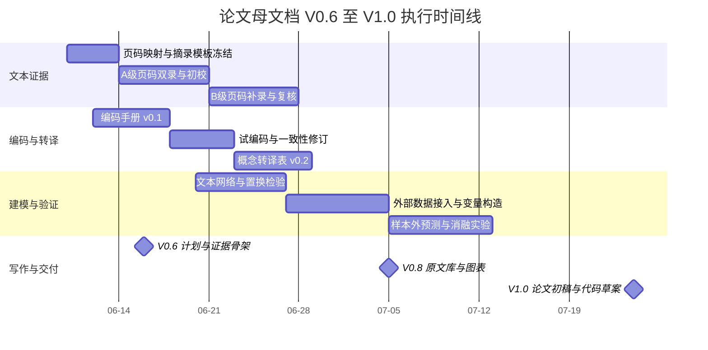

# 论文母文档 V0.6 研究执行方案与首轮交付

## 执行摘要

本方案的目标不是把“象数、易经、八卦、阴阳、五行”直接等同为现代科学术语，而是建立一套**四层转译链条**：先做原文证据抽取，再做概念编码，再做形式模型化，最后进入可量化验证。之所以可以这样启动，不是凭空比附，而是因为两份核心资料本身已经提供了清晰的桥梁结构：《中国系统思维》把《周易》系统观、从系统和信息观点看《周易》、象论、阴阳五行音乐美学、阴阳五行与中国艺术、生态农学等组织成一条“传统系统思维”语料链；《系统理论中的科学方法与哲学问题》则把系统思想、结构与功能、系统与信息、信息概念、系统—信息—控制统一、自组织与系统分析等组织成一条“现代系统科学”语料链。fileciteturn0file0 fileciteturn0file1

本研究的现代语言桥梁，优先采用**系统论—信息论—控制论—非平衡自组织**四组术语，而不是单纯借用流行概念。Shannon 的经典论文给出了“信息源—发射器—信道—接收器—目的地”的通信链条，并明确把熵、冗余、比特放入可度量框架；Wiener 的《Cybernetics》把“反馈与振荡”置于控制核心；Prigogine 的诺奖演讲则明确指出：最小熵产生只在严格线性、近平衡区域成立，而远离平衡时系统可能出现“耗散结构”，即非平衡条件下的有序化。citeturn4view1turn5view1turn3view0turn5view0

因此，V0.6 的首轮交付不是直接写成“终稿论文”，而是形成一份**可执行且可审计的母文档**：包含研究问题、证据页码清单、原文摘录规范、概念转译表、量化验证协议、消融实验方案、图表清单、代码草案规格与里程碑。若外部现实数据尚未就位，V0.6 仍可完整完成“文本证据—概念转译—形式建模—文本统计验证”四步；若外部数据获准补入，则可继续推进到 V0.9/V1.0 的时间序列与机器学习检验。

本方案建议的关键里程碑如下：**V0.6** 在 7 天内完成页码映射、A级证据矩阵、概念转译表样张与统计协议冻结；**V0.8** 在 3 周内完成原文摘录库、编码手册、主要图表与文本统计结果；**V1.0** 在 6 周内完成论文初稿、附录、代码草案和复现实验包。

## 研究问题与假设

本研究建议把问题分成“文本有效性—转译有效性—形式有效性—经验有效性”四层。前两层只依赖两本书即可完成，后两层需要外部数据或合成数据辅助。

### 主研究问题

| 研究问题 | 主假设 | 可检验子假设 | 首要证据来源 | 主检验方式 |
|---|---|---|---|---|
| 传统概念是否在两书中被当作系统语言而非纯神秘语汇 | 《中国系统思维》中的易经、象数、阴阳、五行主要通过整体、关系、结构、平衡、时位、功能来组织 | 相关章节中“结构/关系/整体/功能/平衡/信息”类编码的共现率显著高于随机置换与非核心章节 | 两书正文与目录 | 置换检验、共现网络、互信息 |
| “象”能否严格转译为状态表征与功能模型 | “象”并非静态形貌，而是动态功能与类别压缩 | 使用“状态表征/功能表征”编码本对样本文段进行双人编码时，Kappa 高于“字面意象”编码本 | 《中国系统思维》“象论”部分 | 编码一致性比较、覆盖率比较 |
| 八卦、六爻、卦变能否转译为状态空间、层级与转移 | 八卦可视为八状态基底，六爻可视为层级/阶段，卦变可视为状态转移算子 | 用“结构—层级—转移”模型解释八卦/六爻相关段落时，解释覆盖率高于松散隐喻模型 | 《中国系统思维》“从系统和信息观点看《周易》” | 覆盖率、图模型拟合、消融比较 |
| 五行、生克能否转译为功能模块与反馈网络 | 五行不是五种物质，而是五类功能模块；生与克对应正向支持与负向约束 | 五行跨音乐、艺术、农学等章节后，网络模块结构具有可重复性；删除“反馈”块后解释力显著下降 | 《中国系统思维》第四、第五编 | 模块度、符号网络、消融实验 |
| 第二书是否提供了足够严格的现代桥梁术语 | 第二书可为传统概念提供“结构—功能—信息—控制—自组织”统一桥梁 | 若以第二书术语构建转译表，跨编码员一致性与跨章节迁移性优于自创术语表 | 《系统理论中的科学方法与哲学问题》 | Kappa、迁移准确率、专家复核 |
| 转译变量是否对经验数据有增益价值 | 若外部数据可用，加入传统概念的现代化变量后，模型在样本外预测或分类上优于基线 | 全模型相较现代基线模型在 RMSE/MASE/F1/AUC 上取得稳定改进，且差异通过 DM/Bootstrap/置换检验 | 外部时间序列/面板/标注数据 | Rolling-origin、DM 检验、BCa Bootstrap、标签置换 |

### 本研究的假设边界

本研究**不检验**“八卦是否能神秘预测未来”“五行是否是自然界本体元素”“命理是否决定人生”。本研究检验的是：这些传统概念在两书的系统性解释中，能否被严格转写为**状态、层级、反馈、耦合、信息、控制、开放系统、周期与稳定性**等现代术语，并且这种转写在文本与数据层面是否可复核、可重复、可比较。

## 方法与流程

### 文本数据采集与校读

由于两书均为扫描版，V0.6 采用“**人工校读优先，OCR 仅做辅助，不直接作为最终引文来源**”的原则。研究对象分成三个层级：

1. **页级**：建立“书内页码—PDF 图像页—章节标题”的索引表。
2. **段级**：以自然段为核心分析单元；每段控制在 80–350 字，超长段按分号或句号切分。
3. **命题级**：每个可支持论文论点的句群抽取为一个“证据片段”。

每条证据建议保存以下字段：`doc_id / 书名 / 编次 / 章节 / 书内页码 / PDF图像页 / 段落号 / 原文摘录 / 上下文摘要 / 传统概念标签 / 现代概念标签 / 证据等级 / 录入人 / 复核人 / 复核状态`。  
执行上采用**双录入**：两名录入者独立录入同一页；若字词差异超过字符总数的 0.5%，则回看图像页人工定稿。

### 原文摘录与编码规则

编码采用两层体系。

第一层是**现代系统科学主码**，建议固定为八类：

- 整体
- 关系
- 结构
- 层级
- 状态
- 转移
- 信息
- 控制与反馈
- 开放系统与环境耦合
- 稳定与平衡
- 周期与节律
- 功能与模块

第二层是**传统概念从码**，例如：

- 象
- 数
- 阴阳
- 八卦
- 六爻
- 卦变
- 圜道
- 五行
- 生
- 克
- 时
- 位
- 天
- 地
- 人
- 中和

编码流程建议如下：

1. 先做 30 个段落的试编码。
2. 两位编码员独立编码，计算 Cohen’s kappa；目标值不低于 0.75。
3. 若低于 0.75，优先修改**定义边界**而非扩大标签数量。
4. 正式编码阶段保留 20% 重叠样本做持续一致性监控。
5. 终稿采用“保守编码”：不确定则不贴强标签，而贴“待议/复核”。

### 概念转译与形式建模

转译不是一句话解释，而是固定走四步：

**语义定义**  
先描述传统概念在原文中的最小含义，不加外部引申。

**结构翻译**  
把概念转写为现代术语，例如状态、层级、反馈、耦合、模块、开放系统、编码、时序上下文等。

**指标化**  
为每个转译后的概念指定至少 1 个可量化指标，例如频次、网络度、状态转移概率、耦合强度、信息熵、方差回归速度等。

**验证化**  
为每个指标指定检验方式，例如置换检验、滚动预测、bootstrap 置信区间、分类准确率、消融实验。

这一步的关键原理，和两书的内部结构是匹配的：第一书已经把《周易》放进“系统与信息”视角，并将“象论”与“阴阳五行跨域应用”独立成章；第二书则把系统思想、结构与功能、系统与信息、信息概念、控制与统一体系、自组织等联成一个现代方法链条。fileciteturn0file0 fileciteturn0file1

### 数据标准化与变量构造

若进入外部数据验证，建议统一采用以下规则：

**连续变量**  
训练集内标准化，不允许用全样本信息泄漏。  
常规变量使用：
\[
z = \frac{x-\mu_{\text{train}}}{\sigma_{\text{train}}}
\]
重尾变量使用 robust z-score：
\[
z_r = \frac{x-\text{median}_{\text{train}}}{1.4826 \times MAD_{\text{train}}}
\]

**正偏变量**  
先做 `log1p(x)`，再标准化。

**文本频次变量**  
统一为“每千字频次”或“每段 binary code”，避免长段自然占优。

**时间变量**  
统一保留三层：绝对时间、周期相位、时位交互项。  
例如：
- `phase_t`：季节或周期相位
- `position_t`：层级/角色位次
- `phase_t × position_t`：时位作用

**网络变量**  
对五行、生克、耦合结构，统一保存为邻接矩阵 \(A\) 和符号矩阵 \(S\)：
- \(S_{ij}=+1\)：支持/生
- \(S_{ij}=-1\)：约束/克
- \(S_{ij}=0\)：无直接关系

### 统计检验、消融实验与可视化

研究设计中，统计推断建议采用“三角验证”：

**置换检验**  
用于文本网络、标签一致性、随机映射对照。  
建议 5,000 次置换；若计算资源允许，核心结论用 10,000 次复核。  
显著性水平 \(\alpha=0.05\)，多重比较采用 Benjamini–Hochberg，控制 \(q=0.10\)。

**Bootstrap 置信区间**  
用于指标差值、模型性能差、中心性差值。  
IID 数据使用 BCa bootstrap 2,000 次；时间序列使用 block bootstrap，区块长度默认取：
- 月度数据：12
- 周度数据：8
- 或按 \(l=\lfloor T^{1/3}\rfloor\) 取值

**消融实验**  
至少做四组模型：
- `M_base`：现代常规变量或简单基线
- `M_state`：仅加入状态/层级变量
- `M_feedback`：仅加入反馈/耦合变量
- `M_context`：仅加入时位/环境变量
- `M_full`：全部变量

若 `M_full` 优于 `M_base`，且任一单块消融导致样本外性能显著下降，则可支持“传统概念现代转译具有增量价值”。

**可视化输出**  
V0.6–V1.0 建议固定生产 8 张图：
- 页码—概念密度热图
- 传统概念—现代术语 Sankey 图
- 共现网络图
- 五行符号网络图
- 八卦/六爻状态转移图
- Rolling-origin 预测曲线
- 模型误差分布图
- 消融瀑布图

在时间序列评估上，真实非平稳场景优先采用保持时间顺序的样本外方法，而不是打乱时序的普通交叉验证；这一点与现有经验研究结论一致。citeturn8academia2

## 证据清单与概念转译模板

### 原文证据清单

以下页码清单以**书内页码**为主，终止页暂按下一节起始页减一计算；V0.7 需逐页复核。页码依据两书目录与当前已核对的正文页建立。fileciteturn0file0 fileciteturn0file1

#### 《中国系统思维》优先提取清单

| 书内页码 | 主题 | 提取目标 | 优先级 |
|---|---|---|---|
| 9–13 | 如何看待《周易》 | 建立“《易经》并非仅占筮文本，而有系统性原则”的总论证 | A |
| 14–22 | 圜道与中国思维 | 提取循环、复始、周期、过程观证据 | A |
| 31–46 | 《易经》天人观及影响 | 提取天人关系、主客融合、开放系统耦合证据 | A |
| 56–67 | 从系统和信息观点看《周易》 | 提取整体、关系结构、平衡稳定、全局系统等直接桥梁语句 | A |
| 73–98 | 《易传》象论及其他 | 提取“象”的研究层次、概念归类、功能模型、早期少理理论证据 | A |
| 108–129 | 《吕氏春秋》相关章节 | 作为传统系统思维扩展参照，观察术语迁移 | B |
| 130–199 | 系统哲学的演化 | 建立传统系统思维内部的一般哲学框架 | B |
| 279–352 | 中医学争论、阴阳时间医学 | 提取时间、节律、开放系统与人体整体性 | B |
| 356–365 | 阴阳五行与五声六律 | 提取五行的跨域映射与功能分类证据 | A |
| 365–380 | 艺术之美在于“和”与音乐作用 | 提取中和、协调、稳定、功能作用证据 | B |
| 382–411 | 阴阳五行与中国艺术 | 提取结构同构、形式约束、程式化、时空观念证据 | A |
| 416–442 | “天—地—人”与中国农学 | 提取开放系统、环境输入、资源约束 | A |
| 443–472 | 传统农学中的求规律性、因时制宜 | 提取时位、周期、反馈调节证据 | A |
| 498–519 | 地利与人力的运筹 | 提取控制、配置、决策、运筹视角证据 | B |
| 524–571 | 古代科技系统思维案例举要 | 作为跨域外部证据，验证传统概念并非只在易学中存在 | B |

#### 《系统理论中的科学方法与哲学问题》优先提取清单

| 书内页码 | 主题 | 提取目标 | 优先级 |
|---|---|---|---|
| 4–29 | 钱学森《系统思想、系统科学和系统论》 | 提取系统思想/系统科学/系统论的总框架、分层与桥梁词表 | A |
| 59–68 | 系统理论中的若干科学与哲学问题初探 | 提取“三论”关系、科学方法论边界 | A |
| 69–80 | 恩格斯的系统思想 | 提取辩证法中的系统性根基 | B |
| 81–103 | 系统的结构与功能初探 | 作为“八卦/六爻—结构/功能”转译的现代母板 | A |
| 104–141 | 略论辩证的系统观、系统范畴 | 建立范畴级桥梁：整体、部分、层次、联系、过程 | B |
| 142–156 | 系统与信息 | 提取系统与信息的理论接口 | A |
| 157–188 | 信息论、信息科学中的若干方法 | 提取信息度量与方法支持 | A |
| 174–208 | 信息科学的基本问题、信息概念分析 | 用于清理“信息”概念边界，避免泛化 | A |
| 209–227 | 系、信、控科学统一体系的探索 | 建立“传统概念—系统/信息/控制”统一桥梁 | A |
| 228–257 | 系统分析与决策研究 | 用于论文方法论章节与验证设计 | B |
| 238–257 | 非平衡系统自组织理论在经济系统中的应用 | 与 Prigogine 路线对接，支撑“远离平衡组织化” | B |
| 258–285 | 动态投入产出分析等应用章节 | 作为系统方法可操作性的外部支撑 | C |

### 概念转译示例表

下表不是终版结论，而是 V0.6 需要冻结的**工作版模板**。它的依据来自两书相关章节的目录结构与已核对正文页，同时在现代桥梁上借助 Shannon 的信息链条、Wiener 的反馈控制与 Prigogine 的非平衡有序化语言。fileciteturn0file0 fileciteturn0file1 citeturn4view1turn3view0turn5view0

| 传统概念 | 现代系统翻译 | 可量化指标 | 测量方法 | 主要数据形态 |
|---|---|---|---|---|
| 象 | 状态表征 / 功能签名 | 状态标签一致性、互信息、覆盖率 | 双人编码、标签互信息、错误分析 | 文本段落、案例描述 |
| 数 | 结构编码 / 索引规则 | 编码长度、组合复杂度、状态熵 | 二值/多值编码、熵计算 | 文本编码表、状态表 |
| 阴阳 | 对偶变量 / 张力变量 | 极性指数、对立项转移率 | \(PI=(x^+-x^-)/( |x^+|+|x^-|)\) | 文本或时序变量 |
| 八卦 | 八状态基底 | 8 类分类概率、状态可分性 | 多分类模型、混淆矩阵 | 标注文本、事件数据 |
| 六爻 | 六层层级 / 六阶段过程 | 层级序数、阶段转移概率 | 序数回归、Markov 转移矩阵 | 分阶段序列 |
| 卦变 | 状态转移算子 | 转移矩阵 \(P\)、熵率、下一状态预测误差 | HMM/Markov/序列分类 | 时序或叙事序列 |
| 圜道 | 周期回路 / 循环动力学 | 主周期、谱峰、滞后自相关 | FFT、周期图、ACF/PACF | 时间序列 |
| 五行 | 五功能模块网络 | 模块度 \(Q\)、社群数、因子载荷 | 网络社群发现、EFA/CFA | 多指标矩阵 |
| 生 | 正向支持 / 正反馈或前馈 | 正滞后系数、正向转移概率 | VAR/回归/转移图 | 面板或时间序列 |
| 克 | 负向约束 / 负反馈 | 负滞后系数、误差校正速度 | VAR/ECM/符号网络 | 面板或时间序列 |
| 中和 | 稳定机制 / 协调状态 | 方差收敛、回归半衰期、稳定域 | 单位根/半衰期/稳健区间 | 时间序列 |
| 时位 | 时间—位置情境变量 | 相位×位次交互项显著性 | 交互回归、分层模型 | 序列+层级数据 |
| 天人合一 | 开放系统耦合 | 外部环境对系统的耦合强度 | Granger、Transfer Entropy、交叉相关 | 环境—系统双序列 |
| 整体 | 整体约束 / 系统级属性 | 整体解释覆盖率、全局网络密度 | 共现网络、覆盖率统计 | 文本与网络 |
| 结构 | 关系配置模式 | 邻接矩阵、层级深度、桥接中心性 | 图分析、层次聚类 | 网络化数据 |
| 功能 | 输入—输出作用模式 | 功能增益、误差降低率 | 回归、分类、系统响应分析 | 时序/案例数据 |

## 量化验证与论文结构

### 量化验证设计

本研究至少执行三类检验；如用户提供外部现实数据，则三类全做；如尚无外部数据，则先完成前两类与一个合成数据验证。

#### 文本共现与概念网络检验

**目的**  
检验传统概念是否在两书中稳定地被组织为“整体—结构—信息—反馈—环境耦合”的系统语义网络。

**样本需求**  
A级页码全部段落；预计不少于 150 个分析单元，最好达到 220–300 个。

**变量构造**  
- `y_unit`: 段落编号  
- `c_i`: 传统概念二元标签  
- `s_j`: 现代系统标签  
- `freq_1000`: 每千字频次  
- `PMI(i,j)`: 共现强度  
- `NMI`: 概念簇一致性

**对照组**  
- 章节内随机置换标签
- 非核心章节对照
- 随机映射的伪转译表

**统计流程**  
1. 先在章内计算观测共现矩阵 \(A_{obs}\)。  
2. 在保持边际频次不变的情况下做 5,000 次置换，得到 \(A_{perm}\)。  
3. 比较模块度 \(Q\)、平均 PMI、桥接中心性、覆盖率。  
4. 用经验 p 值与 BH-FDR 校正。  
5. 若核心网络指标在置换分布上落入前 5% 或后 5%，则认为该结构非随机。

**评价指标**  
- 模块度 \(Q\)
- 平均 PMI
- 桥接中心性
- 解释覆盖率
- Kappa/Alpha 一致性

#### 时间序列与样本外预测检验

**目的**  
检验“现代化转译变量”是否对现实时间序列或面板数据有增量价值。

**样本需求**  
- 月度单序列：最低 60 期，优选 120 期  
- 周度序列：最低 104 期，优选 156 期  
- 面板数据：最低 \(N\ge 30, T\ge 24\)

**变量构造**  
- 因变量：\(y_t\)  
- 基线变量：\(x_t\)  
- 转译变量：\(z_t^{trad\to sys}\)，如周期、耦合、反馈、层级、时位  
- 交互项：\(phase_t \times position_t\)，\(feedback_t \times environment_t\)

**模型规格**  
- 基线：Naive / Seasonal Naive / ARIMA / ETS / 线性 ARX  
- 扩展：Elastic Net / XGBoost / LightGBM / VAR（若多变量）  
主回归原型：
\[
y_t=\alpha+\sum_{k=1}^{p}\phi_k y_{t-k}+\beta' x_t+\gamma' z_t^{trad\to sys}+\varepsilon_t
\]

**交叉验证**  
采用 expanding-window rolling-origin：  
- 初始训练窗：`max(60, floor(0.5T))`
- 预测步长：`h ∈ {1,3,6}`
- 滑动步长：1
- 所有标准化只在训练窗内拟合，再作用于验证/测试窗

**评价指标**  
- RMSE
- MAE
- MASE
- sMAPE
- 若为概率预测，加 Brier score

**推断流程**  
1. 逐折生成样本外预测。  
2. 计算损失差 \(d_t = L(e_{1,t})-L(e_{2,t})\)。  
3. 主检验采用 Diebold–Mariano 检验评估等预测能力；对指标差使用 BCa bootstrap 2,000 次构造 95% 置信区间。  
4. 对重尾/强相关情形，补做区块 bootstrap 或子样本检验。  
5. 多模型多地平线比较统一做 FDR 校正。

在方法选择上，采用保时间顺序的样本外评估，是因为在真实非平稳场景下，这类方法通常比打乱顺序的普通交叉验证更稳妥。citeturn8academia2

#### 监督学习与消融检验

**目的**  
检验转译变量是否能改善分类/回归任务，并识别哪一类传统概念最有信息量。

**样本需求**  
- 分类任务：优选 \(n \ge 500\)；若只有 \(200 \le n < 500\)，仅使用正则化线性模型与浅层树模型  
- 文本分类：按段落或案例标注  
- 序列分类：按时间窗标注

**模型组**  
- `B0`: 仅现代常规特征  
- `B1`: + 状态/层级特征  
- `B2`: + 反馈/耦合特征  
- `B3`: + 时位/环境特征  
- `B4`: 全部特征

**分割方式**  
- 非时序文本：分层 5 折 + 外层留章验证  
- 时序/面板：嵌套式 walk-forward  
- 超参数：内层 5 折或内层 expanding window

**评价指标**  
- 分类：Macro-F1、AUROC、PR-AUC、Brier、校准斜率  
- 回归：\(R^2\)、RMSE、MAE  
- 重要性：Permutation Importance、SHAP（仅解释，不作为显著性检验）

**显著性流程**  
- 标签置换检验：2,000 次  
- 特征重要性重复：每折 30 次 permutation repeat  
- 消融判定：若删除一个概念块后，平均性能下降且 95% BCa CI 不跨 0，则认定该概念块信息有效  
- 实用显著性阈值：  
  - 回归：\(\Delta MASE \le -0.03\) 或 \(\Delta RMSE \le -0.05\sigma_y\)  
  - 分类：\(\Delta Macro\text{-}F1 \ge 0.03\)

#### 合成数据安慰剂检验

若现实数据尚未提供，V0.8 可先做一个合成实验：

1. 构造 8 状态 Markov 链，对应“八卦状态”；
2. 在其中叠加 5 个功能模块和正/负反馈边；
3. 加入外部环境驱动项；
4. 用研究管线恢复状态转移、反馈方向与耦合强度；
5. 评价恢复误差，如 KL divergence、adjacency recovery F1。

若连合成数据都不能恢复已知结构，则说明转译表或估计方法尚未稳定，不能进入现实数据验证。

### 建议论文结构

| 章节标题 | 章节要点 | 需支持的证据类型 |
|---|---|---|
| 摘要与问题意识 | 界定“转译”而非“等同” | 研究设计说明、问题边界 |
| 资料基础与方法说明 | 说明两书来源、页码、扫描特征、校读流程 | 目录页、书内页码、摘录规范 |
| 《中国系统思维》的传统系统范畴 | 交代《周易》系统观、象论、阴阳五行、生态农学主线 | 关键原文摘录、章节页码 |
| 《系统理论中的科学方法与哲学问题》的现代桥梁 | 交代系统思想、结构与功能、系统与信息、系信控统一 | 关键原文摘录、注释书目 |
| 象数与信息编码 | 将“象”“数”转译为状态表示、结构编码、功能压缩 | 原文摘录、Shannon 桥梁、文本统计 |
| 八卦、六爻与状态空间 | 将八卦/六爻/卦变转成多状态、层级、转移模型 | 原文摘录、图模型、状态转移图 |
| 阴阳、五行与反馈网络 | 将阴阳、生克、中和转为正负反馈、模块、稳态机制 | 原文摘录、符号网络、系统图 |
| 量化验证 | 报告置换、bootstrap、rolling-origin、消融结果 | 统计表、图表、显著性检验 |
| 边界、伦理与结论 | 说明传统文化尊重、反宿命化、方法学边界 | 反例、限制、伦理说明 |
| 附录 | 原文摘录表、概念表、代码说明、图表清单 | 可复现材料 |

## 里程碑、风险与资源

### 甘特式时间线

### 交付物清单与时间表

| 版本 | 时间点 | 核心产出 | 格式 |
|---|---|---|---|
| V0.6 | 第 1 周 | 执行方案、页码映射表、A级证据矩阵骨架、概念转译表样张、统计协议 | `.docx/.md` + `.xlsx/.csv` |
| V0.7 | 第 2 周 | 原文摘录表 A 版、编码手册 v0.1、双录复核日志 | `.xlsx/.csv/.md` |
| V0.8 | 第 3–4 周 | 文本共现网络、置换检验结果、第一批图表、概念对照表 v0.2 | `.ipynb/.py/.png/.svg` |
| V0.9 | 第 5 周 | 外部数据变量表、滚动预测结果、消融实验表、模型代码草案 | `.py/.ipynb/.xlsx` |
| V1.0 | 第 6 周 | 论文初稿、附录、图表全集、复现说明书 | `.docx/.md/.pdf` + 代码包 |

### 风险与伦理考量

| 风险 | 表现形式 | 缓解方案 |
|---|---|---|
| 过度神秘化 | 把传统概念直接说成自然因果律 | 坚持“转译”而非“等同”；所有结论都落到证据、指标、检验 |
| 过度还原化 | 把传统文化完全压扁成现代术语 | 保留原文语义层与历史语境层，不删去文化说明 |
| 宿命化风险 | 将研究结果被误读为“人生注定” | 明确研究对象是概念系统与建模方法，不是命定论 |
| OCR/转录误差 | 扫描件识别错字、页码错位 | 双录入、人工复核、书内页码优先 |
| 研究者主观编码偏差 | 标签边界漂移 | 预注册编码本、双人编码、Kappa 审核 |
| 现实数据隐私 | 若接入个人日志、医疗或企业数据 | 去标识化、最小必要字段、权限控制、审计日志 |
| 不可重复 | 代码、版本、图表来源混乱 | Git 版本管理、固定随机种子、记录环境与参数 |
| 文化不敬 | 以讥讽方式处理传统文本 | 采用解释学与方法论双重尊重，避免价值贬损 |

这一伦理边界也与现代经典的使用方式一致：Shannon 提供的是可量化信息框架，Wiener 提供的是反馈与控制框架，Prigogine 提供的是非平衡组织框架；它们都不是为了替代文本原义，而是为了形成可检验的第二语言。citeturn4view1turn3view0turn5view0

### 优先参考来源与检索策略

优先级建议如下：

**最高优先**  
两份中文原始资料的书内页码、目录页、关键正文页。第一书负责“传统语义与结构证据”，第二书负责“现代桥梁语义与方法论证据”。这一步必须先于任何外部文献。fileciteturn0file0 fileciteturn0file1

**高优先**  
第二书内部注释已经给出一条英文经典线索，包括 Bertalanffy、Haken 等，因此补充英文文献最好顺着这条内部书目链路走，而不要另起炉灶。fileciteturn0file1

**现代经典补充顺序**  
- 信息论：Shannon 1948/1949  
- 控制论：Wiener 1948/1961  
- 一般系统论：Bertalanffy 1968  
- 非平衡自组织：Prigogine 1977 诺奖演讲与相关著作  
Shannon 的原始通信结构和熵概念、Prigogine 的诺奖演讲，都有可靠的大学/官方来源可直接核引。citeturn5view1turn5view0

**方法学检索顺序**  
1. 先检索官方/原始 PDF、出版社、大学镜像、DOI  
2. 再检索高质量学术数据库  
3. 统计方法补充只服务于“验证协议”，不反向改写文本含义

建议检索式示例：
- “书名 + 书内页码 + 关键术语”
- “site:nobelprize.org Prigogine lecture pdf”
- “site:math.harvard.edu Shannon communication pdf”
- “Wiener cybernetics feedback oscillation”
- “rolling-origin time series evaluation”

### 需要你提供的资源清单

| 资源 | 说明 | 是否必需 |
|---|---|---|
| 页码确认 | 若你已有手工页码标注，请提供“书内页—PDF图像页”对照 | 强烈建议 |
| 研究主轴排序 | 请明确你更优先“象数—信息论”“八卦—状态空间”“五行—反馈网络”哪一条 | 必需 |
| 外部现实数据样本 | 若要做经验验证，请提供时间序列/面板/文本标注数据 | 若做 V0.9/V1.0 则必需 |
| 数据抓取权限 | 是否允许外部公开数据抓取 | 必需 |
| OCR 使用边界 | 是否允许做辅助 OCR，还是坚持纯人工录入 | 必需 |
| 目标期刊/格式 | 例如 GB/T 7714、APA、脚注体例、目标字数 | 强烈建议 |
| 研究领域选择 | 外部验证更偏市场、个人日志、医疗、企业过程还是社会数据 | 强烈建议 |
| 研究协作资源 | 是否有第二位校读或编码人员 | 非必需但极有帮助 |

### 下一步立即可执行的三项任务清单

1. **冻结 A 级页码与摘录模板**  
   先确认我按上表启动以下页码：第一书 9–13、14–22、31–46、56–67、73–98、356–365、382–411、416–472；第二书 4–29、81–103、142–227。确认后即可进入双录。

2. **冻结概念编码手册 v0.1**  
   请你确认是否采用本方案的 12 个现代系统主码与 16 个传统从码；一旦确认，我就可以把“概念转译表”扩成正式编码本。

3. **确认外部验证路线**  
   请直接决定三选一：  
   - 只做文本母文档与文本统计验证；  
   - 做文本母文档 + 合成数据安慰剂实验；  
   - 做完整外部数据验证，并告知数据来源与抓取权限。